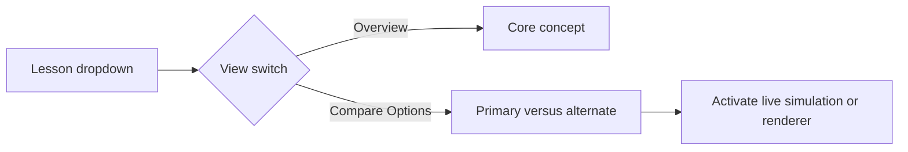
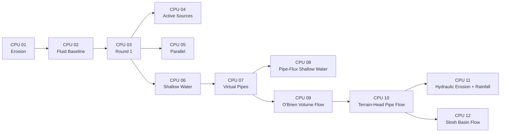

# Trial 3 Experiment Lesson Catalog

This catalog provides the deterministic lesson order used by the in-app
`Lesson Guide` panel. The ten foundational `lesson_step*.md` files remain in
their original numbered course sequence. This catalog orders the optional
experiment branches: CPU lessons first, then all other experiment lessons in
alphabetical name order.

---

## UI Switch

The application now contains a `Lesson Guide` window with:

- A `Lesson` dropdown ordered exactly as this catalog.
- An `Overview` view for the purpose of each lesson.
- A `Compare Options` view for the contrast being studied.
- Buttons that switch the live simulation or renderer to the matching options.



The panel is a compact navigation aid. The Markdown files remain the full
lesson materials and the record of measured findings.

---

## CPU Lessons

### CPU 01 - Simple Erosion Simulator

**Full lesson:** `lesson_experiment_simple_erosion_sim.md`

**Topic:** The original CPU terrain-changing simulation, the pluggable
simulator contract, and a simulator-declared erosion test map.

**UI comparison:** Simple Erosion versus Cellular Fluid Baseline.

### CPU 02 - Cellular Fluid Baseline

**Full lesson:** `lesson_experiment_cellular_fluid_sim.md`

**Topic:** The preserved four-neighbor cellular water implementation.

**UI comparison:** Fluid Baseline versus Optimized Round 1.

### CPU 03 - Fluid Upgrade / Round 1

**Full lesson:** `lesson_experiment_cellular_fluid_sim_upgrade.md`

**Topic:** Cone diagnosis, fractional water, fixed stepping, and the first
semantics-preserving performance pass.

**UI comparison:** Optimized Round 1 versus Fluid Baseline.

**Recorded result:** Round 1 passed exact comparison and measured `1.281x`
baseline speedup in both benchmark workloads.

### CPU 04 - Active Sources / Round 2

**Full lesson:** `lesson_experiment_cellular_fluid_active_sources.md`

**Topic:** Skip flow evaluation for dry sources while preserving contributing
write order.

**UI comparison:** Active Sources versus Optimized Round 1.

**Recorded result:** Round 2 passed exact comparison, measured `1.768x`
baseline speedup for center pour, and measured `0.769x` for uniform rain.

### CPU 05 - Deterministic Parallel

**Full lesson:** `lesson_experiment_cellular_fluid_cpu_parallel.md`

**Topic:** Parallel proposal generation followed by ordered serial replay.

**UI comparison:** CPU Parallel versus Optimized Round 1.

**Recorded result:** Exact state passed, but the measured implementation was
slower than the baseline for both test workloads.

### CPU 06 - Shallow Water Heightfield

**Full lesson:** `lesson_experiment_shallow_water_heightfield_cpu_basic.md`

**Topic:** A new CPU-only water experiment that stores water depth plus
horizontal velocity.

**UI comparison:** Shallow Water Heightfield versus Optimized Round 1.

### CPU 07 - Virtual Pipe Fluid

**Full lesson:** `lesson_experiment_virtual_pipe_fluid_sim.md`

**Topic:** A CPU-only experiment inspired by O'Brien/Hodgins' virtual-pipe
volume model, using signed pipe flows between eight neighboring columns.

**UI comparison:** Virtual Pipe Fluid versus Shallow Water Heightfield.

### CPU 08 - Pipe-Flux Shallow Water

**Full lesson:** `lesson_experiment_pipe_flux_shallow_water_sim.md`

**Topic:** A new CPU-only shallow-water branch where water depth lives in cells
and persistent momentum lives in edge/pipe fluxes.

**UI comparison:** Pipe-Flux Shallow Water versus Virtual Pipe Fluid.

### CPU 09 - O'Brien Volume Flow

**Full lesson:** `lesson_experiment_obrien_volume_flow_sim.md`

**Topic:** A paper-faithful CPU recreation of only the O'Brien/Hodgins main
volume subsystem: vertical columns, eight virtual pipes, hydrostatic pressure,
pipe flow integration, and positivity correction.

**UI comparison:** O'Brien Volume Flow versus Virtual Pipe Fluid.

### CPU 10 - Terrain-Head Pipe Flow

**Full lesson:** `lesson_experiment_terrain_head_pipe_flow_sim.md`

**Topic:** A terrain-aware pipe-flow branch that keeps the virtual pipes but
uses free-surface elevation, `terrain height + water depth`, so hills can block
flow and depressions can collect water.

**UI comparison:** Terrain-Head Pipe Flow versus O'Brien Volume Flow.

### CPU 11 - Hydraulic Erosion + Rainfall

**Full lesson:** `lesson_experiment_hydraulic_erosion_rain_sim.md`

**Topic:** A FastErosion PG07 baseline workbench with four-neighbor pipe flux,
velocity-derived sediment capacity, semi-Lagrangian sediment transport,
evaporation, and stochastic visible rainfall on the erosion valley map.

**UI comparison:** Hydraulic Erosion + Rainfall versus Terrain-Head Pipe Flow.

### CPU 12 - Slosh Basin Flow

**Full lesson:** `lesson_experiment_slosh_basin_flow_sim.md`

**Topic:** A fixed-terrain pre-erosion flow branch on a purpose-built basin map
with a shelf, island, baffle ridge, raised rim, and spillway.

**UI comparison:** Slosh Basin Flow versus Terrain-Head Pipe Flow.



---

## Other Experiments

These lessons are listed in strict alphabetical display-name order.

### HLSL Compute Phase 1

**Full lesson:** `lesson_experiment_cellular_fluid_hlsl_compute_phase1.md`

**Topic:** GPU compute proposal/application passes with readback integration.

**UI comparison:** HLSL Compute Phase 1 versus CPU Fluid Baseline.

### HLSL Compute Phase 2 - Tiled Resident

**Full lesson:** `lesson_experiment_cellular_fluid_hlsl_compute_phase2_tiled_resident.md`

**Topic:** Tiled HLSL proposal pass plus GPU-resident water rendering.

**UI comparison:** HLSL Compute Phase 2 - Tiled Resident versus HLSL Compute Phase 1.

### Raycast Renderer

**Full lesson:** `lesson_experiment_raycast_renderer.md`

**Topic:** Full-screen raycast rendering packaged as a selectable renderer.

**UI comparison:** Raycast versus Split LOD.

### Split LOD Renderer

**Full lesson:** `lesson_experiment_split_lod_renderer.md`

**Topic:** Mixed coarse/fine representation used as the default renderer.

**UI comparison:** Split LOD versus Raycast.

### Wireframe Renderer

**Full lesson:** `lesson_experiment_wireframe_renderer.md`

**Topic:** Geometry-oriented column inspection through a wireframe view.

**UI comparison:** Wireframe versus Split LOD.


---

## Ordering Review

| Order | Display Name | Group | Full Lesson |
|---:|---|---|---|
| 1 | CPU 01 - Simple Erosion Simulator | CPU | `lesson_experiment_simple_erosion_sim.md` |
| 2 | CPU 02 - Cellular Fluid Baseline | CPU | `lesson_experiment_cellular_fluid_sim.md` |
| 3 | CPU 03 - Fluid Upgrade / Round 1 | CPU | `lesson_experiment_cellular_fluid_sim_upgrade.md` |
| 4 | CPU 04 - Active Sources / Round 2 | CPU | `lesson_experiment_cellular_fluid_active_sources.md` |
| 5 | CPU 05 - Deterministic Parallel | CPU | `lesson_experiment_cellular_fluid_cpu_parallel.md` |
| 6 | CPU 06 - Shallow Water Heightfield | CPU | `lesson_experiment_shallow_water_heightfield_cpu_basic.md` |
| 7 | CPU 07 - Virtual Pipe Fluid | CPU | `lesson_experiment_virtual_pipe_fluid_sim.md` |
| 8 | CPU 08 - Pipe-Flux Shallow Water | CPU | `lesson_experiment_pipe_flux_shallow_water_sim.md` |
| 9 | CPU 09 - O'Brien Volume Flow | CPU | `lesson_experiment_obrien_volume_flow_sim.md` |
| 10 | CPU 10 - Terrain-Head Pipe Flow | CPU | `lesson_experiment_terrain_head_pipe_flow_sim.md` |
| 11 | CPU 11 - Hydraulic Erosion + Rainfall | CPU | `lesson_experiment_hydraulic_erosion_rain_sim.md` |
| 12 | CPU 12 - Slosh Basin Flow | CPU | `lesson_experiment_slosh_basin_flow_sim.md` |
| 13 | HLSL Compute Phase 1 | Other | `lesson_experiment_cellular_fluid_hlsl_compute_phase1.md` |
| 14 | HLSL Compute Phase 2 - Tiled Resident | Other | `lesson_experiment_cellular_fluid_hlsl_compute_phase2_tiled_resident.md` |
| 15 | Raycast Renderer | Other | `lesson_experiment_raycast_renderer.md` |
| 16 | Split LOD Renderer | Other | `lesson_experiment_split_lod_renderer.md` |
| 17 | Wireframe Renderer | Other | `lesson_experiment_wireframe_renderer.md` |

Review result:

```text
CPU experiment lessons: first
Remaining experiment lessons: HLSL Phase 1, HLSL Phase 2, Raycast, Split LOD, Wireframe
Remaining display-name order: alphabetical
Foundational step lessons: preserved in established Lesson 01 through Lesson 10 order
```
