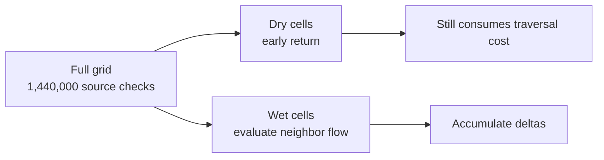
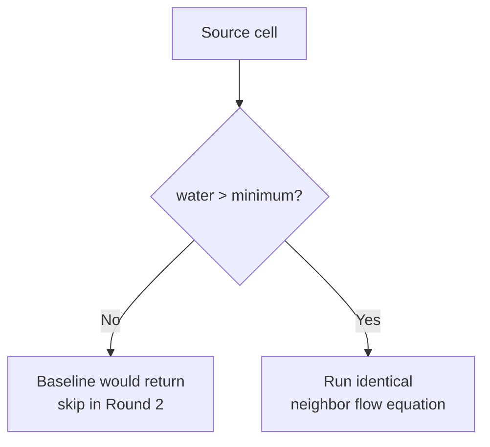
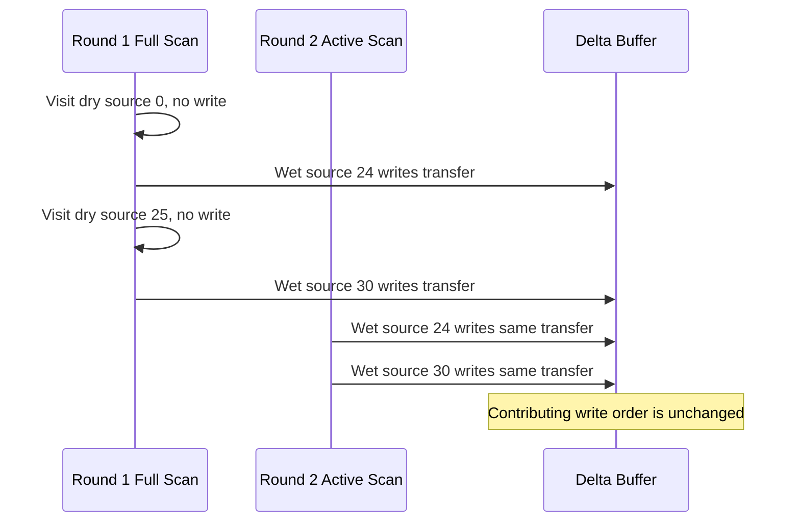
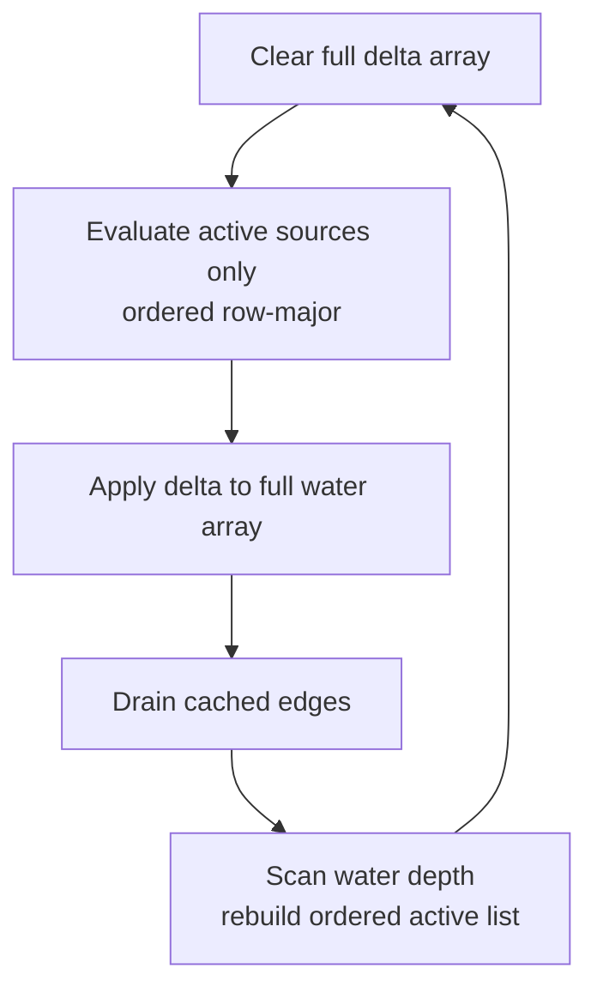
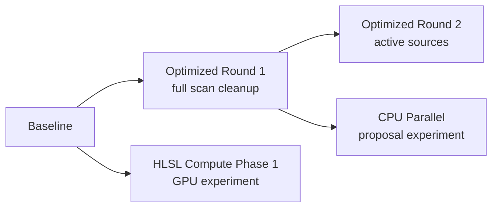
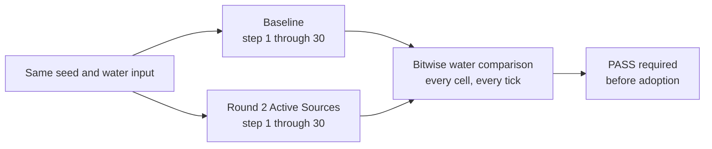
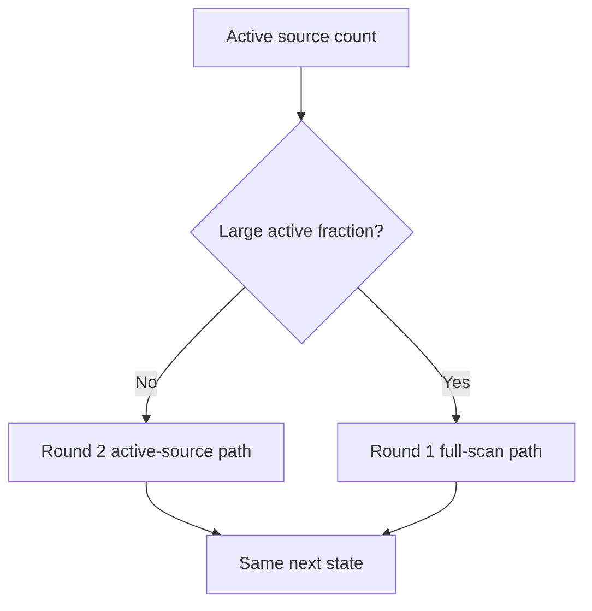
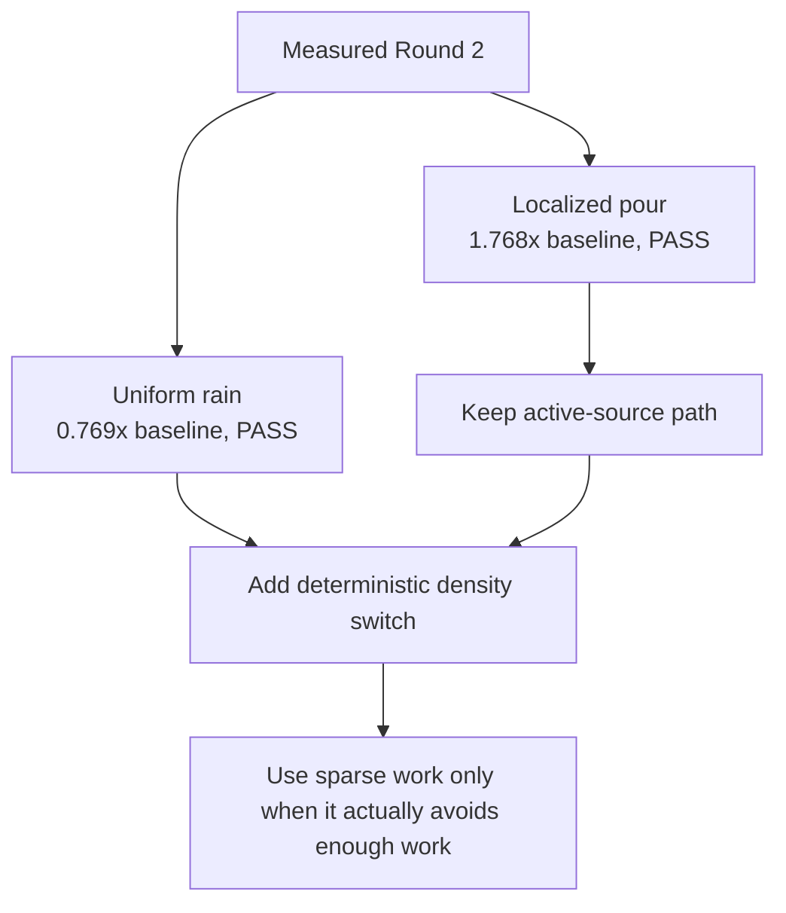

# Experiment Lesson: Optimized Round 2 - Active Sources

---

## Chapter 1: Why Circle Back To The CPU

Round 1 optimized costs that could be removed without changing which cells
participate in a tick:

```text
reuse the delta buffer
fast-path interior topology
cache drainage indices
reuse diagnostic storage
```

The CPU Parallel and HLSL branches then explored executing similar work on more
processors. A deferred CPU idea remained untested:

```text
Do not compute outgoing flow for cells that contain no transferable water.
```

This is an important experiment before memory tiling. Tiling makes work cheaper
once it is performed. Active sources asks whether much of that work can be
skipped entirely.

---

## Chapter 2: The Full-Field Cost

The Trial 3 water grid contains:

```text
1200 x 1200 = 1,440,000 cells
```

Round 1 examines every source cell every tick, even for a small center pour.
Most dry cells return quickly, but each one must still be visited and tested.



The optimization hypothesis is workload-dependent:

| Workload | Prediction |
|---|---|
| Center pour | Active sources should help because wet cells occupy a small region |
| Uniform rain | Active sources may not help because most or all cells are wet |

---

## Chapter 3: What Counts As Active

The baseline already has this early return:

```cpp
if (available_water <= minimum_water_inches_)
    return;
```

Round 2 defines an active source using that exact condition:

```text
active source = water depth > minimum_water_inches
```

It does not try to predict whether a wet cell will actually find a lower
neighbor. That would add a more complex eligibility rule. The first experiment
only removes work already proven to be an immediate no-op in the baseline.



---

## Chapter 4: Preserving The Tick

The selectable variant is:

```text
Cellular Water Flow (Optimized Round 2 - Active Sources)
```

It preserves:

- The same fractional water state.
- The same surface-equalization equation.
- The same maximum flow and settle-rate limits.
- The same four neighbors in `left, right, up, down` order.
- The same synchronous delta application.
- The same boundary drainage.

It changes one traversal:

```text
Round 1: evaluate every source in row-major order
Round 2: evaluate only wet sources, stored in row-major order
```

Dry sources produced no delta additions in Round 1. Omitting them therefore
leaves the order of every contributing floating-point addition unchanged.

## Sequence Interaction Diagram



---

## Chapter 5: Round 2A Scope

This first active-source version intentionally does not make all data sparse.
Each tick is:



Why keep full-array clearing and application?

- It gives the smallest meaningful behavior change.
- It makes exact comparison against the baseline straightforward.
- It measures whether avoiding empty flow calculations is worthwhile before
  adding sparse-update bookkeeping.

This version still performs a cheap full-field water threshold scan to build
the next list. For localized water, that scan replaces a full field of
neighbor-flow evaluation. For broad rain, the list provides little avoidance
and adds management overhead.

---

## Chapter 6: Files Changed

| File | Purpose |
|---|---|
| `sim/simple_cellular_fluid_sim_active_sources.h` | New deterministic active-source simulator |
| `main.cpp` | Adds Round 2 as a selectable simulator while retaining Round 1 as default |
| `fluid_sim_benchmark.cpp` | Times and exactly compares Round 2 alongside existing CPU variants |

The preserved experiment ladder is now:



---

## Chapter 7: Correctness Test

The existing console benchmark now initializes identical terrain and water for
the baseline and Round 2, advances both simulations through 30 ticks, and
compares every cell bit-for-bit after each tick.



The acceptance rule remains strict:

```text
faster + exact = viable optimization
faster + not exact = separate simulation variant, not an optimization
```

---

## Chapter 8: Timing Protocol

The benchmark reports:

```text
5 warmup steps
30 measured steps
3 repetitions
median milliseconds per step
```

Scenarios:

| Scenario | Reason |
|---|---|
| Center pour: radius `11`, depth `22 in` | Tests sparse localized water |
| Uniform rain: depth `1 in` | Tests dense water where active lists may not help |

Release benchmark results recorded on May 27, 2026:

| Scenario | Baseline ms/step | Round 1 ms/step | Round 2 Active ms/step | Round 2 speedup | Exact state |
|---|---:|---:|---:|---:|---|
| Center pour: radius `11`, depth `22 in` | 5.562 | 4.341 | 3.145 | 1.768x | PASS |
| Uniform rain: depth `1 in` | 22.438 | 17.518 | 29.168 | 0.769x | PASS |

Environment during this run:

```text
Build: Release
Grid: 1200 x 1200 cells
Hardware threads reported by C++ runtime: 16
```

Round 2 is numerically validated for the tested scenarios and first 30 steps.
Its performance hypothesis is also confirmed: avoiding dry-source flow work is
valuable for localized water, while maintaining the active list is a loss when
the full field is wet.

---

## Chapter 9: Possible Follow-On Rounds

Round 2A answers whether active source evaluation alone is useful. It does not
claim to be the final sparse CPU representation.

Round 2A is exact in this benchmark and helps localized water. One possible
later experiment can track only cells whose deltas may change:


That step has higher proof risk because changing one cell's water can alter a
neighbor's ability to flow on the next tick. It should be a separate variant,
not silently folded into this one.

The dense rain case is slower, so the immediate next experiment should be a
deterministic hybrid that chooses:



This is also separate future work. Round 2A first gives us a simple, testable
measurement of avoided dry-source calculations.

---

## Chapter 10: Decision From The Measurement

Round 2 should remain available as the proven sparse-water experiment, but it
should not replace Round 1 as the general default yet:



The next CPU optimization round is therefore:

```text
Optimized Round 3 - Hybrid Active/Full Scan
```

It should reuse Round 2 when the active fraction is low and fall back to the
existing exact Round 1 traversal when the active fraction is high. Each branch
already preserves baseline behavior; the experiment will measure whether a
simple deterministic selection rule captures both advantages.
