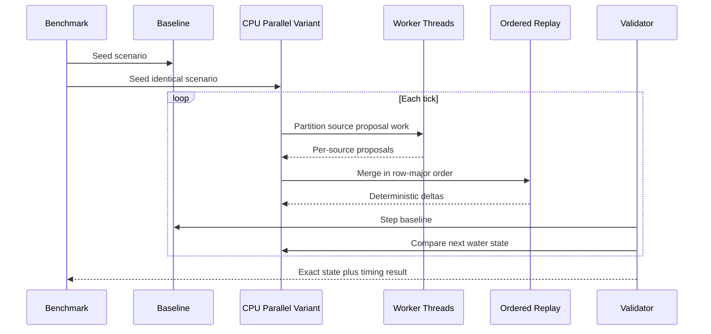
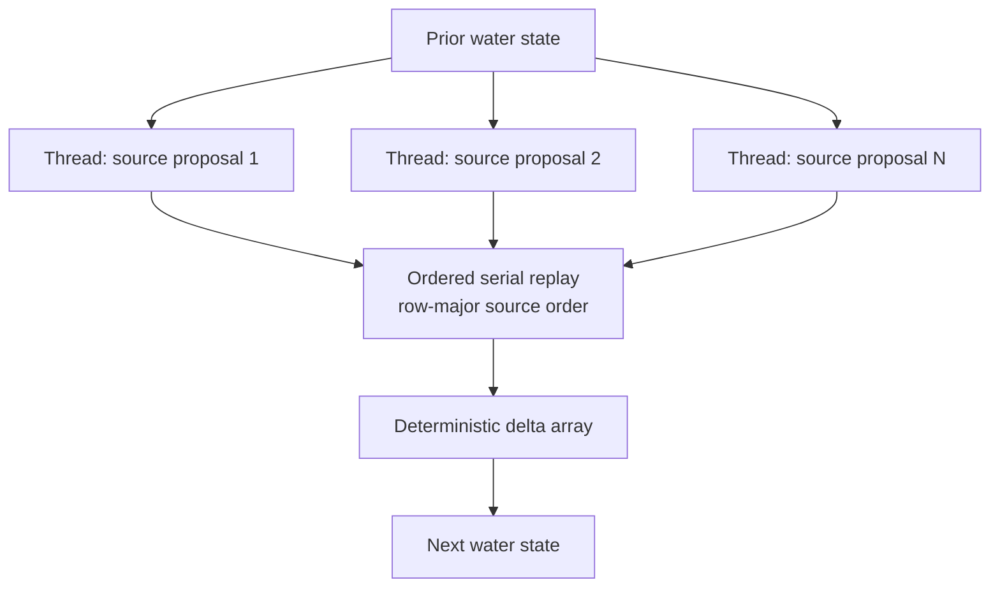

# Experiment Lesson: Deterministic CPU Multithreading For Cellular Water

---

## Chapter 1: The Question

After `Cellular Water Flow (Optimized Round 1)`, the next obvious performance
question was:

```text
Can this simulation use multiple CPU threads without changing its behavior?
```

The answer is not simply "parallelize the loop." Each source cell adds flow
into shared destination cells. If multiple threads update those shared delta
entries directly, their floating-point additions can occur in different orders
from run to run. That would make the simulator faster at the cost of turning
the preserved baseline into an approximate reference.

Our rule remains:

> A performance experiment may change the work schedule, but it must preserve
> the per-tick result unless it is explicitly classified as a new model.

---

## Chapter 2: Why Direct Parallel Writes Are Unsafe

The cellular step has two conceptual operations:

```text
1. A wet source cell calculates water it wants to send to lower neighbors.
2. Those transfers accumulate into a delta array for the next water state.
```

Several source cells may send water into the same receiver cell. In the serial
baseline, those additions occur in a stable order:

```text
source cells: row-major order
neighbors:    left, right, up, down
```

A naive parallel loop would allow additions like these to race:

```cpp
deltas_[neighbor] += inflow;
```

Even if locks or atomic operations prevent corruption, they do not guarantee
the original floating-point addition order. Small numerical changes can then
spread over later ticks.

So direct shared parallel accumulation was rejected for this experiment.

---

## Chapter 3: The Deterministic Two-Phase Design

The new selectable simulator is:

```text
Cellular Water Flow (CPU Parallel Experiment)
```

It divides one tick into two phases.

### Phase A: Parallel Proposal Generation

Each source cell reads the same prior water state and computes its proposed
outflow independently. It writes only into its own private `CellWork` slot:

```text
source index
receiver indices
receiver inflow quantities
total outflow
```

Because one source owns one work slot, this phase has no competing writes.
The order in which source proposals are computed cannot affect their values:
none of them reads another proposal or the pending delta array.

The implementation uses the C++ parallel execution policy:

```cpp
std::for_each(std::execution::par, cell_work_.begin(), cell_work_.end(), ...);
```

### Phase B: Ordered Delta Replay

After every proposal is ready, the simulator returns to a single ordered pass:

```text
replay source slots in baseline row-major order
add neighbor inflows in baseline left/right/up/down order
```

Only this replay writes into `deltas_`. As a result, the floating-point
accumulation order remains comparable to the baseline.

This is the central trade:

```text
parallelize independent calculation
keep shared accumulation deterministic
```

---

## Chapter 4: What Was Added

The CPU-parallel experiment adds:

- a separate `SimpleCellularFluidSimParallel` implementation
- a per-cell work buffer holding static neighbors and computed transfers
- parallel proposal computation
- serial deterministic transfer replay
- `Last step` and `Mean step` timings in its UI
- a hardware-thread readout for context

It does not replace the other simulations. The selector now contains:

```text
Cellular Water Flow (Baseline)
Cellular Water Flow (Optimized Round 1)
Cellular Water Flow (CPU Parallel Experiment)
```

Round 1 remains the default while the multithreaded version is evaluated.

---

## Chapter 5: The Cost Of Determinism

This is not guaranteed to be faster.

The parallel experiment avoids unsafe shared writes, but it pays for:

- a larger per-cell work buffer
- a parallel proposal phase
- a second serial replay phase
- parallel scheduling overhead

The approach is most likely to help when many wet cells perform meaningful
flow calculations. It may lose on small isolated puddles, where most cells
quickly discover that they have no useful work.

This is why timing must be captured, rather than assuming that "more threads"
means "faster simulation."

---

## Chapter 6: The Benchmark Harness

A console benchmark target was added:

```text
grannys_house_trials_grass_field_003_fluid_benchmark
```

It uses the same live terrain seed as the application:

```text
1200 x 1200 one-inch cells
```

It compares all three fluid variants under two workloads:

| Workload | Purpose |
|---|---|
| Center pour: radius `11`, depth `22 in` | Sparse, localized activity |
| Uniform rain: depth `1 in` | Broad activity across the field |

The timing protocol is:

```text
5 warmup steps
30 measured steps
3 repetitions
median milliseconds per step reported
```

Median timing reduces sensitivity to a single noisy run. Each workload reports
speedup relative to the preserved baseline.

---

## Chapter 7: Correctness Validation

The same benchmark also runs a correctness pass. For each scenario it:

1. initializes the baseline and each candidate from identical terrain
2. injects identical water
3. advances both by one tick
4. compares every cell's water depth bit-for-bit
5. repeats through step `30`

The expected outcome for a semantics-preserving experiment is:

```text
Exact state: PASS
```

If the CPU-parallel simulator is faster but does not pass the exact comparison,
it is not accepted as a faster implementation of this simulation. It would
instead be a separate numerical variant requiring its own justification.

---

## Chapter 8: Recorded Timing Results

Timing results recorded from a Release benchmark run on May 27, 2026:

Environment established before the run:

```text
GPU available for later CUDA experiment: NVIDIA GeForce RTX 3070
CUDA compute capability:                8.6
CUDA compiler on current PATH:          not found
```

| Scenario | Baseline ms/step | Round 1 ms/step | CPU Parallel ms/step | Round 1 speedup | CPU Parallel speedup | Exact state |
|---|---:|---:|---:|---:|---:|---|
| Center pour: radius `11`, depth `22 in` | 5.562 | 4.341 | 33.237 | 1.281x | 0.167x | PASS |
| Uniform rain: depth `1 in` | 22.438 | 17.518 | 37.448 | 1.281x | 0.599x | PASS |

---

## Chapter 9: What Comes Next

This CPU Parallel design passed exact-state validation but was substantially
slower in both measured scenarios. Its deterministic proposal and replay
structure is useful knowledge, but it is not a performance winner for the
current workload and should remain an experimental reference.

The later CPU Active Sources experiment showed a better immediate direction:
localized water benefits from skipping dry source calculations, while dense
rain benefits from the Round 1 full scan. The next CPU experiment is therefore
a deterministic hybrid active/full-scan mode before further parallel work.

GPU work remains a separate question:

```text
Can thousands of GPU threads compute flow proposals while an ordered or
otherwise proven merge preserves the reference behavior?
```

The HLSL Compute Phase 1 path now explores that question through D3D12 compute
shaders without requiring CUDA tooling.

The workflow remains:

```text
one experiment
then benchmark
then lesson with measured data
then the next experiment
```

## Sequence Interaction Diagram



## Concept Diagram


