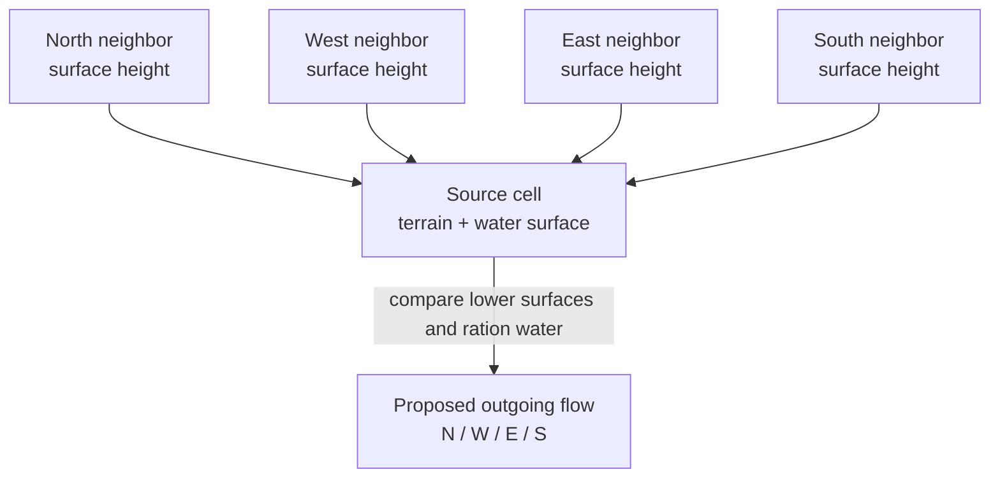
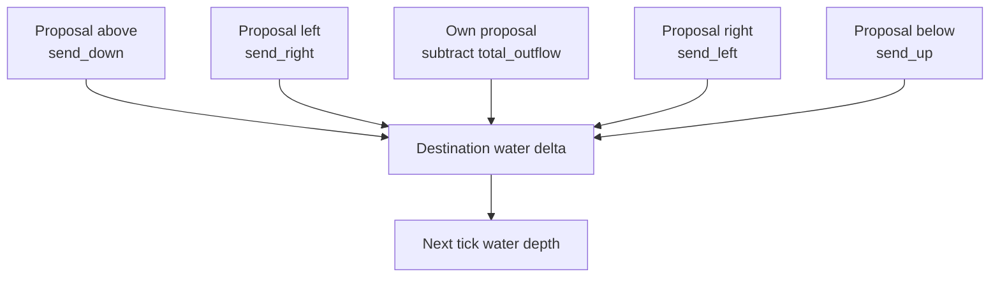
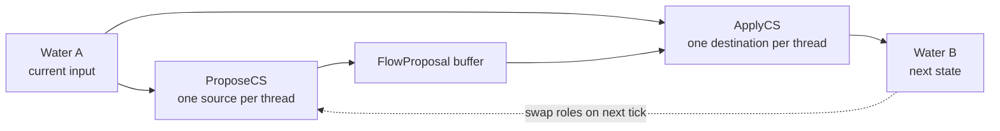
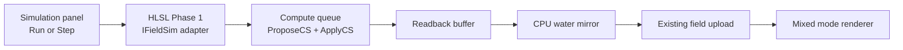
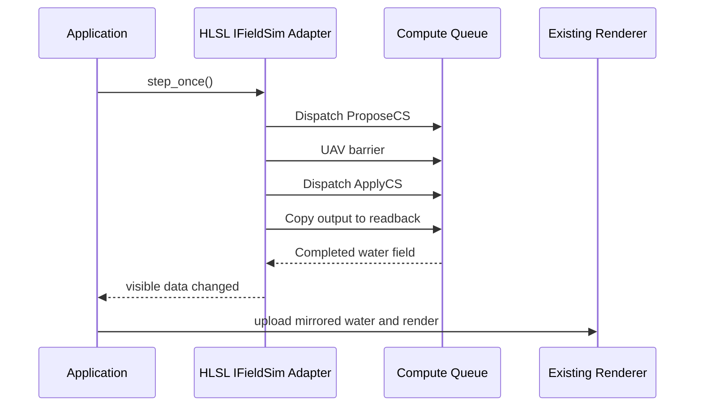
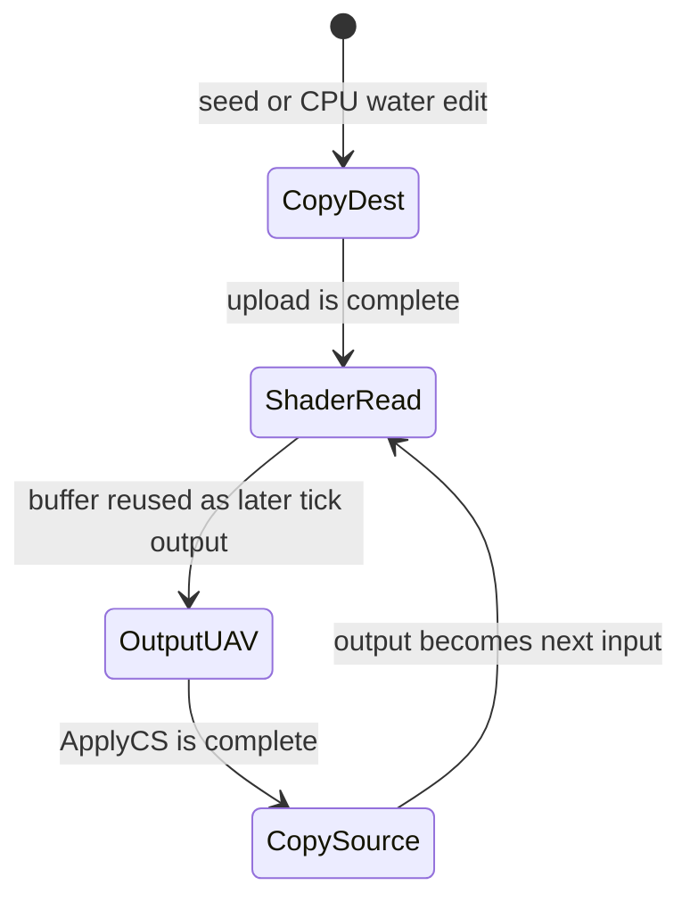
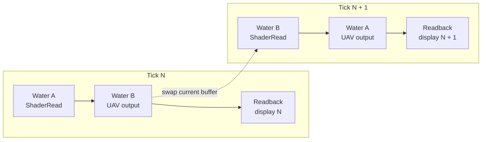
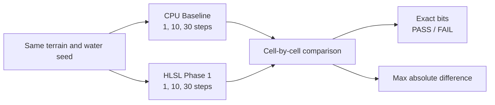

# Experiment Lesson: HLSL Compute Phase 1 For Cellular Water

---

## Chapter 1: Why This Experiment Exists

The CPU work established a disciplined sequence:

```text
keep a trusted baseline
make one optimization experiment at a time
measure actual performance
compare results before adopting a new path
```

The next question is larger than a normal CPU optimization:

```text
Can a shader-language compute path advance the cellular water field massively
in parallel?
```

Phase 1 preserves all CPU simulators and adds two views of the shader
experiment:

1. A standalone GPU benchmark for timing and baseline comparisons.
2. A selectable interactive mode that reads water back after every tick so the
   current renderer can show it.

The guiding question is:

> Can HLSL execute the water tick on the GPU, how fast is the kernel, and how
> closely does its state match the CPU baseline?

---

## Chapter 2: One Cellular Water Tick

The algorithm is still the simple cellular model. Each wet source cell examines
its four direct neighbors, identifies lower surfaces, and proposes transfers
limited by its available water, settling rate, and maximum flow.



Why there are two passes:

- A source cell may want to send water to several destinations.
- Many source cells may send water into the same destination.
- Parallel threads must not perform uncontrolled additions into the same water
  value if we want a clear, testable experiment.

---

## Chapter 3: Pass A, `ProposeCS`

`ProposeCS` launches one shader thread per cell. Each thread:

1. Reads its source water and terrain.
2. Reads the four neighboring surfaces.
3. Applies the same lower-neighbor selection rule as the CPU baseline.
4. Computes local equalization, maximum flow, and settle-rate limiting.
5. Writes only its own `FlowProposal`.

A proposal stores:

```cpp
float total_outflow;
float send_left;
float send_right;
float send_up;
float send_down;
```

No proposal thread writes another cell's water. That makes this pass naturally
parallel.

---

## Chapter 4: Pass B, `ApplyCS`

`ApplyCS` launches one thread per destination cell. A destination gathers the
four proposals that could flow into it, subtracts its own outflow, and writes
its next water depth.



The gather follows the CPU baseline's effective row-major update order as
closely as possible. A CPU and a GPU may still evaluate floating point
instructions differently, so Phase 1 measures equivalence instead of assuming
it.

---

## Chapter 5: Ping-Pong Water Buffers

The two shader passes use alternating water buffers. Input stays unchanged
during a tick, while output becomes the next state.



The GPU resources are:

| Buffer | Role |
|---|---|
| Terrain heights | Static integer terrain input |
| Water A | Current or next water-depth buffer |
| Water B | Alternating next or current water-depth buffer |
| Flow proposals | Outgoing transfers written per source cell |
| Readback water | CPU-visible result for inspection and display |
| Timestamp readback | CPU-visible benchmark timing results |

---

## Chapter 6: Interactive Mode Integration

The live app renders from the `IFieldSim` interface, whose water query is
CPU-readable. Phase 1 therefore uses a compatibility bridge rather than
changing the renderer at the same time as the simulation.

The simulation picker now includes:

```text
Cellular Water Flow (HLSL Compute Phase 1)
```



This is an intentional first integration:

- It makes shader water visible in the existing Trial 3 application.
- It allows direct interactive comparisons against the CPU variants.
- It preserves the CPU baseline and Optimized Round 1 as reference modes.
- It is not the final speed architecture because every visual simulation tick
  waits for GPU-to-CPU readback.

Optimized Round 1 remains the default fluid simulation. HLSL Phase 1 is a
selectable experimental mode.

## Sequence Interaction Diagram



---

## Chapter 7: D3D12 Resource States

D3D12 requires explicit resource roles. A water buffer moves from uploaded
state, to shader input, to compute output on a later tick, and output is copied
for display.





---

## Chapter 8: Files Added And Changed

| File | Purpose |
|---|---|
| `shaders/fluid_compute_phase1.hlsl` | `ProposeCS` and `ApplyCS` compute kernels |
| `fluid_compute_phase1_benchmark.cpp` | D3D12 benchmark host, timestamp measurement, and CPU comparison |
| `sim/simple_cellular_fluid_gpu_phase1_sim.h` | Selectable live GPU adapter with readback for the current renderer |
| `main.cpp` | Registers the GPU-backed mode after D3D12 setup |
| `CMakeLists.txt` | Shader compilation, copies, and standalone benchmark target |

The benchmark executable target is:

```text
grannys_house_trials_grass_field_003_fluid_compute_phase1_benchmark
```

Its generated executable filename is shortened for reliable linking within the
synchronized workspace:

```text
gf003_fluid_compute.exe
```

---

## Chapter 9: Benchmark Protocol

The benchmark uses the same live terrain size:

```text
1200 x 1200 one-inch cells
```

It runs the same two initial water scenarios used for CPU experiments:

| Scenario | Purpose |
|---|---|
| Center pour: radius `11`, depth `22 in` | Localized water activity |
| Uniform rain: depth `1 in` | Broad water activity |

Timing setup:

```text
5 warmup ticks
30 measured ticks
3 repetitions
median timing reported
```

| Metric | Meaning |
|---|---|
| CPU baseline ms/step | CPU wall-clock time inside the baseline step loop |
| Phase 1 kernel ms/step | Timestamp-query duration around Phase 1 compute dispatches |
| Phase 2 tiled kernel ms/step | Timestamp-query duration around tiled Phase 2 compute dispatches |
| Phase 1/2 submit+readback ms/step | Queue execution, fence wait, and validation readback |
| Live interactive tick ms | App-mode dispatch plus per-tick display readback |

The kernel metric indicates raw compute potential. The live interactive metric
includes the bridge into the existing CPU-facing renderer contract.

---

## Chapter 10: Correctness Protocol

For each scenario, Phase 1 compares GPU water state to
`Cellular Water Flow (Baseline)` after:

```text
step 1
step 10
step 30
```

Every cell is checked and the benchmark reports:

```text
Exact at 1/10/30: PASS or FAIL
Max abs difference: largest numerical divergence found
```

Interpret results carefully:

- `PASS` means the tested checkpoint water bits matched the baseline.
- `FAIL` means the shader is not proven to be the same numerical
  implementation.
- A faster but differing shader remains an experimental simulation variant
  until its behavior is characterized.



---

## Chapter 11: Recorded Timing Results

Results are filled only from an executed Release benchmark, never inferred.

Known hardware and tooling context before the benchmark:

```text
GPU:                         NVIDIA GeForce RTX 3070
Reported compute capability: 8.6
HLSL compiler path:           fxc.exe present in Windows SDK
CUDA compiler on PATH:        not found
```

| Scenario | CPU baseline ms/step | Phase 1 kernel ms/step | Phase 2 tiled kernel ms/step | Phase 1 submit+readback ms/step | Phase 2 submit+readback ms/step | Phase 2 vs Phase 1 kernel | Exact at 1/10/30 | Max abs difference |
|---|---:|---:|---:|---:|---:|---:|---|---:|
| Center pour | pending | pending | pending | pending | pending | pending | pending | pending |
| Uniform rain | pending | pending | pending | pending | pending | pending | pending | pending |

---

## Chapter 12: What We Learn From Phase 1

### Outcome A: Faster And Exact

If GPU kernel timing is substantially lower and exact comparison passes, the
next useful design is a renderer path that consumes GPU water directly.

### Outcome B: Faster But Numerically Different

If the kernel is fast but comparison fails, the GPU path may still be useful,
but it becomes a separately characterized simulation experiment.

### Outcome C: Readback Dominates

If live interactive or validation time is high while kernel time is low, the
lesson is architectural: displaying GPU water through CPU readback costs more
than the fluid computation. The next phase should remove that round trip.

---

## Chapter 13: Documentation Rule Going Forward

For future agents and optimization experiments, every variant should record:

1. The reference implementation it compares against.
2. The exact computation or ownership change being tested.
3. The performance hypothesis.
4. The timing protocol and hardware context.
5. Real measured results.
6. State-equivalence results.
7. The decision: retain, integrate, revise, or discard.

Diagrams are part of the experiment record whenever they clarify physics,
buffer ownership, or synchronization. This lesson leaves its timing table
pending until an approved benchmark run supplies real measurements.

Phase 2 is now preserved as a separate lesson and selectable experiment:
`lesson_experiment_cellular_fluid_hlsl_compute_phase2_tiled_resident.md`.
It removes ordinary per-step readback from the visual path and adds a tiled
proposal shader while keeping this Phase 1 baseline available for comparison.
