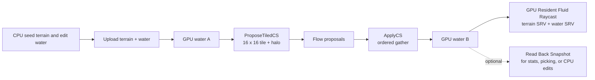
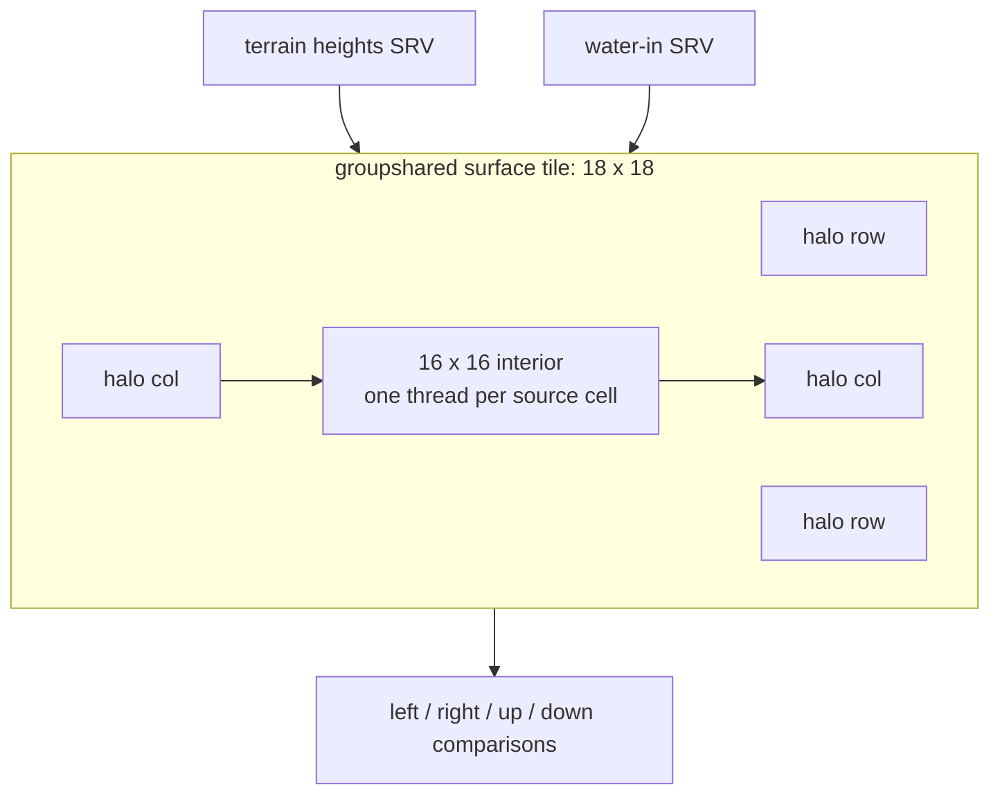
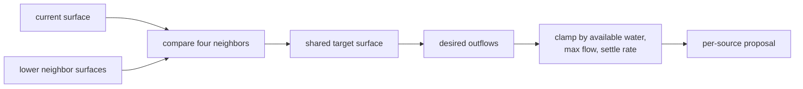
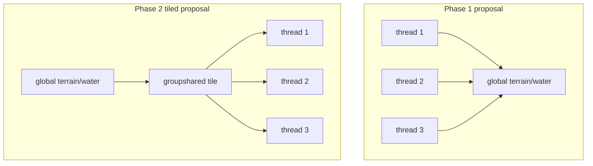
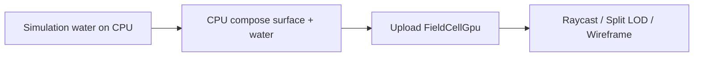
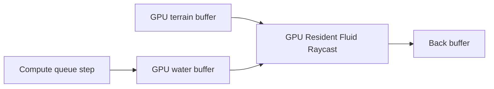
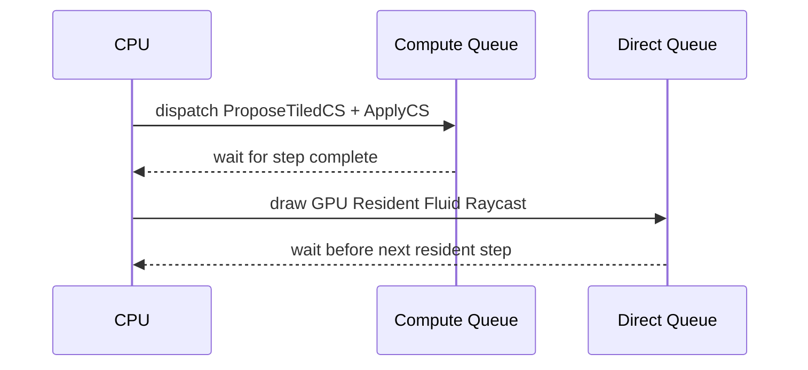

# Experiment Lesson: HLSL Compute Phase 2 - Tiled GPU Resident

## Purpose

Phase 2 keeps the Phase 1 HLSL experiment intact and adds a new selectable
variant:

- The proposal pass reads neighboring surfaces from a `16 x 16` compute tile
  plus a one-cell halo cached in `groupshared` memory.
- The apply pass is intentionally unchanged from Phase 1, so we isolate the
  optimization to the neighbor-heavy part of the algorithm.
- The water buffer can remain GPU-resident after each step.
- A matching renderer reads terrain and water directly from those GPU buffers,
  avoiding the per-step readback that Phase 1 needs for the CPU-facing renderers.

This is still the same simple cellular fluid idea. It is not a new fluid model.
It is an ownership and memory-access experiment.

## Concept Diagram

## Tile And Halo Layout

Each thread group owns a `16 x 16` interior. The shader also loads one neighbor
cell around that interior, producing an `18 x 18` shared-memory tile.

Physics-wise, nothing changes in the proposal math:

## Why Tiling Helps

Phase 1 asks global memory for the same neighbor surfaces over and over. A cell
and its neighbor both need many of the same values. Phase 2 lets the group load
those values once into shared memory, then reuse them for all threads in the
tile.

The expected benefit is lower global-memory traffic in the proposal pass. The
risk is that shared-memory setup and synchronization can cost more than they
save on some GPUs or workloads. That is why Phase 1 remains selectable.

## GPU-Resident Rendering

The normal renderers use a CPU-composed `FieldCellGpu` upload buffer:

The resident path skips that composition on ordinary simulation frames:

The tradeoff is observability. The CPU-side stats and selected-cell readout are
only exact after an explicit snapshot, or after an edit that forces a snapshot.

## Synchronization Shape

The simulation uses a compute queue. The renderer uses the direct graphics
queue. For this first preserved experiment we use conservative synchronization:
wait after frames that involve resident GPU fluid so the next compute step does
not race the previous draw.

The compute queue leaves resident terrain/water buffers in `COMMON` for the
handoff. That matters because `PIXEL_SHADER_RESOURCE` is graphics-only state;
asking a compute command list to transition into it can fail at command-list
close time. The direct queue can then read the buffer through the resident
raycast SRVs.

## Sequence Interaction Diagram

This is deliberately simple and safe. A later version can replace the broad
waits with queue-to-queue fences.

## What Changed

Files touched by this experiment:

- `shaders/fluid_compute_phase2_tiled.hlsl`: tiled proposal shader plus copied
  Phase 1 apply pass for comparison builds.
- `shaders/gpu_fluid_raycast_renderer.hlsl`: wrapper that compiles the existing
  raycast shader against separate terrain and water SRVs.
- `sim/simple_cellular_fluid_gpu_phase1_sim.h`: preserved Phase 1 adapter now
  also constructs the Phase 2 tiled/resident mode.
- `gfx/raycast_renderer.h`: same renderer class can compile the normal or
  GPU-resident raycast PSO.
- `main.cpp`: registers the Phase 2 simulator, registers the resident renderer,
  pairs them in the UI, and expands the shared descriptor heap.
- `CMakeLists.txt`: compiles the new HLSL shader blobs.

## Validation Plan

Correctness checks:

1. Build Debug and confirm all new shader blobs compile.
2. Select `Cellular Water Flow (HLSL Phase 2 - Tiled GPU Resident)`.
3. Confirm the renderer automatically switches to `GPU Resident Fluid Raycast`.
4. Add center water, step once, and confirm visible water changes.
5. Click `Read Back Snapshot` and confirm stats and selected-cell readout update.
6. Switch back to HLSL Phase 1 and CPU Round 1 to confirm preserved modes still work.

Performance checks:

1. Measure Phase 1 compute timing and Phase 2 tiled compute timing on the same
   terrain, water input, and step count.
2. Record whether the resident renderer removes enough CPU upload/readback work
   to improve interactive frame pacing.
3. Record both kernel timing and whole-frame timing, because they answer
   different questions.

## Timing Results

Not measured yet in this lesson. Record real numbers after the next approved
build and benchmark run.

| Scenario | Phase 1 kernel ms/step | Phase 2 tiled kernel ms/step | Phase 2 vs Phase 1 | Exact at 1/10/30 |
|---|---:|---:|---:|---|
| Center pour | pending | pending | pending | pending |
| Uniform rain | pending | pending | pending | pending |

Interactive frame pacing is also pending. Record it separately from kernel
timing because resident rendering changes CPU upload/readback work, not just
shader execution time.

## Lesson Takeaway

Phase 2 is a careful GPU-side optimization pass. It does not change the cellular
fluid rule. It changes where repeated neighbor reads happen and where the live
water state lives. The key engineering move is preserving Phase 1 and adding a
new selectable experiment, so timing and behavior can be compared instead of
argued from memory.
