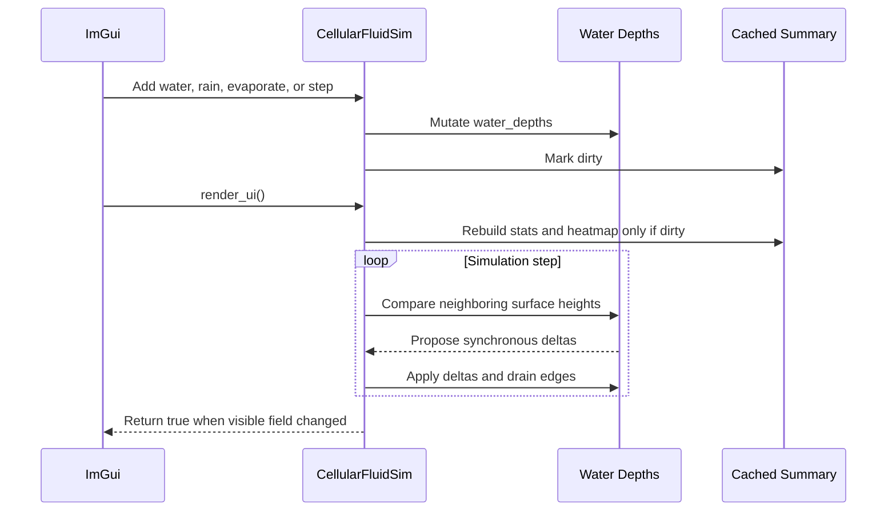
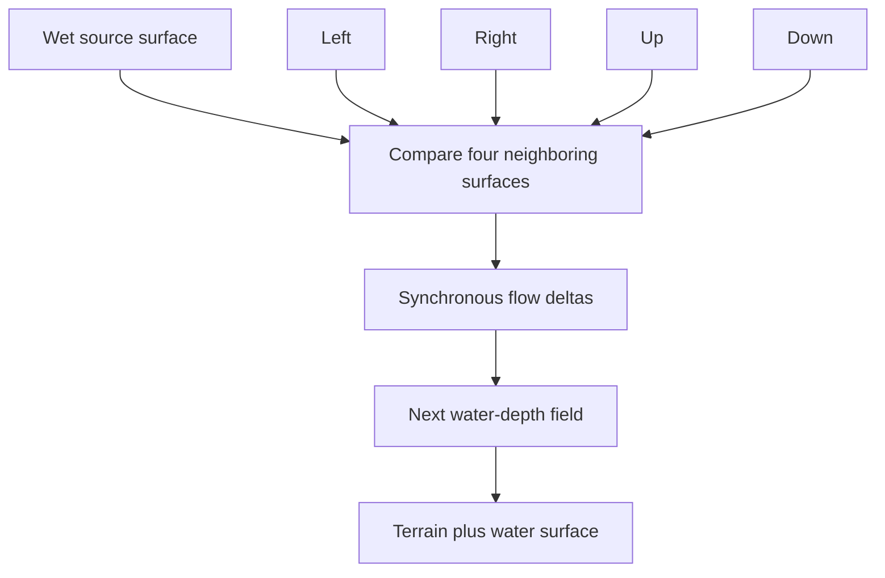

# Experiment: The Cellular Fluid Simulator

---

## Chapter 1: A Different Kind of Simulation

`SimpleErosionSim` models solid material — sand grains that fall irreversibly
from tall columns to shorter ones. The field's total material is conserved; once
moved, it does not move back.

The cellular fluid simulator models something different: water that flows across
a terrain surface, can be added or removed, and seeks its own level. The terrain
itself does not change. Water accumulates in valleys, flows downhill one cell at
a time, and can be evaporated or drained at the boundary.

The difference matters for the renderer. In the erosion simulator the precise
surface is the terrain height. In the fluid simulator
`surface_height_inches_at(x, z)` is the *water surface* — terrain plus
fractional water depth. The column's visual height changes with the water level
even though the terrain underneath is unchanged.

---

## Chapter 2: Precise Fluid Readback

`IFieldSim` retains integer accessors for the frozen learning snapshots, but it
now also has precise render-facing adapters:

```cpp
[[nodiscard]] virtual float surface_height_inches_at(int x, int z) const
{
    return static_cast<float>(height_at(x, z));
}

[[nodiscard]] virtual float water_depth_inches_at(int x, int z) const
{
    return static_cast<float>(water_depth_at(x, z));
}
```

For erosion, these adapters preserve the original integer terrain result and a
zero water depth. The fluid experiment overrides both precise methods so a
half-inch transfer is visible rather than rounded away.

`SimpleCellularFluidSim` overrides it:

```cpp
[[nodiscard]] float water_depth_inches_at(int x, int z) const override
{
    return water_depths_[index_of(x, z)];
}

[[nodiscard]] float surface_height_inches_at(int x, int z) const override
{
    const std::size_t i = index_of(x, z);
    return static_cast<float>(terrain_heights_[i]) + water_depths_[i];
}
```

A renderer that wants to draw water as a separate material can call
`water_depth_inches_at()` to determine how deep the water is and shade those
cells differently. The current renderers upload that value and tint wet
columns blue while using `surface_height_inches_at()` for their top surface.

---

## Chapter 3: Two Arrays, Not One

The erosion field keeps one array: `column_heights`. The fluid simulator keeps
two:

```cpp
std::vector<int> terrain_heights_;  // immutable after reset
std::vector<float> water_depths_;   // fractional liquid depth, changes every step
```

Keeping them separate means the simulator can always recover the original terrain
regardless of how much water has been added. When `reset()` is called:

```cpp
void reset(int new_width, int new_depth, std::vector<int> heights_inches) override
{
    width_ = new_width;
    depth_ = new_depth;
    cycle_count_ = 0;
    terrain_heights_ = std::move(heights_inches);
    water_depths_.assign(terrain_heights_.size(), 0.0f);  // start with no water
    clear_water_summary_cache();
}
```

The terrain is loaded from the seed data. Water starts at zero everywhere, but
once it flows it can hold fractions of an inch. This is important: two cells
with surfaces at `36` and `35` inches can now settle at `35.5` inches each
instead of either forming a stable one-inch step or swapping a whole inch.

---

## Chapter 4: The Flow Rule — Share With Lower Neighbours

Each step scans every wet cell and gathers all four-neighbor surfaces lower
than its own surface. It computes the level the source and those lower
neighbors would share if they equalized locally:

```cpp
shared_surface = (current_surface + sum(lower_neighbor_surfaces))
    / (1 + lower_neighbor_count);
```

Each lower neighbor requests enough water to rise toward that shared surface.
The source then transfers a limited fraction of the requested total:

```cpp
const float total_flow = std::min({
    available_water,
    max_flow_inches_,
    desired_outflow * settle_rate_
});
```

The total transfer is capped by available water, the `Max flow` control, and
the `Settle rate` relaxation factor. Distributing it proportionally among all
lower neighbors removes the old directional streak from selecting only one
lowest neighbor. Fractional depth removes the false stable cone that resulted
when a one-inch drop rounded to zero flow.

All changes are collected in a `deltas` array and applied after the scan loop.
This avoids cells earlier in the scan order seeing updates made to cells later in
the same step — the cellular automaton advances uniformly in logical time and
conserves water except when edge drainage or evaporation is enabled.

---

## Chapter 5: Adding and Removing Water

The ImGui panel exposes four ways to introduce or remove water:

**Add Center Water** — places a disc of water at the grid centre. The radius and
initial depth are set by sliders.

```cpp
if (ImGui::Button("Add Center Water"))
{
    add_water_disc(width_ / 2, depth_ / 2, add_radius_, add_depth_inches_);
    changed = true;
}
```

**Add Rain** — adds one inch of water uniformly to every cell in the field.

```cpp
void add_rain(float depth_inches)
{
    for (float& water : water_depths_)
        water += depth_inches;
}
```

**Evaporate 1 in** — subtracts one inch from every wet cell, flooring at zero.

```cpp
void evaporate(float depth_inches)
{
    for (float& water : water_depths_)
        water = std::max(0.0f, water - depth_inches);
}
```

**Drain edges** — if the `drain_edges_` checkbox is enabled, every step zeroes
the water depth on the four boundary rows and columns. This simulates an open
field where water flows off the edge rather than pooling indefinitely.

All four operations set `changed = true`, which causes the height buffer to be
re-uploaded to the GPU before the next draw.

---

## Chapter 6: The WaterSummary Dirty Cache

Recomputing statistics over the entire grid every frame would be wasteful when
the user is just watching without stepping. The simulator uses a dirty flag
pattern:

```cpp
WaterSummary water_summary_;
bool water_summary_dirty_ = true;
```

`WaterSummary` holds the wet cell count, total water volume, and maximum water
depth. It is recomputed only when `water_summary_dirty_` is set. Any operation
that changes water (step, add, evaporate, reset) calls `mark_water_summary_dirty()`.

`ensure_water_summary_current()` is called at the start of `render_ui()`:

```cpp
void ensure_water_summary_current()
{
    if (!water_summary_dirty_)
        return;
    // … scan all cells, rebuild summary, rebuild heatmap …
    water_summary_dirty_ = false;
}
```

If nothing changed since the last frame, the function returns immediately. The
scan only runs when the data is actually stale.

---

## Chapter 7: The Water Depth Heatmap

The simulator panel includes a 160×160 pixel minimap of the water distribution.
It is drawn using ImGui's retained draw list — a low-level API that lets code
emit raw geometry into an ImGui window:

```cpp
const ImVec2 canvas_pos = ImGui::GetCursorScreenPos();
ImDrawList* draw_list = ImGui::GetWindowDrawList();
ImGui::InvisibleButton("##water_depth_heatmap", canvas_size);
draw_list->AddRectFilled(canvas_pos, …, IM_COL32(24, 32, 34, 255)); // dark bg
```

The minimap samples the water grid at up to 48×48 points. Each sample maps to a
cell in the canvas. Wet samples are drawn as coloured rectangles that shade from
a muted teal at low depth to a brighter blue-white at maximum depth:

```cpp
const float t = std::min(1.0f,
    static_cast<float>(sample_max) / static_cast<float>(max_depth));
const int r = static_cast<int>(30.0f  + 20.0f  * t);
const int g = static_cast<int>(96.0f  + 90.0f  * t);
const int b = static_cast<int>(150.0f + 95.0f  * t);
const int a = static_cast<int>(80.0f  + 175.0f * t);
```

Dry cells receive no rectangle — they remain the dark background. The result is
a real-time map of where water is accumulating, which is often more informative
than watching the 3D render.

---

## Chapter 8: What We Learned

- `surface_height_inches_at()` and `water_depth_inches_at()` are precise
  **default-off extension points** on `IFieldSim`. Integer simulators get free
  adapters; fluid simulators override them so fractional water reaches rendering.
- Keeping **terrain and water as separate arrays** makes it trivial to recover
  the original terrain, report water volume independently, and eventually render
  the two materials with different colours.
- **Fractional water depth** lets liquid surfaces flatten without either a
  one-cell-per-one-inch cone or whole-inch ping-pong transfers.
- **Multi-neighbor local equalization** spreads water symmetrically, while
  `Settle rate` keeps a synchronous cellular pass from responding too violently.
- The **dirty flag pattern** avoids re-scanning the entire grid every frame to
  update statistics. It is the right pattern whenever an aggregate is expensive
  to compute but only changes when the underlying data changes.
- `ImDrawList::AddRectFilled` is the way to draw custom 2D geometry directly
  into an ImGui window without a separate D3D12 pass. It is useful for
  debug visualisations like heatmaps that do not need GPU shaders.

---

## What Comes Next

All five experiments — three renderers and two simulators — demonstrate the full
capability of the pluggable component framework introduced in Steps 9 and 10.
Any new renderer can be added by implementing `IFieldRenderer`. Any new
simulator can be added by implementing `IFieldSim`. The two interfaces are
completely independent of each other: a cellular fluid field can be viewed
through the raycast renderer, the wireframe renderer, or the split LOD renderer
without any additional changes to either side.

## Sequence Interaction Diagram



## Concept Diagram


