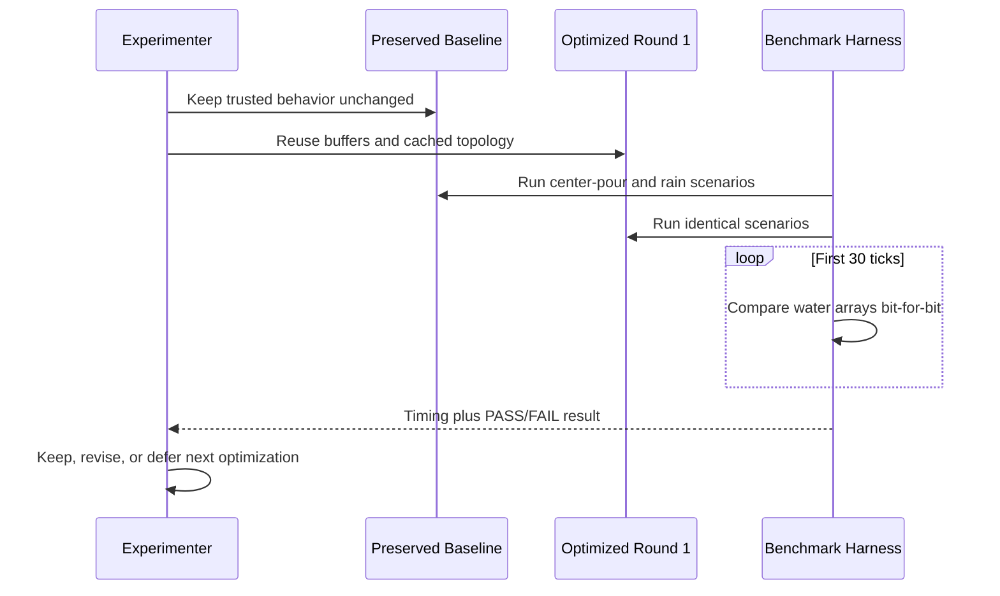
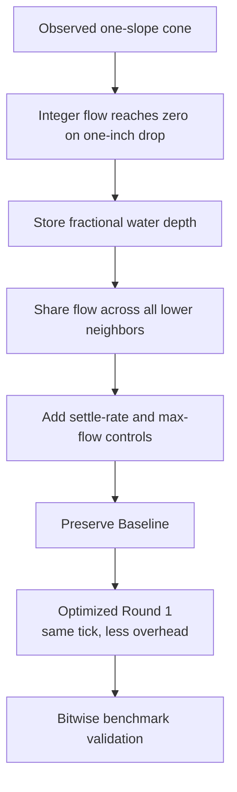

# Experiment Lesson: Upgrading the Cellular Fluid Simulator

---

## Chapter 1: Why We Returned to This Simulator

`grass-field-003` was built as a learning project: begin with a small
simulation, render it clearly, then make improvements only after we understand
what the existing system is doing.

The cellular water experiment had reached exactly the point where that method
paid off. It could place water, draw it as blue surface columns, drain field
edges, and advance deterministically through a cellular step. But when water
was added to the middle of the field, it did something suspicious:

- instead of flattening into a shallow pool, it settled into a steep blue cone
- the cone became stable when its surface dropped one inch per cell
- because the live grid cells are one inch wide, that stable shape had a slope
  of `1`, or a 45-degree stair-step surface

This was not merely a tuning problem. It exposed a mismatch between the
simulation rule and the material being simulated. The rule behaved plausibly
for granular material such as soil or sand. It was wrong for resting water.

The goal of this upgrade was not to turn the experiment into computational
fluid dynamics. The goal was smaller and more useful:

> keep a simple, deterministic, heightfield cellular water simulation, but let
> its water settle and spread like liquid rather than like a pile of grains.

---

## Chapter 2: The Original Flow Model

The original fluid simulator stored:

```cpp
std::vector<int> terrain_heights_;
std::vector<int> water_depths_;
```

Every value was measured in whole inches. Terrain and water were separate, and
the rendered surface was:

```text
surface_height = terrain_height + water_depth
```

During a step, a wet cell examined its four orthogonal neighbors:

```text
left, right, north, south
```

It chose only the single lowest neighbor and used this transfer rule:

```cpp
const int surface_drop = current_surface - lowest_surface;
if (surface_drop < 2)
    continue;

const int flow =
    std::min({available_water, max_flow_inches_, surface_drop / 2});
```

There were several good ideas here:

- terrain and water remained separate
- water responded to effective surface height, not terrain alone
- a delta buffer applied all transfers simultaneously
- `max_flow_inches_` limited how fast a single step could move water

But two choices caused the visible artifact:

1. Water was stored only in whole inches.
2. A one-inch surface difference was explicitly stable.

---

## Chapter 3: Diagnosing the Stable Cone

The live experiment expands each authored one-foot terrain cell into
`12 x 12` fine cells. That means:

```text
horizontal simulation cell width = 1 inch
vertical water unit              = 1 inch
```

Now consider two adjacent water surfaces:

```text
cell A surface = 36 inches
cell B surface = 35 inches
surface drop   = 1 inch
```

Under the original rule:

```cpp
if (surface_drop < 2)
    continue;
```

No transfer occurs. Therefore the solver accepts:

```text
36 35 34 33 32
```

as an equilibrium profile.

Because each horizontal cell is one inch wide, the profile is:

```text
1 inch downward / 1 inch outward = slope 1
```

Applied in all directions from the source, that profile appears as a blue
cone. More exactly, because the solver uses four-neighbor movement rather than
diagonals, its cellular footprint is closer to a stepped diamond pyramid; the
rendered perspective makes it read as a cone.

This is a valid angle-of-repose rule for a toy granular simulator. A sand pile
may support a slope. Resting water may not. Connected water wants a level free
surface unless terrain or a barrier prevents it.

---

## Chapter 4: Why Changing Only the Guard Did Not Work

The first attempted adjustment was to change the no-flow condition:

```cpp
if (surface_drop + available_water < 2)
    continue;
```

The intuition was understandable: a cell with water available should be able
to continue spreading even if the visible surface difference is only one inch.

But that condition was not the last decision in the flow rule. Immediately
after it, the transfer was still computed as:

```cpp
const int flow =
    std::min({available_water, max_flow_inches_, surface_drop / 2});
```

For a one-inch surface drop:

```text
surface_drop / 2 = 1 / 2 = 0
```

because this is integer division.

So the revised guard allowed the code to reach the flow calculation, but the
flow calculation still returned zero. The cone remained.

This was the first major lesson:

> In a discrete simulation, a visible equilibrium can be determined by a later
> quantization operation even after the apparent threshold has been removed.

---

## Chapter 5: Why Adding Water To The Flow Produced Edge Collection

The next attempted transfer formula was:

```cpp
const int flow = std::min({
    available_water,
    max_flow_inches_,
    (surface_drop + available_water) / 2
});
```

This made one-inch water layers move, so the cone no longer looked exactly the
same. However, water began collecting in lines along terrain edges.

The reason is that `available_water` was already included in
`current_surface`:

```cpp
current_surface = terrain_height + available_water;
surface_drop = current_surface - neighbor_surface;
```

Adding `available_water` again double-counted source water:

```text
flow = (surface_drop + available_water) / 2

     = ((terrain + water - neighbor_surface) + water) / 2

     = (terrain - neighbor_surface + 2 * water) / 2
```

On flat terrain, take two cells:

```text
terrain:  0 | 0
water:    2 | 0
surface:  2 | 0
```

The physically useful local equalization is:

```text
flow = 1
resulting water: 1 | 1
```

The modified rule instead computes:

```text
flow = (2 + 2) / 2 = 2
resulting water: 0 | 2
```

It sends the whole water amount across the edge rather than sharing it between
the cells.

At a terrain ledge, this becomes especially obvious:

```text
upper terrain surface:  12 12 12 12
lower terrain surface:   0  0  0  0
```

Water above the ledge is pushed rapidly into the lower receiving row. Because
all changes are synchronous, water received during this pass cannot continue
outward until the next pass. The terrain boundary temporarily behaves like a
collection gutter.

There was a second contributor: each source cell chose only one lowest
neighbor. When multiple directions were equally low, the fixed neighbor scan
order broke the tie implicitly. That encouraged directional streaks and made
edge collection look even more structured.

This was the second major lesson:

> Making water move is not enough. A transfer rule must also avoid moving too
> much water and must avoid arbitrary single-direction bias.

---

## Chapter 6: The Central Mathematical Constraint

For two cells with surfaces `A` and `B`, transferring water quantity `q` from
the higher one to the lower one produces:

```text
new_A = A - q
new_B = B + q
```

To equalize them:

```text
A - q = B + q
2q = A - B
q = (A - B) / 2
```

So the original half-drop idea was not the mistake. It was mathematically the
right basic idea for two cells.

The mistake was trying to perform that calculation in integer inches:

```text
A - B = 1 inch
ideal q = 0.5 inch
integer q = 0 inches
```

There are only two possible outcomes if water remains integer-valued:

- leave the one-inch difference stable, which creates the cone
- transfer a whole inch, which swaps high and low cells and can oscillate

The solver needed a representation capable of expressing the correct answer:

```text
0.5 inches of water
```

---

## Chapter 7: Change One — Fractional Water Depth

Terrain remains stored in integer inches:

```cpp
std::vector<int> terrain_heights_;
```

That is still appropriate. The terrain came from an inch-scale authored field
and does not need sub-inch erosion in this experiment.

Water now uses floating-point inches:

```cpp
std::vector<float> water_depths_;
```

This permits:

```text
before:  surface 36.0 | 35.0
flow:            0.5
after:   surface 35.5 | 35.5
```

Fractional depth is the minimum representation change that lets the simulator
model a genuinely leveling liquid surface.

Importantly, this does not make the simulator complex. It is still:

- a 2D heightfield
- one water depth value per cell
- four-neighbor cellular transfers
- synchronous delta application
- deterministic for the same inputs and controls

---

## Chapter 8: Change Two — Precise Values Through `IFieldSim`

Changing only the internal water vector would not be enough. If the renderer
continued reading integer accessors, the visible water surface would still be
rounded into inch-high stair steps.

The original `IFieldSim` contract exposed:

```cpp
virtual int height_at(int x, int z) const = 0;
virtual int water_depth_at(int x, int z) const;
```

These methods remain in place for compatibility with the frozen step snapshots
and the integer erosion simulator.

Two precise adapters were added:

```cpp
virtual float surface_height_inches_at(int x, int z) const;
virtual float water_depth_inches_at(int x, int z) const;
```

Their default behavior converts the original integer methods to `float`, so
existing simulators need no changes. `SimpleCellularFluidSim` overrides them
to expose its true fractional water state.

The live `main.cpp` path now uses the precise methods when:

- uploading surface height to the GPU
- uploading water depth for blue water shading
- building split coarse/fine rendering data
- displaying selected-column surface and water depth
- selecting the camera focus height

This creates a useful interface pattern:

> Integer experiments keep their simple contract; fluid experiments can expose
> precision without forcing frozen educational snapshots to be rewritten.

---

## Chapter 9: Change Three — Flow To All Lower Neighbors

The old solver selected one destination:

```text
find lowest neighbor
send flow only there
```

That made the result dependent on tie-breaking order. A small mound on level
terrain should spread radially, but a one-neighbor solver tends to form streaks
and preferential paths.

The upgraded solver still checks only four orthogonal neighbors, but it collects
every neighbor whose surface is lower than the current cell's surface:

```cpp
std::array<LowerNeighbor, 4> lower_neighbors;
```

It then computes the local surface that the source and its lower neighbors
would share if they equalized:

```text
shared_surface =
    (source_surface + sum(lower_neighbor_surfaces))
    / (source_count + lower_neighbor_count)
```

For each lower neighbor:

```text
desired_inflow = shared_surface - neighbor_surface
```

The outgoing amount is distributed among those neighbors in proportion to
their desired inflows.

Example:

```text
              neighbor surface 9
                      |
neighbor 9 --- source 12 --- neighbor 9
                      |
              neighbor surface 9
```

Instead of selecting one of the equal neighbors and creating a directional
streak, the source attempts to feed all four symmetrically.

This remains a simple cellular rule. We did not introduce velocity fields,
pressure solvers, particles, diagonals, or global iteration.

---

## Chapter 10: Change Four — Conservative Relaxation Controls

A synchronous cellular solver can still react too strongly if many source cells
push into the same receiving cell during the same step. To keep the behavior
readable, the upgraded rule retains a local flow cap and adds a relaxation
control:

```cpp
const float total_flow = std::min({
    available_water,
    max_flow_inches_,
    desired_outflow * settle_rate_
});
```

The controls mean:

| Control | Meaning |
|---|---|
| `Max flow` | Maximum amount one cell may send during one step |
| `Settle rate` | Fraction of locally desired equalization performed per step |

`Settle rate = 1.0` tries to resolve local surface differences aggressively.

`Settle rate = 0.5` takes a gentler step toward equilibrium. This is the new
default because simultaneous neighboring transfers can otherwise produce more
sloshing than is helpful for this visual experiment.

The total outgoing amount is also capped by `available_water`, preserving a
simple but important invariant:

```text
a cell cannot send more water than it had at the start of the step
```

The delta-buffer design remains in place. Except for intentional evaporation or
edge drainage, transfer steps conserve total water.

---

## Chapter 11: What We Deliberately Did Not Build

This upgrade should not be mistaken for a realistic hydraulic solver.

It still does not model:

- momentum or directional velocity
- acceleration under gravity
- pressure under deep water
- hydraulic jumps, waves, turbulence, or viscosity
- diagonally connected flow
- infiltration, saturation, erosion, or material-specific resistance
- source inflows such as a continuously open cistern

Those may matter later for the Granny's House scenario, but adding them now
would blur the lesson. The current experiment is about surface leveling and
basic downhill spreading.

It is still correctly named `SimpleCellularFluidSim`.

---

## Chapter 12: What To Watch For When Running It

After rebuilding and running the live Trial 3 experiment, compare the new
behavior against the original failure cases.

### Center-water mound on near-flat terrain

Original expected behavior:

```text
stable steep cone with one-inch-per-cell slopes
```

Upgraded expected behavior:

```text
the peak should relax continuously into a wider, flatter pool
```

### Water crossing terrain steps

Original attempted fix behavior:

```text
strong blue collection lines along ledges
```

Upgraded expected behavior:

```text
water may pool behind or below real terrain height changes, but should spread
across equally favorable receiving neighbors instead of forming tie-order streaks
```

### Control tuning

Try:

```text
Max flow:    lower value = slower travel downhill
Settle rate: lower value = calmer leveling, more steps to converge
```

These controls should change speed and visual smoothness, not restore a stable
45-degree water cone.

---

## Chapter 13: Remaining Questions For The Next Pass

This upgrade fixes the clearest representation and routing artifacts, but it
will likely expose the next layer of useful questions:

1. Should water flow into diagonal neighbors, or is four-neighbor movement
   desirable for clarity and cost?
2. Should very thin films below a threshold disappear, remain visible, or be
   treated as soil wetness later?
3. Should a downhill cell favor gravitational travel before lateral leveling,
   or is local surface equalization enough for this experiment?
4. Should the sim report total drained water, so edge drainage can be inspected
   rather than simply deleting water invisibly?
5. When this plugs into the authored Granny map, which materials should slow,
   absorb, divert, or destabilize under water?

These questions are now worth asking because the basic free-surface behavior is
no longer dominated by an accidental granular-cone rule.

---

## Chapter 14: The Larger Engineering Lesson

The most important part of this experiment was not replacing `int` with
`float`. It was following the artifact back to the rule that produced it.

The investigation proceeded in a useful order:

1. Observe a surprising stable shape.
2. Measure the shape: a one-cell drop per one-cell run.
3. Connect that slope to the code's `< 2` transfer threshold.
4. Test a minimal intervention.
5. Notice that integer division still creates zero flow.
6. Test a more forceful intervention.
7. Notice the new edge-collection artifact.
8. Derive the correct two-cell equalization equation.
9. Change the representation and distribution rule that prevented that
   equation from being expressed.

That sequence is the real lesson:

> A simulation artifact is evidence about the model. Patch it only after you
> can explain why the model produced it, or the artifact will simply move
> somewhere else.

---

## Chapter 15: Giving The Simulation A Clock

Once the revised fluid could be stepped manually, the next practical obstacle
was that inspection was tedious. Pressing `Step (x1)` or `Step (x50)` is useful
for controlled experiments, but it is not a comfortable way to watch water
move across a field.

The application now exposes `Run` and `Pause`. While running, it accumulates
elapsed real time and advances the selected simulator at a target rate of:

```text
30 simulation steps per second
```

This is intentionally separate from the rendering frame rate. A fast GPU may
draw many frames between two fluid steps; a slower frame may trigger more than
one waiting step. The fluid rules do not change just because the window is
rendering quickly or slowly.

There is one practical guardrail: catch-up is capped after a long stall. If a
window drag, debugger pause, or temporary delay lasts a long time, the
application does not attempt to execute an enormous backlog of simulation work
in a single frame. That policy affects responsiveness of playback, not the
calculation performed by an individual fluid tick.

This distinction matters:

```text
simulation rule = what one tick means
playback clock   = when the application requests ticks
```

Keeping those separate lets us speed up display and interaction without
quietly changing the physical behavior under examination.

---

## Chapter 16: Why We Preserved A Baseline

After repairing the model, we wanted to make it faster. But an optimization
pass is dangerous if it replaces its own reference implementation. If the
fluid later behaves strangely, we need to know whether the cause was:

- the repaired flow model itself
- an optimization error
- a renderer or timing issue

So the fluid experiment is now split into two selectable simulators:

```text
Cellular Water Flow (Baseline)
Cellular Water Flow (Optimized Round 1)
```

The baseline retains the understandable repaired version. Round 1 is the
current working version and is selected by default.

This is more than a naming convenience. It creates a local control group:

1. reset both simulations from the same terrain
2. apply the same water input and parameter settings
3. step both the same number of times
4. compare their water states and visuals

In an experimental project, keeping the old working implementation nearby is
often cheaper and safer than trying to reconstruct it later from memory.

---

## Chapter 17: Optimization Rule — Faster Work, Same Tick

For Round 1, the definition of a safe optimization was strict:

> The implementation may spend less time producing a tick, but it must not
> redefine what that tick computes.

The following behaviors remain the same as the baseline:

- one water-depth value per cell
- fractional-inch water storage
- the same local surface equalization equation
- the same maximum-flow and settle-rate controls
- synchronous delta accumulation followed by application
- edge draining
- row-major source-cell visitation
- neighbor consideration order: left, right, up, down

The last two points are particularly important because water values are
floating point. Even when the mathematical formula is the same, performing
additions in a different order can slightly change the stored result. That is
why Round 1 did not begin with threads, GPU compute, or unordered active-cell
processing.

---

## Chapter 18: Round 1 Optimization — Reuse The Delta Buffer

Each fluid tick computes transfers into a temporary delta array. The baseline
creates that array afresh on every call to `step_once()`:

```cpp
std::vector<float> deltas(water_depths_.size(), 0.0f);
```

On the live field, that means preparing storage for a very large grid every
tick, including repeated allocation management. The delta values do need to
be reset each tick, but the memory block itself does not need to be replaced.

Round 1 creates scratch storage when the simulator is reset:

```cpp
deltas_.assign(terrain_heights_.size(), 0.0f);
```

Then each tick reuses the same block:

```cpp
std::fill(deltas_.begin(), deltas_.end(), 0.0f);
```

What changed:

```text
memory allocation lifetime
```

What did not change:

```text
the zero delta state at the start of each tick
the calculations written into each delta entry
the order in which those writes occur
```

This is an ideal first optimization: it removes recurring housekeeping while
leaving the simulation equation alone.

---

## Chapter 19: Round 1 Optimization — Separate Interior From Boundary Work

The original readable implementation checks whether each potential neighbor
is inside the grid:

```text
for every cell:
    test left boundary
    test right boundary
    test upper boundary
    test lower boundary
```

But almost every cell in a large field is an interior cell. Interior cells
always have exactly four valid neighbors. Boundary checks are necessary at the
edges, not throughout the entire interior.

Round 1 therefore has two paths:

```text
boundary cells: use cached valid-neighbor lists
interior cells: use the four known neighbor indices directly
```

This reduces repeated boundary logic in the common path. Importantly, it does
not switch to an arbitrary processing order. The optimized loops are arranged
so cells are still processed row by row, left to right, exactly as in the
baseline.

The neighbor order is also kept identical:

```text
left, right, up, down
```

We initially considered caching neighbors for every cell. That would remove
some index calculations, but on a `1200 x 1200` grid it would also create a
large topology table and add memory traffic in the hottest path. Caching only
boundary topology is a better first-round tradeoff: small retained metadata,
simple interior work, and clearer equivalence reasoning.

---

## Chapter 20: Round 1 Optimization — Cache Drain Locations

When edge drainage is enabled, the set of drained cells does not change while
the grid dimensions stay the same. The baseline recomputes those indices from
coordinates each time it drains:

```text
top edge, bottom edge, left edge, right edge
```

Round 1 stores the boundary drain indices when the simulation is reset and
replays them each tick. It even preserves the baseline's harmless repeated
corner writes, because preserving an exact operation sequence gives us the
cleanest comparison target.

This optimization is small relative to the main flow scan, but it has three
advantages:

- it is easy to explain
- it is easy to prove equivalent
- it removes repeated static bookkeeping from each step

---

## Chapter 21: Round 1 Optimization — Reuse Diagnostic Storage

The water-depth heatmap and summary readout are diagnostics, not inputs to the
fluid rule. They show wet-cell count, total water, maximum depth, and a small
sampled map.

The baseline already recomputes them only when water changes, which is a good
design. Round 1 improves the remaining storage work: its heatmap sample vector
is resized if needed and cleared for reuse, rather than being replaced each
refresh.

This optimization must stay one-way:

```text
simulation state -> diagnostics
```

Diagnostics must never become an approximate source for the simulation. That
keeps UI optimizations completely outside the physics being tested.

---

## Chapter 22: Measuring Whether Optimization Helped

An optimization experiment needs observability, not just confidence. Round 1
shows two timing values in its UI:

```text
Last step: time spent in the most recent tick
Mean step: average tick time since reset
```

These readouts help answer immediate questions:

- Does adding broad rain cost more than moving a small puddle?
- Does performance remain adequate while the simulation is running at 30 Hz?
- Does Round 1 visibly reduce step time compared with the baseline?

They are useful measurements, but not a full benchmark. A rigorous comparison
should use the same:

- terrain seed
- water placement
- drainage setting
- max-flow and settle-rate settings
- number of steps
- build configuration

Then record time separately from rendering and UI work.

---

## Chapter 23: Proving We Did Not Change The Simulation

For Round 1, we performed an initial structural equivalence check: for grid
sizes from `1 x 1` through `10 x 10`, the optimized traversal visits every
source cell and every valid neighbor in the same order as the baseline,
including edge cases.

That check establishes something important:

```text
Round 1 did not accidentally reorder the flow accumulation loop.
```

It is not yet a complete numerical regression test. The next correctness tool
should run the baseline and Round 1 from identical conditions, then compare
water-depth state after checkpoints such as:

```text
step 1
step 10
step 100
step 1000
```

For this performance pass, the preferred acceptance criterion is byte-for-byte
equal water state. A merely similar-looking pool is not enough: a visual test
can hide small divergence that grows over many ticks.

Update recorded on May 27, 2026: the CPU fluid benchmark now performs this
bitwise state comparison for each of the first 30 ticks in both a center-pour
and uniform-rain workload. Round 1 passed both scenarios. In the Release run,
it measured `4.341 ms/step` versus `5.562 ms/step` for the center pour and
`17.518 ms/step` versus `22.438 ms/step` for uniform rain, a `1.281x` speedup
in both measured cases.

---

## Chapter 24: Optimizations We Deliberately Deferred

Several techniques may eventually produce larger speedups, but they do not
belong in the first safe pass:

### Active-cell worklists

Processing only wet or recently affected cells could avoid scanning dry
regions. However, a worklist can change when a cell becomes eligible to flow,
or change ordering when multiple neighbors become active. It should be added
only alongside an exact baseline comparison harness.

### Parallel CPU stepping

Multiple CPU threads could process the grid faster, but simultaneous updates
can reorder floating-point additions or introduce write conflicts. A safe
parallel design would need deterministic per-partition storage and an
identically ordered merge.

### GPU compute stepping

A compute shader could move much more water-state processing to the GPU, but
it introduces new precision, synchronization, ordering, and debugging
questions. It may become a valuable new experiment; it is not a transparent
replacement for this baseline.

The restraint here is intentional. Optimizing a simulator without changing it
means that proof obligations rise with ambition.

---

## Chapter 25: The Optimization Lesson

The fluid experiment now has a useful development ladder:

```text
baseline repaired simulation
    -> Optimized Round 1 working simulation
    -> future optimized variants proven against the baseline
```

The important move was not simply to make code faster. It was to preserve a
version we trust, then change only implementation costs that could be reasoned
about locally:

1. remove repeated scratch allocation
2. remove unnecessary interior boundary tests
3. cache static drain and edge topology data
4. reuse UI diagnostic storage
5. measure tick cost in the working variant
6. retain order as part of the simulation's reproducibility contract

This gives us a productive rule for future work:

> When a simulation is still teaching us what it means, preserve a reference
> version and optimize in rounds. Speed becomes trustworthy only when behavior
> remains comparable.

## Sequence Interaction Diagram



## Concept Diagram


