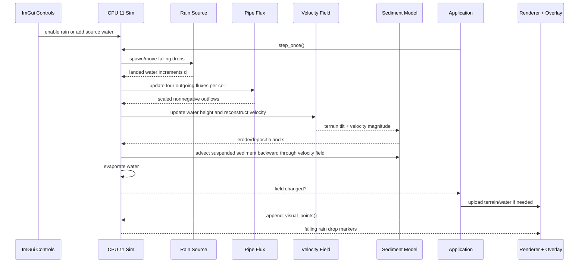
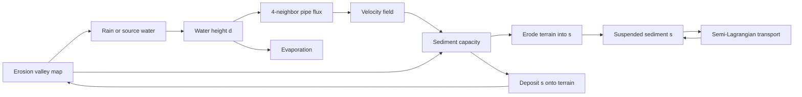

# CPU 11 - Hydraulic Erosion + Rainfall

## Overview

This experiment is now the first paper-derived hydraulic erosion workbench.

The implementation uses **Fast Hydraulic Erosion Simulation and Visualization
on GPU** by Mei, Decaudin, and Hu as the baseline algorithm. The current version
is still CPU-only inside Grass Field 003, but the state layout and update order
match the paper closely enough that a future GPU pass has a clean target.

The simulator owns these per-cell fields:

- terrain height `b`
- water height `d`
- suspended sediment amount `s`
- four outgoing pipe fluxes
- reconstructed horizontal velocity `(u, v)`

The useful Grass Field 003 shell remains:

- the erosion incline/valley seed map
- the selected-cell water source
- visible falling rain drops
- the existing split water/terrain renderer
- phase labels and a single-phase stepping button for inspecting the paper loop
- renderer diagnostic channels for depth, velocity, sediment, and terrain change

## Algorithm

The paper decomposes hydraulic erosion into a repeated sequence. CPU 11 follows
that sequence:

1. Add water from rainfall or a river/source.
2. Update four-neighbor virtual-pipe outflow flux.
3. Scale outgoing flux so a cell cannot send more water than it contains.
4. Update water height from incoming minus outgoing flux.
5. Reconstruct the velocity field from flux.
6. Compute sediment capacity from terrain tilt and velocity.
7. Erode terrain into suspended sediment, or deposit sediment back to terrain.
8. Transport suspended sediment with semi-Lagrangian advection.
9. Evaporate water.

The visible rain drops are a presentation layer over step 1. A drop does not
directly erode land when it hits. It becomes water in the cell where it lands,
then the normal water-flow and sediment steps decide what happens.

## Runtime Sequence

## Workbench Controls

CPU 11 exposes the paper loop as a visible workbench rather than a black box:

- **Last phase / Next phase step** show where the update loop is.
- **Step Next Phase** advances one paper phase at a time: water increment,
  pipe flux, water/velocity, erosion/deposition, sediment transport, then
  evaporation.
- **Sediment capacity**, **Dissolving**, and **Deposition** expose the main
  FastErosion tuning constants.
- **Max terrain step** limits how much terrain can move in one simulation step,
  which keeps early experiments readable while we tune the erosion model.

The split renderer can also switch diagnostic views:

- **Water depth**: opaque blue, with shallow water lighter and deep water darker.
- **Flow speed**: brightens fast-moving water.
- **Suspended sediment**: warms sediment-heavy water toward orange.
- **Erosion/deposition**: marks latest erosion green and latest deposition red.

## Concept Diagram

## Compare Options

Compare CPU 11 with CPU 10, Terrain-Head Pipe Flow.

CPU 10 is the water-control case:

- terrain is fixed
- water pools and flows by free-surface head
- the pipe graph uses eight neighbors
- Manning rough-bed friction helps settle the flow
- no sediment exists

CPU 11 is the FastErosion baseline:

- terrain is mutable
- water uses four-neighbor virtual pipes
- velocity is reconstructed from pipe flux
- sediment capacity is based on terrain tilt and velocity
- suspended sediment is transported by the velocity field
- evaporation is part of the loop

## What To Watch

- Add water at an upstream selected cell and watch whether sediment follows the
  main water path.
- Enable rainfall at low intensity first.
- Look for gullies forming along sustained flow directions.
- Look for sediment deposition where water slows or evaporates.
- Use Reset Active before judging a new tuning pass.

## Current Limitations

- This is CPU-only even though the paper is designed for GPU multipass updates.
- Rain drop visibility is Grass Field 003 presentation; the paper models water
  increment directly.
- The current implementation has one terrain material, not Stava-style layers.
- Stava's force/dissolution split is not implemented yet.
- Stava's material slippage/talus step is not implemented yet.
- Parameters are exposed because they are still initial guesses and need visual
  tuning against the paper behavior.

## What We Learned

- FastErosion PG07 gives the correct baseline order for this experiment.
- The velocity field is not optional; erosion and sediment transport depend on
  it directly.
- Four-neighbor flux keeps the baseline closer to the paper than the previous
  eight-neighbor terrain-head experiment.
- Stava 2008 should be layered on after the baseline is behaving: first force
  versus dissolution, then material slippage, then layers.
