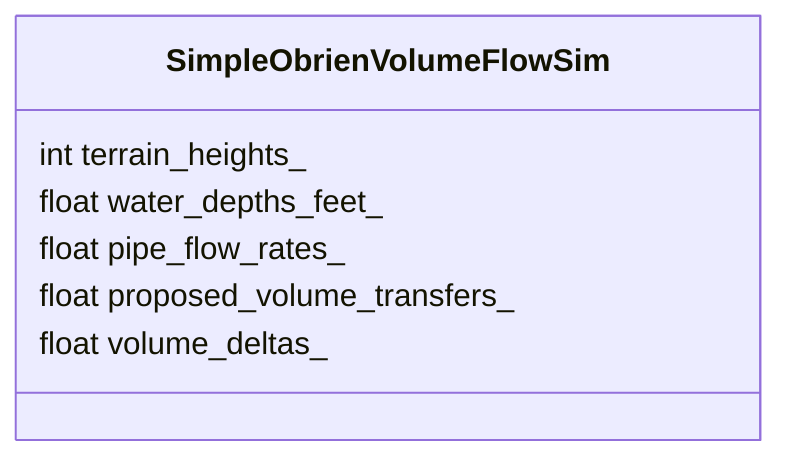
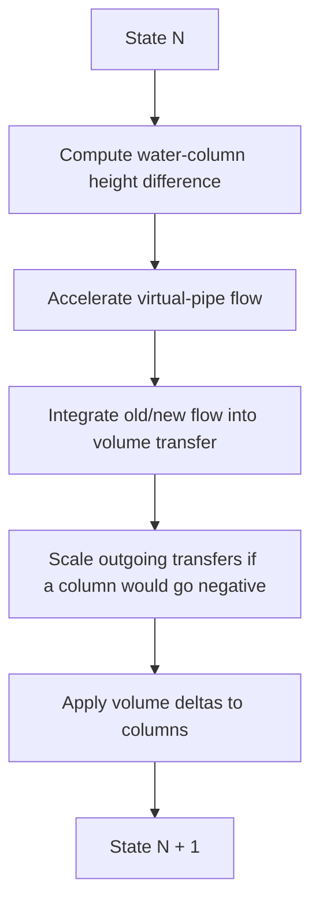
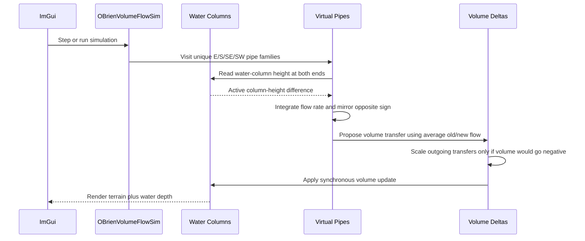

# Experiment Lesson: O'Brien Volume Flow

## Purpose

This is the paper-faithful branch of the O'Brien/Hodgins exploration.

The earlier `Virtual Pipe Fluid` experiment borrowed the useful idea and added
game-feel controls. This experiment is narrower on purpose: it recreates only
the paper's main volume subsystem.

Included:

- vertical fluid columns,
- eight-neighbor virtual pipes,
- hydrostatic pressure from water head,
- signed pipe flow rates,
- trapezoidal volume update from old and new flow,
- conservation by mirrored opposite pipe flow,
- positive-volume correction.

Excluded:

- surface-control mesh,
- external pressure from objects,
- splash particles,
- spray thresholds,
- separate rendering surface.

The renderer still displays:

```text
visible height = terrain height + water depth
```

but the simulation itself is focused on column volume and pipe flow.

## Paper Mapping

The volume model can be read as a hydraulic network:

```text
column volume -> column water height
water-height difference -> pressure difference
pressure difference -> pipe acceleration
pipe acceleration -> signed flow rate
signed flow rate -> volume change
```

This experiment stores water depth in feet and pipe flow in cubic feet per
second. Since the field cells are one foot by one foot, depth and volume are
easy to compare:

```text
volume = water_depth * cell_area
cell_area = 1 ft^2
```

Terrain height is used for rendering only in this experiment. The paper's
volume section defines pressure from the height of the fluid column, not from a
terrain-following hydraulic head. That keeps this branch focused on the
published volume-flow section rather than adding a separate terrain/wetting
model.

## State



Each cell has eight possible pipe directions:

```text
E, W, S, N, SE, NW, SW, NE
```

The implementation computes the four unique edge families:

```text
E, S, SE, SW
```

and mirrors the opposite side:

```text
Q(A -> B) = -Q(B -> A)
```

That is the incompressible-flow symmetry the paper calls out.

## Step Loop



The key difference from the earlier game-feel pipe experiments is that this
branch intentionally does not expose solver sliders. The internal equation
constants exist because the paper's equations require them, but the experiment
does not turn them into game-feel controls.

The paper later mentions damping as an adjustable implementation parameter.
This stripped-down branch leaves damping out of the core flow update so the
experiment stays focused on equations (1) through (9).

## Sequence Interaction Diagram



## Interaction

| Control | Meaning |
|---|---|
| Add Water at Target | Adds the fixed starting water sample at the selected cell, or field center if no cell is selected |
| Step (x1) | Advances the paper volume update once |
| Step (x25) | Advances the same update twenty-five times for quick observation |

Boundary pipes are closed walls in this first recreation. The paper allows
other boundary conditions, but wall boundaries keep this branch focused.

## Paper Constraints

The only stabilization-like correction intentionally kept here is the one in
the paper's volume section:

```text
if a column would go negative, scale back the outgoing pipes from that column
```

That correction is not a game bumper. It is the paper's way of enforcing the
physical requirement that a water volume cannot be negative.

The panel still reports conservation-oriented observations like total volume,
wet cell count, max depth, and max pipe flow. It does not expose `max flux`,
`max out/cell`, CFL controls, pipe resets, evaporation, rain, or user-tunable
damping.

## Implementation Files

| File | Purpose |
|---|---|
| `sim/simple_obrien_volume_flow_sim.h` | Paper-section CPU `IFieldSim` implementation |
| `main.cpp` | Registers CPU 09 and connects lesson buttons |
| `LESSON_CATALOG.md` | Adds CPU 09 to the experiment ladder |
| `lesson_experiment_obrien_volume_flow_sim.md` | This lesson |

## Takeaway

This is the clean comparison point:

```text
What does the paper's volume subsystem do before we add surface modeling,
spray, object pressure, or game-feel clamps?
```

That makes it a good baseline for judging the more playful water branches.
