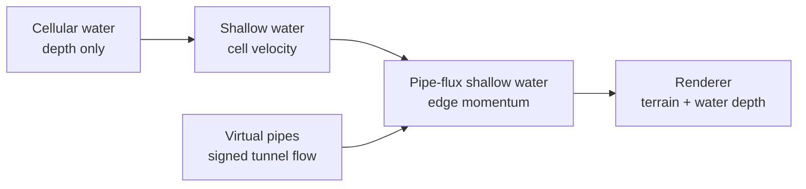
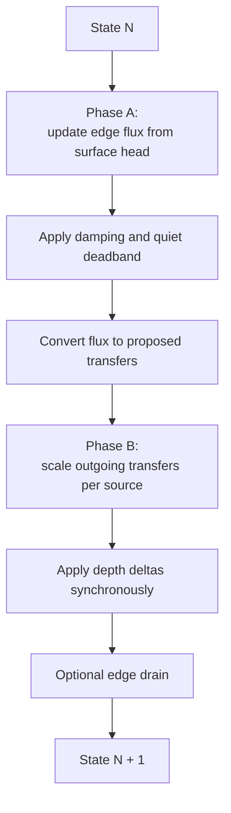
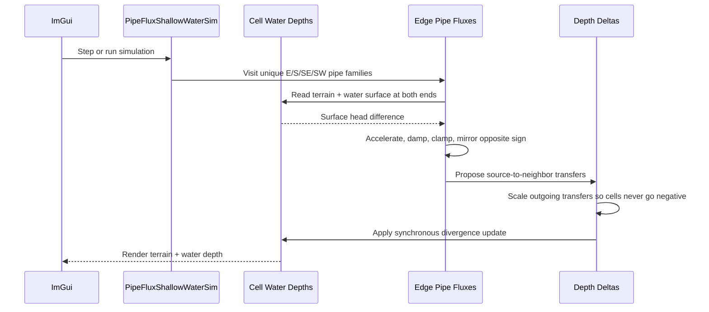

# Experiment Lesson: Pipe-Flux Shallow Water

## Purpose

This is Experiment 2 in the new fluid branch.

The cellular fluid baseline is preserved as the simple reference. The original
shallow-water heightfield proved that storing velocity in cells gives water
memory, but it also revealed an uncomfortable failure mode: it can stabilize
into chunky, blocky puddle patterns.

This experiment keeps the shallow-water goal but changes where momentum lives:

```text
cell-centered water depth + edge-centered pipe flux
```

That means cells store how much water they contain, while each connection
between neighboring cells stores signed flow momentum.

## Concept Diagram



## State

Each cell stores:

```text
terrain_height_inches
water_depth_inches
```

Each pipe/edge stores:

```text
signed flux in inches per step
```

The simulator currently stores eight possible directions per cell:

```text
E, W, S, N, SE, NW, SW, NE
```

but it computes only four unique edge families:

```text
E, S, SE, SW
```

That covers every undirected connection once. The opposite side is written with
the negative value:

```text
flux(A -> B) = -flux(B -> A)
```

The default mode uses four-neighbor flow. Diagonal pipes are exposed as an
opt-in stress test because diagonal flow can look better, but it also makes
stability tuning more sensitive.

## Step Loop

Each tick has two phases.



The important difference from the older shallow-water experiment is that the
velocity is no longer a value sitting inside the cell. Momentum belongs to the
connection between two cells.

## Sequence Interaction Diagram



## Controls

| Control | Meaning |
|---|---|
| Pressure scale | How strongly surface-height differences accelerate pipe flux |
| Time step | How much time one logical tick advances |
| Pipe conductance | How much the pipe responds to pressure each tick |
| Flux damping | How much pipe momentum survives each tick |
| Settle deadband | Surface difference ignored as "close enough" |
| Max flux | Safety clamp for one pipe's signed flow |
| Max out/cell | Safety clamp for total water leaving a source cell |
| Diagonal pipes | Enables the four diagonal edge families |
| Drain edges | Lets water leave through the boundary |
| Zero Pipe Momentum | Clears edge momentum without removing water |

This is still a game-feel model, not a claim of full physical correctness. The
sliders are part of the experiment.

## Why It Should Stabilize Better

The previous shallow-water model stored velocity per cell. A cell velocity does
not naturally know which neighbor it is exchanging with, and the model can
leave alternating local patterns behind.

Pipe flux is more localized:

- one edge has one signed flow,
- that flow is driven by the two surfaces it connects,
- equal and opposite flow is maintained across the edge,
- outgoing transfers are scaled before application,
- near-flat edges damp down faster through the quiet deadband.

That does not make it perfect, but it gives us a more coherent place to put
water momentum.

## What To Watch For

Promising signs:

- center pours spread smoothly without immediately becoming checkerboard water,
- water has momentum after it starts moving,
- zeroing pipe momentum visibly calms moving water,
- diagonal pipes make rounder spreading when enabled,
- the sim stays interactive at the one-foot grid scale.

Failure signs:

- pressure scale or timestep causes oscillation,
- damping is so high that the model becomes boring diffusion,
- diagonal pipes create diagonal streaks or too much leakage,
- max outflow clamps constantly, making motion look sticky.

## Implementation Files

| File | Purpose |
|---|---|
| `sim/simple_pipe_flux_shallow_water_sim.h` | New CPU `IFieldSim` implementation |
| `main.cpp` | Registers CPU 08 and points lesson buttons at it |
| `LESSON_CATALOG.md` | Adds CPU 08 to the experiment ladder |
| `lesson_experiment_pipe_flux_shallow_water_sim.md` | This lesson |

## Takeaway

This is the first branch that feels like the intended next foundation:

```text
water depth in cells, water momentum in connections
```

If it behaves well, Experiment 3 can focus on readability and surface features
instead of changing the underlying flow model again.
