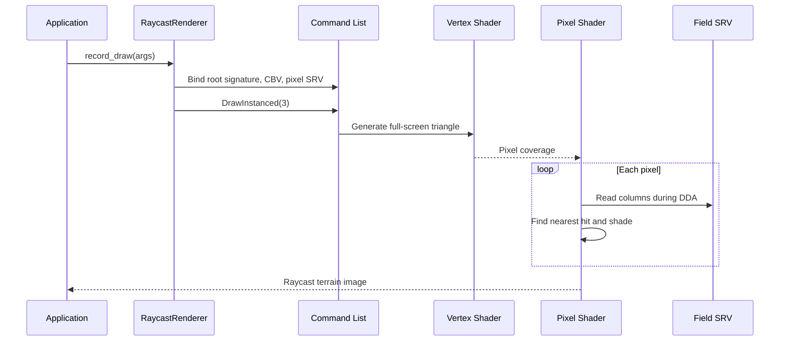
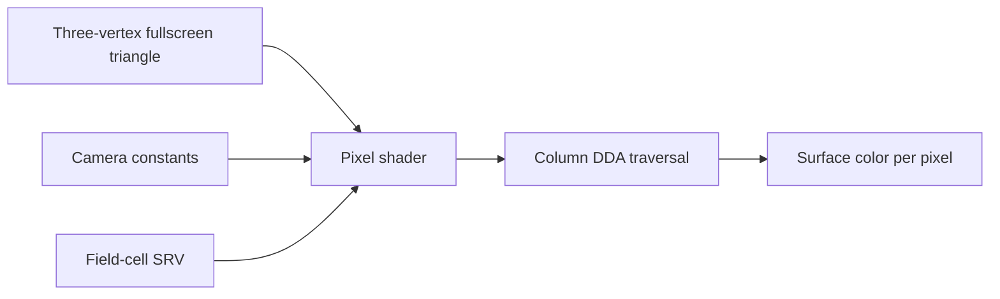

# Experiment: The Raycast Renderer as a Pluggable Component

---

## Chapter 1: What This Experiment Solves

Lesson 10 introduced `IFieldRenderer`, the abstract interface that lets the
application swap renderers at runtime. The *Column Raycast* technique itself was
already described in depth in Lesson 05 — DDA marching, the full-screen
triangle, and the pixel shader's camera ray logic. What Lesson 05 did not cover
is how that rendering approach lives *as a class* inside the pluggable framework.

This experiment documents `RaycastRenderer`: the C++ class that wraps everything
a raycast render pass needs — root signature, pipeline state object, and draw
call — into a single self-contained component.

---

## Chapter 2: What the Renderer Owns

Every concrete renderer is responsible for exactly two GPU objects:

- **Root signature** — tells the GPU what resources the shader expects and where
  to find them. Each renderer may have a different layout.
- **Pipeline state object (PSO)** — bundles the vertex and pixel shaders, the
  rasterizer settings, the blend state, and the depth/stencil configuration.

The application allocates and owns neither. It calls `initialize()` once and
`record_draw()` every frame. `RaycastRenderer` creates both objects in
`initialize()` and keeps them in two `ComPtr` members:

```cpp
class RaycastRenderer final : public IFieldRenderer
{
    Microsoft::WRL::ComPtr<ID3D12RootSignature> m_root_signature;
    Microsoft::WRL::ComPtr<ID3D12PipelineState> m_pso;
    // …
};
```

`ComPtr` is the smart pointer for COM objects. When `RaycastRenderer` is
destroyed (or replaced with a different renderer), both objects release
automatically. No manual `Release()` calls needed.

---

## Chapter 3: The Root Signature — Two Parameters

The raycast shaders need two things from the CPU side each frame:

1. **SceneConstants** — the camera matrices, camera world position, and field
   dimensions. These change every frame as the camera moves.
2. **Column heights SRV** — the structured buffer of column heights that the
   pixel shader samples.

The root signature expresses this as two *root parameters*:

```cpp
D3D12_ROOT_PARAMETER params[2] = {};

// Param 0: inline root CBV at b0 — SceneConstants
params[0].ParameterType             = D3D12_ROOT_PARAMETER_TYPE_CBV;
params[0].Descriptor.ShaderRegister = 0;  // b0 in HLSL
params[0].ShaderVisibility          = D3D12_SHADER_VISIBILITY_ALL;

// Param 1: descriptor table — one SRV at t0 (column heights)
D3D12_DESCRIPTOR_RANGE srv_range = {};
srv_range.RangeType          = D3D12_DESCRIPTOR_RANGE_TYPE_SRV;
srv_range.NumDescriptors     = 1;
srv_range.BaseShaderRegister = 0;  // t0 in HLSL
srv_range.OffsetInDescriptorsFromTableStart = D3D12_DESCRIPTOR_RANGE_OFFSET_APPEND;

params[1].ParameterType    = D3D12_ROOT_PARAMETER_TYPE_DESCRIPTOR_TABLE;
params[1].DescriptorTable.NumDescriptorRanges = 1;
params[1].DescriptorTable.pDescriptorRanges   = &srv_range;
params[1].ShaderVisibility = D3D12_SHADER_VISIBILITY_PIXEL;
```

There is one decision worth examining in detail.

### Inline CBV vs. Descriptor Table

Param 0 is an *inline root CBV* — the GPU virtual address of the constant buffer
is stored directly in the root signature, embedded in the command list. No
descriptor heap slot is needed. This is slightly cheaper than a descriptor table
because it avoids a heap indirection.

Param 1 is a *descriptor table* — a pointer into the shader-visible descriptor
heap. The application already maintains that heap for ImGui, so it just places
the field SRV there and passes the GPU handle at draw time.

### Why PIXEL Visibility for the SRV?

The raycast vertex shader does *not* read the height field. Its only job is to
place three vertices at the correct NDC positions to cover the screen. The height
data is consumed entirely by the pixel shader — one column lookup per DDA step.

Marking the SRV as `SHADER_VISIBILITY_PIXEL` is a *hint to the driver*: the
resource does not need to be visible in the vertex shader. Drivers can sometimes
use this hint to reduce register pressure or bandwidth on certain hardware. It
also documents intent — anyone reading the root signature can see immediately
that the height field is a pixel-shader resource in this renderer.

### Deny Flags

```cpp
desc.Flags =
    D3D12_ROOT_SIGNATURE_FLAG_DENY_HULL_SHADER_ROOT_ACCESS   |
    D3D12_ROOT_SIGNATURE_FLAG_DENY_DOMAIN_SHADER_ROOT_ACCESS |
    D3D12_ROOT_SIGNATURE_FLAG_DENY_GEOMETRY_SHADER_ROOT_ACCESS;
```

The project uses only VS and PS stages. Denying hull, domain, and geometry
shader access to the root signature is a driver hint that those stages are
inactive. The cost of setting this is zero; the potential benefit is a driver
optimization on some hardware.

---

## Chapter 4: The PSO — No Depth Buffer

The pipeline state object mirrors the rendering technique:

```cpp
D3D12_RASTERIZER_DESC raster = {};
raster.FillMode  = D3D12_FILL_MODE_SOLID;
raster.CullMode  = D3D12_CULL_MODE_NONE;   // full-screen triangle, no back face
raster.DepthClipEnable = TRUE;

D3D12_DEPTH_STENCIL_DESC ds = {};
ds.DepthEnable   = FALSE;  // PS manages occlusion via DDA
ds.StencilEnable = FALSE;
```

Two details stand out:

**No depth buffer.** The raycast pixel shader computes depth by marching forward
along the ray until it hits a column. When the PS writes the colour for a pixel,
it has already resolved which column (and which height on that column) is visible.
There is nothing for the rasterizer's depth test to do — the PS *is* the depth
test. So the PSO disables it entirely.

**No culling.** The full-screen triangle covers the entire viewport, and by
definition it faces the camera. Back-face culling is irrelevant here, but it is
set to `NONE` explicitly rather than relying on a default value. Explicit is
always better than implicit when the setting matters.

---

## Chapter 5: The Draw Call — Three Vertices, No Buffer

```cpp
args.cmd->DrawInstanced(3, 1, 0, 0);
```

Three vertices, one instance, no index buffer, no vertex buffer. The vertex
shader receives vertex IDs 0, 1, and 2 via `SV_VertexID` and generates the
three corners of the oversized covering triangle from scratch. The GPU
rasterizer clips the triangle to the viewport and invokes the pixel shader once
per pixel on screen.

This technique was established in Lesson 05. The renderer class packages it
behind the `record_draw()` virtual method so the application never needs to
manage viewport rectangles, scissor rects, or resource bindings directly.

---

## Chapter 6: Binding Order Matters

The `record_draw()` method binds resources in a specific order:

```cpp
args.cmd->SetGraphicsRootSignature(m_root_signature.Get()); // 1. root sig first
args.cmd->SetDescriptorHeaps(1, &args.srv_heap);            // 2. heaps before tables
args.cmd->SetGraphicsRootConstantBufferView(0, args.cb_gpu_va);  // 3. CBV
args.cmd->SetGraphicsRootDescriptorTable(1, args.field_srv_gpu); // 4. SRV table
args.cmd->SetPipelineState(m_pso.Get());                    // 5. PSO
args.cmd->IASetPrimitiveTopology(D3D_PRIMITIVE_TOPOLOGY_TRIANGLELIST);
args.cmd->RSSetViewports(1, &vp);
args.cmd->RSSetScissorRects(1, &scissor);
args.cmd->DrawInstanced(3, 1, 0, 0);
```

D3D12 validates that descriptor heaps are bound before any descriptor table
root parameter is set. Binding the heap after the table silently produces an
error or a device removal. The ordering above is the correct pattern: root
signature first, then heaps, then all root parameters, then PSO, then draw state,
then draw.

---

## Chapter 7: No Settings to Expose

```cpp
void render_ui() override
{
    ImGui::TextDisabled("DDA column raycast — no settings.");
}
```

The DDA step count, shading normal computation, and colour gradient are all
hard-coded in the HLSL. A future version might expose them as sliders — step
granularity, ambient intensity, fog distance. For now, the UI section is a
placeholder that honestly tells the user nothing is configurable.

---

## Chapter 8: What We Learned

- The **raycast renderer** wraps everything the raycast technique needs — root
  signature, PSO, and draw call — in one self-contained class. `Application`
  does not know or care about any of these details.
- An **inline root CBV** stores the GPU virtual address directly in the command
  list, avoiding a descriptor heap slot. This is the right choice for frequently
  updated per-frame data.
- Marking the SRV as `SHADER_VISIBILITY_PIXEL` both documents intent and gives
  the driver a potential optimisation hint.
- Disabling the depth buffer in the PSO is correct when the pixel shader
  performs its own occlusion — adding a D3D12 depth test on top would just
  waste state without doing any work.
- `DrawInstanced(3, 1, 0, 0)` with no vertex buffer is the canonical way to
  invoke a full-screen pass in D3D12.

---

## What Comes Next

The wireframe renderer uses the same `IFieldRenderer` contract but takes a
completely different approach: it builds a real mesh in the vertex shader using
`SV_VertexID` and a structured buffer read, and lets the rasterizer do all the
occlusion work. Comparing the two side-by-side is the point of having a
pluggable renderer.

## Sequence Interaction Diagram



## Concept Diagram


