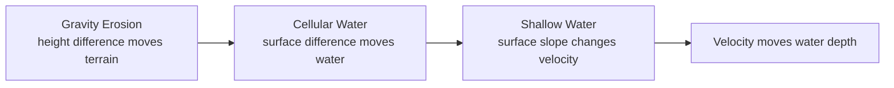
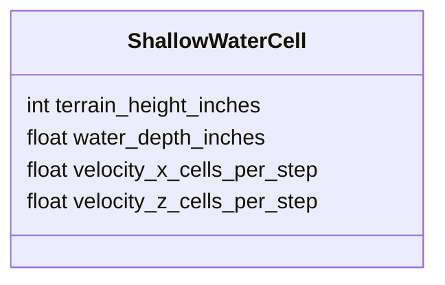
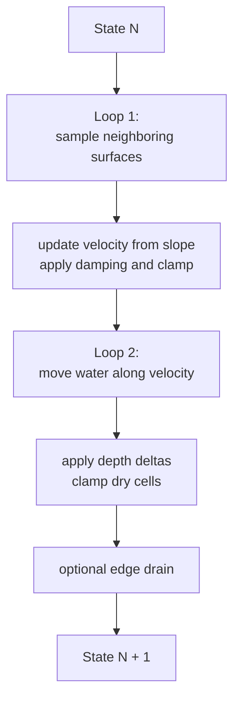
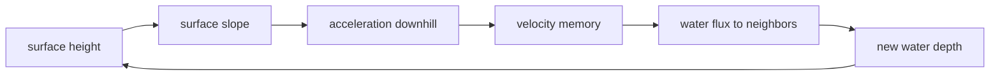
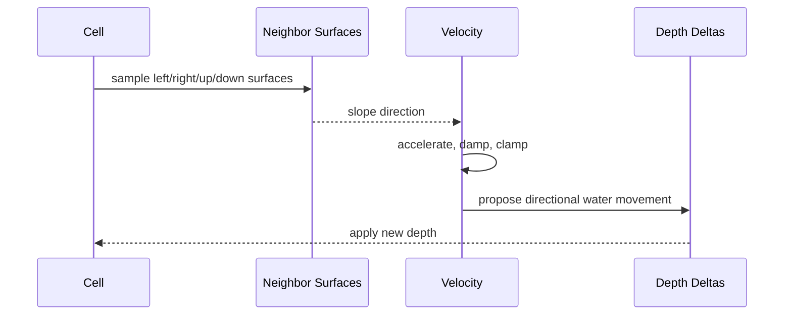

# Experiment Lesson: CPU Basic Shallow Water Heightfield

## Purpose

This starts a new preserved simulation experiment. It is not another
optimization round for cellular water.

The cellular sim stores:

```text
terrain height + water depth
```

The shallow-water experiment stores:

```text
terrain height + water depth + horizontal velocity
```

That one extra idea, velocity, gives the water memory. The current cellular
sim asks "where is the surface lower right now?" every tick. This experiment
asks "how does the surface slope accelerate water, and where does the existing
velocity carry it?"

## Concept Diagram



## State

Each cell keeps the same immutable terrain height used by the other experiments,
plus three mutable fields:



The renderer still sees a simple heightfield:

```text
visible surface = terrain height + water depth
```

So this experiment can plug into the existing renderers without changing the
rendering contract.

This experiment runs at one-foot resolution. Earlier one-inch fluid grids were
useful for fine detail, but shallow water carries velocity state, so the first
playable version uses the original coarse `100 x 100` foot grid to keep the
interaction responsive.

## Step Loop

The first version deliberately uses plain CPU loops:



This keeps the experiment easy to inspect. If the behavior is useful, later
lessons can optimize it.

## Physics Sketch

The current cellular sim directly converts surface differences into transferred
water. Shallow water inserts acceleration and velocity between those ideas:



That loop is why this is the next logical step from gravity erosion. Terrain
slope became material movement. Water surface slope now becomes water
acceleration.

## Current Implementation

The first CPU version uses:

- `water_depths_`: water height per cell.
- `velocity_x_`: horizontal X velocity per cell.
- `velocity_z_`: horizontal Z velocity per cell.
- `depth_deltas_`: scratch buffer for synchronous water movement.

`SimpleShallowWaterSim` overrides `IFieldSim::cell_size_feet()` to return
`1.0f`, so the GF003 application seeds it from coarse GrassField heights and
renders each simulation cell as a one-foot column.

Each tick:

1. Wet cells compare neighboring surface heights.
2. Surface slope accelerates velocity downhill.
3. Damping removes energy so the sim does not grow without bound.
4. Velocity proposes left/right/up/down water movement.
5. Total outflow is clamped by available water and max flow.
6. Deltas are applied synchronously.
7. Optional edge drainage removes water at the field boundary.

## Sequence Interaction Diagram



## UI Controls

| Control | Meaning |
|---|---|
| Gravity | How strongly surface slope accelerates velocity |
| Damping | How much velocity survives each tick |
| Flow scale | How much water velocity can move per tick |
| Max velocity | Safety clamp for velocity magnitude |
| Max flow | Safety clamp for water leaving one cell per tick |
| Drain edges | Whether water can leave the field boundary |

These controls are intentionally exposed because this model will need tuning.
The first goal is to see motion character, not to claim physical correctness.

## What To Watch For

Promising signs:

- Water keeps moving after the local slope changes.
- Pours have visible momentum.
- Water can slosh, overshoot, and settle.
- The same renderer shows more fluid-like motion than cellular relaxation.

Failure signs:

- Water explodes numerically.
- Velocity keeps growing without visible cause.
- Water tunnels through terrain too easily.
- Damping must be so high that motion becomes cellular again.

## Files

| File | Purpose |
|---|---|
| `sim/simple_shallow_water_sim.h` | CPU-only shallow-water experiment |
| `main.cpp` | Registers the experiment as `CPU 06 - Shallow Water Heightfield` |
| `LESSON_CATALOG.md` | Adds the lesson after the existing CPU experiments |

## Takeaway

This experiment starts clean. The old cellular sim remains the simple baseline.
The new shallow-water sim tries the next model up: still a heightfield, still
grid-based, still understandable, but with velocity as state.
