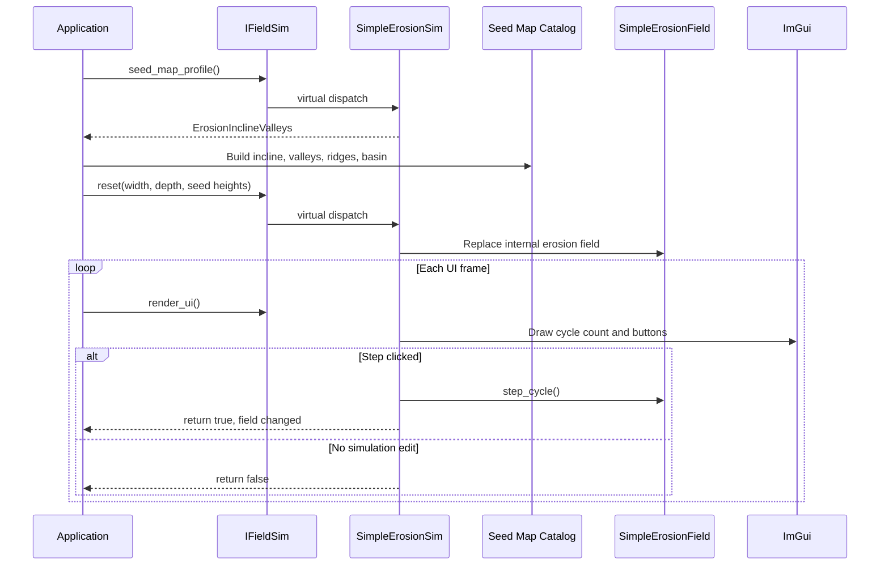
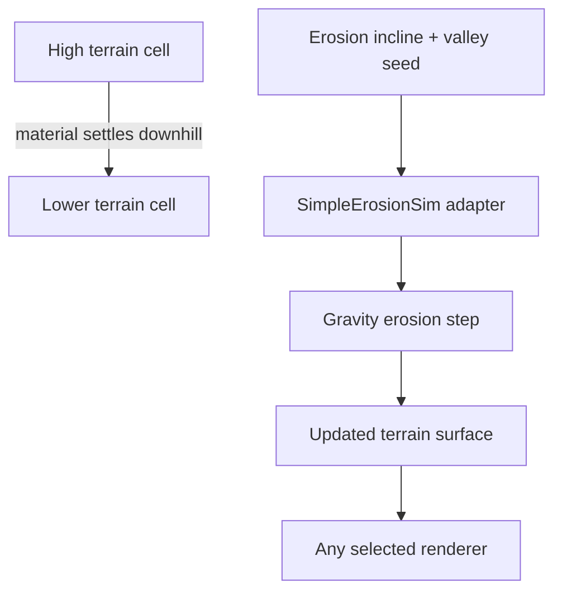

# Experiment: The Simple Erosion Simulator

---

## Chapter 1: Two Different Things Called "Erosion Field"

Before this experiment was written the project already had `SimpleErosionField`
— a class introduced in Step 4 as a pure C++ data type for simulating gravity
erosion. Step 9 then added `SimpleErosionSim`, a thin adapter that wraps
`SimpleErosionField` behind the `IFieldSim` interface.

If that sounds redundant, it is worth understanding why both exist.

`SimpleErosionField` knows nothing about `Application`, `IFieldSim`, or ImGui.
It is a self-contained data structure: it holds a grid of column heights and
knows how to advance the erosion simulation by one cycle. That is all it does.
Its header can be included by anything, tested in isolation, and compiled without
D3D12 or ImGui present.

`SimpleErosionSim` adds the two things `Application` needs that
`SimpleErosionField` does not provide:

1. The `IFieldSim` contract — width, depth, height_at, reset, render_ui.
2. ImGui controls — step buttons, cycle counter, visible in the simulation panel.

This is the *Adapter pattern*: conforming an existing class to an interface it
was not designed to implement, without modifying the original.

---

## Chapter 2: What the Gravity Erosion Algorithm Does

`SimpleErosionField` implements a simple gravity settling model. In each cycle
it scans every column in the grid. If a column is taller than one of its four
direct neighbours by more than a stability threshold (typically one inch), some
material "falls off" to the lower neighbour.

The result is that steep faces erode over time, material accumulates in valleys,
and the field gradually converges toward a flat surface. The cycle count grows
with each step. A freshly reset field starts with the original seed heights; a
field that has run 10,000 cycles is much flatter.

The implementation lives entirely in `SimpleErosionField`. `SimpleErosionSim`
does not duplicate or re-implement any of this logic — it delegates:

```cpp
[[nodiscard]] int height_at(int x, int z) const override
{
    return m_field.height_at(x, z);
}

[[nodiscard]] int width()  const noexcept override { return m_field.width(); }
[[nodiscard]] int depth()  const noexcept override { return m_field.depth(); }
```

Each forwarding method is a single line. The adapter adds no logic of its own to
the rendering contract.

---

## Chapter 3: The Lifecycle Contract — reset()

`IFieldSim::reset()` receives fresh seed heights from the application. It is
called at startup and whenever the user presses Reset in the panel. The adapter
implements it by constructing a new `SimpleErosionField` in-place:

```cpp
void reset(int new_width, int new_depth,
           std::vector<int> heights_inches) override
{
    m_field = SimpleErosionField(new_width, new_depth,
                                 std::move(heights_inches));
}
```

`std::move(heights_inches)` transfers the seed vector into the new
`SimpleErosionField` without copying. The old field is destroyed by the
assignment. The cycle count resets to zero, and the grid reverts to the original
seed heights.

The key design point is that `Application` calls `reset()` through the
`IFieldSim` pointer. It does not know the concrete type is `SimpleErosionSim`.
When a different simulator is substituted, `Application::reset_field()` does not
change.

The adapter also declares which seed map best shows the experiment:

```cpp
[[nodiscard]] SeedMapProfile seed_map_profile() const noexcept override
{
    return SeedMapProfile::ErosionInclineValleys;
}
```

That keeps map choice simulator-owned without turning the app into a runtime map
switcher. Most simulators still use the shared `GrassField` seed. This one asks
for a purpose-built erosion testbed: a whole-map incline, two tributary valleys,
side ridges, roughness, and a lower basin.

---

## Chapter 4: The UI Contract — render_ui() Returns bool

The `render_ui()` method in `IFieldSim` returns `bool`. This is a signal:

- `true` — the simulator mutated visible terrain data this frame. The application
  should re-upload the height buffer to the GPU before the next draw call.
- `false` — nothing changed. Skip the upload.

Without this return value the application would have to upload the height buffer
every single frame to be safe. That is a few kilobytes of CPU-to-GPU copy that
most frames do not need.

`SimpleErosionSim::render_ui()` sets `changed = true` only when a button is
pressed:

```cpp
[[nodiscard]] bool render_ui() override
{
    ImGui::Text("Cycles: %d", m_field.cycle_count());
    ImGui::Separator();

    bool changed = false;

    if (ImGui::Button("Step (x1)"))
    {
        m_field.step_cycle();
        changed = true;
    }

    ImGui::SameLine();

    if (ImGui::Button("Step (x100)"))
    {
        for (int i = 0; i < 100; ++i)
            m_field.step_cycle();
        changed = true;
    }

    return changed;
}
```

The cycle count is displayed above the buttons. This makes the display of
simulation state purely the simulator's responsibility — `Application` does not
read `cycle_count()` directly. `Application` knows only that the UI method
returned true or false.

---

## Chapter 5: Step x1 and Step x100

Two buttons are provided because erosion is a slow process at fine scale.
Pressing **Step (x1)** once on a freshly seeded field changes nearly nothing
visible — the effect of one gravity settling pass across 128×128 cells is
imperceptible.

**Step (x100)** runs 100 cycles in a tight loop on the CPU before returning. At
100 cycles the erosion patterns begin to be visible. At 1,000 cycles the field
has settled noticeably. Watching the wireframe renderer while pressing Step
(x100) repeatedly is one of the clearest ways to see the algorithm working.

Both buttons set `changed = true`, which triggers a GPU buffer re-upload. The
application sees no difference between the two; it just responds to the dirty
signal.

---

## Chapter 6: The Adapter's Private Member

The adapter owns one private member:

```cpp
private:
    SimpleErosionField m_field;
```

This is a value member, not a pointer. The field is embedded directly in the
adapter rather than heap-allocated. When `reset()` is called, `m_field` is
replaced by assignment — no `new`, no `delete`, no `unique_ptr`. The old field
is destroyed by the assignment operator; the new field takes its place.

Default-constructing `SimpleErosionSim` leaves `m_field` in an empty state (size
0×0). The comment in the header is explicit about this:

```cpp
// Default-constructs an empty (unusable) field.
// Must call reset() before any rendering or picking queries are made.
SimpleErosionSim() = default;
```

The application always calls `reset_field()` in its constructor, so by the time
any rendering occurs the field has been populated.

---

## Chapter 7: File Layout

```
sim/
  i_field_sim.h            ← abstract interface (header-only)
  simple_erosion_field.h   ← pure-C++ simulation data type
  simple_erosion_field.cpp ← simulation logic (step_cycle, reset, etc.)
  simple_erosion_sim.h     ← IFieldSim adapter, header-only
```

`SimpleErosionSim` is entirely in the header — the forwarding methods are
one-liners and the UI method is short enough that an out-of-line definition would
add noise. The separation between `simple_erosion_field.h/.cpp` (the algorithm)
and `simple_erosion_sim.h` (the adapter) means the core algorithm can be tested
independently without ImGui present.

---

## Chapter 8: What We Learned

- The **Adapter pattern** conforms an existing class to an interface without
  modifying the original class. `SimpleErosionField` remains a pure, testable
  data type; `SimpleErosionSim` adds the framework glue.
- `seed_map_profile()` lets a simulator request the terrain that best reveals
  its behavior while the application keeps one reset path.
- `render_ui()` returning `bool` is a **dirty flag** mechanism: it lets the
  simulator signal when a GPU re-upload is actually needed, avoiding a constant
  per-frame upload cost.
- Using a **value member** (`SimpleErosionField m_field`) rather than a pointer
  is correct when the object is always present and the reset operation can be
  expressed as an assignment.
- Owning all simulation-specific UI logic inside the simulator class means
  `Application` never needs to be updated when a new simulator type is added.

---

## What Comes Next

`SimpleErosionSim` handles one kind of simulation: sand grains falling
downhill. The cellular fluid simulator handles a completely different physical
process — water flowing between cells — and introduces a new dimension to the
`IFieldSim` contract: `water_depth_at()`.

## Sequence Interaction Diagram



## Concept Diagram


