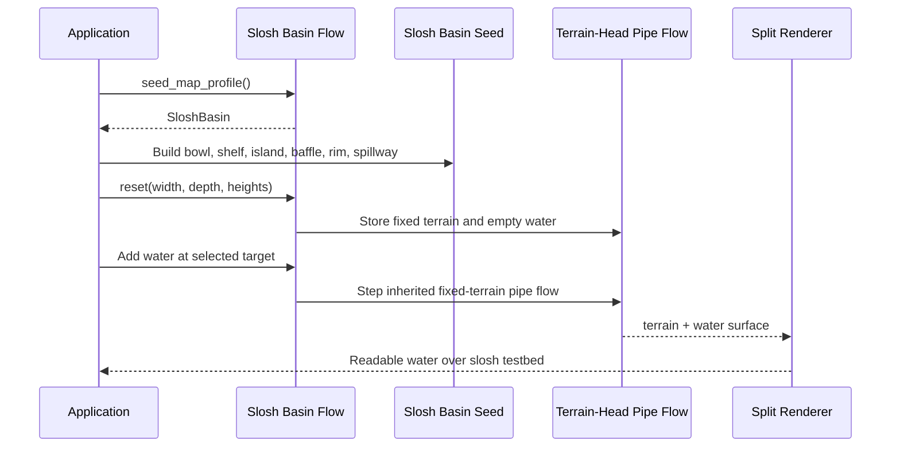
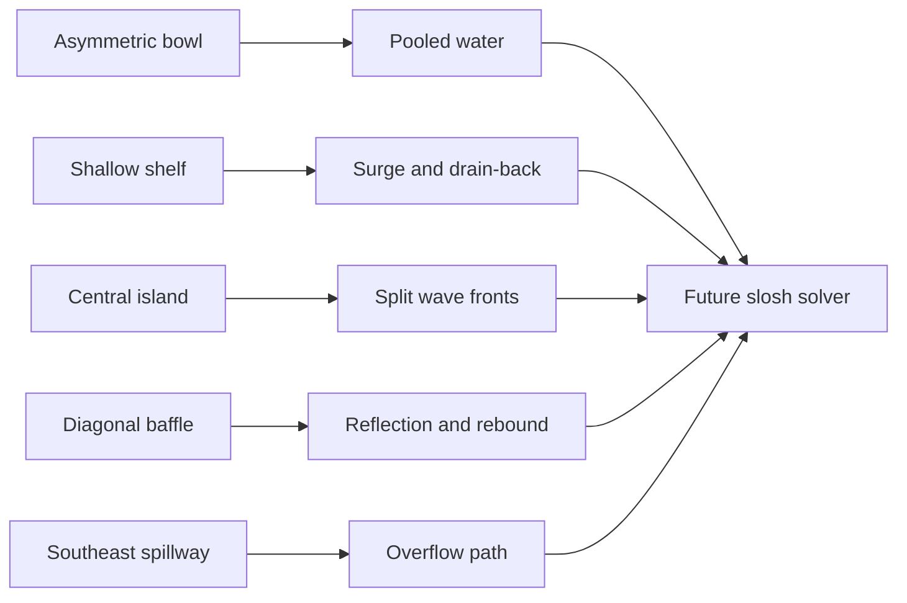

# CPU 12 - Slosh Basin Flow

## Overview

This experiment starts the slosh branch by returning to fixed-terrain water
flow before hydraulic erosion.

Step one is deliberately terrain-first. The simulator currently wraps the
pre-erosion terrain-head pipe flow model from CPU 10, but requests a new
purpose-built height map:

- a broad asymmetric bowl
- a shallow shelf
- a central island
- a diagonal submerged baffle
- a raised rim
- a southeast spillway notch

The goal is to create a map that makes future slosh motion visually obvious:
water should have places to surge, reflect, split, pile up, and drain back.

## Why This Is Not Erosion

CPU 11 mutates terrain by moving sediment.

CPU 12 does not. The terrain is fixed again. This keeps the question focused:

> Can the water itself feel lively, with inertia and rebound, before we add
> terrain mutation back into the picture?

## Current Implementation

`SimpleSloshBasinFlowSim` is a small wrapper around
`SimpleTerrainHeadPipeFlowSim`.

That means the current solver behavior is inherited:

- one simulation cell is one foot
- water depth lives in cells
- flow lives in virtual pipes
- pressure uses free-surface height, `terrain + water`
- terrain blocks uphill flow until the water surface rises high enough
- boundary pipes are closed walls

The important new piece is `SeedMapProfile::SloshBasin`, which lets this
experiment request terrain that is shaped for slosh and splash testing without
changing CPU 10 or the shared GrassField map.

## Runtime Sequence

## Concept Diagram

## What To Watch

- Add water near one side of the basin and watch whether it crosses the shelf.
- Add water near the island and watch whether the flow splits around it.
- Fill the basin high enough to find the southeast spillway.
- Use the split renderer's water-depth display to judge whether the bowl shape
  reads clearly.

## Next Step

Replace the inherited terrain-head flow core with an explicit slosh solver that
stores face velocities and preserves more water momentum, so pools can overshoot
equilibrium and visibly rebound before damping out.
