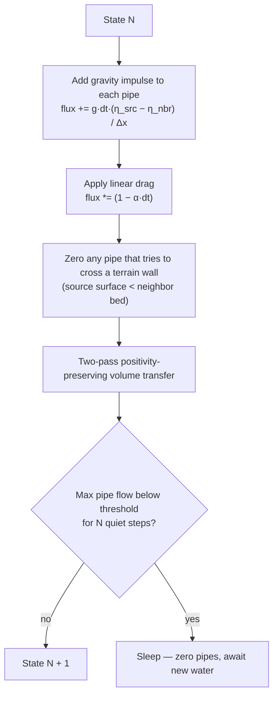
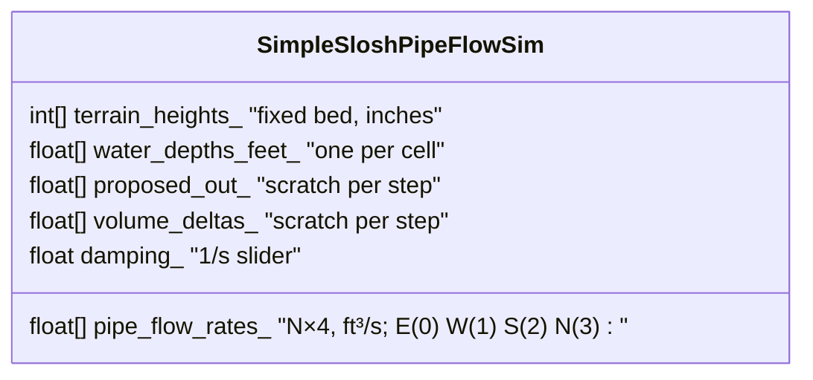
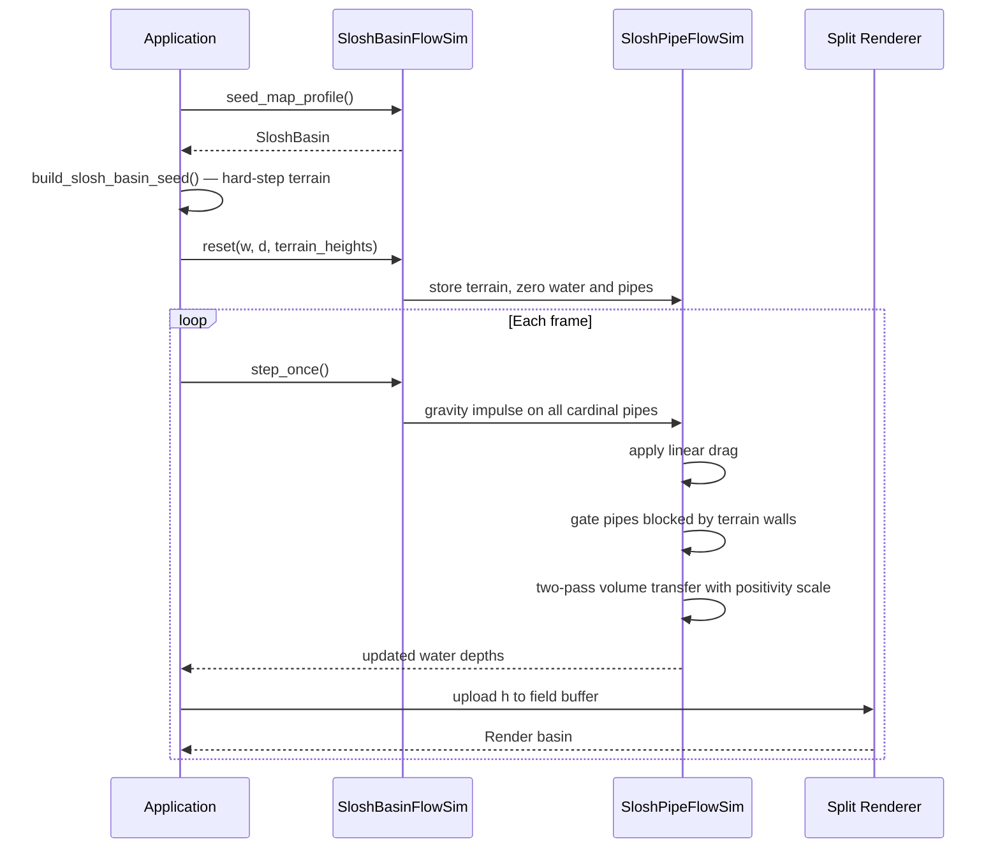

# CPU 12 - Slosh Basin Flow

## Overview

This experiment is the first deliberate step away from terrain-eating simulations
and back toward pure fluid behavior. The question it asks is simple:

> What does it take for water to actually slosh — to carry velocity across a flat
> basin, hit a rigid obstacle at full speed, and visibly rebound?

The answer is in two parts: the physics of the solver, and the shape of the world
it runs in.

## What Changed From CPU 11

CPU 11 mutates terrain. Every step, sediment moves, cliffs erode, and the ground
changes under the water. That makes wave behavior almost impossible to isolate.

CPU 12 locks the terrain and replaces the Manning rough-bed solver with one built
specifically for inertia:

**Solver: `SimpleSloshPipeFlowSim`**

- Four cardinal pipes per cell (E, W, N, S — no diagonals).
- Flow is updated each step from two contributions:
  - a gravity impulse proportional to the free-surface head difference between
    adjacent cells
  - a linear drag that scales the whole accumulated flow rate by `(1 - α·dt)`
- The gate condition still applies: flow from A to B is zeroed if A has no water,
  or if A's free surface does not reach B's terrain bed.

The critical difference is that drag leaves the pipe rate alive between steps
rather than re-deriving it from scratch. A pipe that was flowing east yesterday
is still flowing east today, minus a small fraction. Waves can build up and
carry across the basin.

Compare with the Manning model in CPU 10/11:

```
Manning (CPU 10):     flux ∝ sign(Δh) * |h|^(4/3)       — re-derived every step
Linear drag (CPU 12): flux[t+1] = (flux[t] + g·dt·Δη) * (1 - α·dt)  — accumulated
```

**Map: hard-step terrain**

Every terrain feature in this basin has a vertical face. Nothing is a smooth
hill. This matters because smooth Gaussian hills kill all wave momentum long
before any wave reaches a barrier — the water bleeds energy climbing a ramp,
never arriving at the obstacle at speed.

The basin map:

| Feature | Height | Location |
|---|---|---|
| Basin floor | 16 in | everywhere inside the rim |
| Outer rim | 72 in | 4-cell border on all sides |
| Spillway notch | 50 in | south rim, x = 74–88 |
| Central pillar | 72 in | solid 16×14 ft block, x = 43–58, z = 43–56 |
| East partial wall | 72 in | 3 ft wide, x = 67–69, z = 4–72, gap below z = 73 |
| Diagonal baffle | 72 in | rasterized line from [22, 76] to [60, 28], 2-cell wide |
| West ledge | 34 in | half-height step, x = 4–20, z = 34–66 |

Each of these features produces a genuinely vertical face. Water traveling at
speed arrives at a wall and is gated — its pipe momentum collapses in one step
rather than dissolving over ten cells of approach slope. The resulting pressure
pile-up pushes back the way it came.

## Step Loop



## State Layout



Pipe directions: `E(0) ↔ W(1)`, `S(2) ↔ N(3)`. Opposite of d is `d ^ 1`.
Only the E and S members of each pair are iterated; the reverse is mirrored.

## Runtime Sequence



## What To Try

- Add water near the west ledge. The 34-inch ledge sits above the flat floor
  (16 in) — watch whether a large enough surge overtops it.
- Add water in the northwest corner and watch it travel the flat floor toward
  the central pillar at speed.
- Compare damping slider at 0.02 versus 0.5. At 0.02 waves bounce many times
  before settling. At 0.5 momentum is gone in a second.
- Use the velocity display mode (`Debug Gain` > 0, display set to speed) to
  see where momentum is concentrated after a wave hits the east wall.

## Limitations Of This Solver

Even with good constants, the pipe model has a fundamental ceiling:

- Velocity is pipe-stored, not cell-stored. A pipe is a scalar between two
  neighbors. There is no representation of the wave front itself, only the
  pair-wise flows that constitute it.
- The gate condition that zeros pipes at terrain walls also zeros all the
  stored momentum in that direction. The pressure pile-up is correct but no
  reflected wave is explicitly launched — it emerges only from the rebuilt
  head gradient on the next step.
- Stability and wave speed are coupled through `k_pipe_area`. A smaller pipe
  area is more stable at thin water depths but slows apparent wave propagation.
  There is no pipe area value that gives both stability on a near-dry floor and
  fast, energetic waves.

These limitations motivate CPU 13, where velocity is stored on cell faces
rather than in pipes.

## Next Step

CPU 13 introduces the staggered MAC grid. Velocity components live on cell
faces and are only incremented each step — never re-derived. Wave speed becomes
a physical consequence of depth (`c = √(g·H)`), not a solver parameter.
