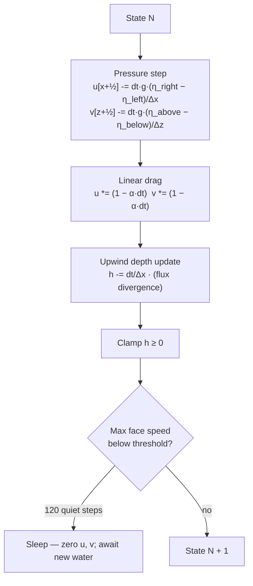
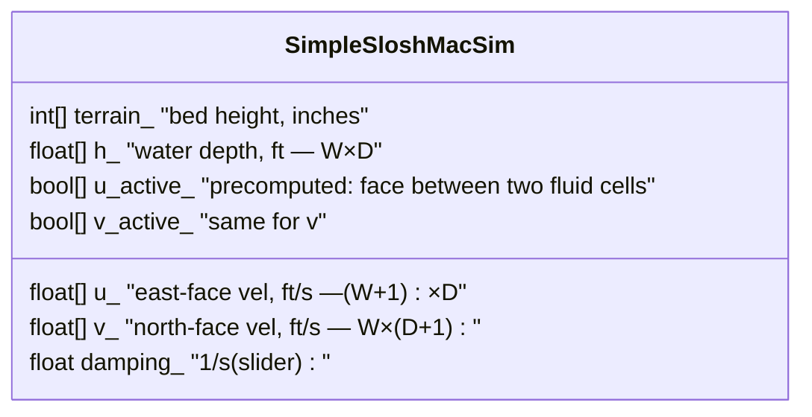
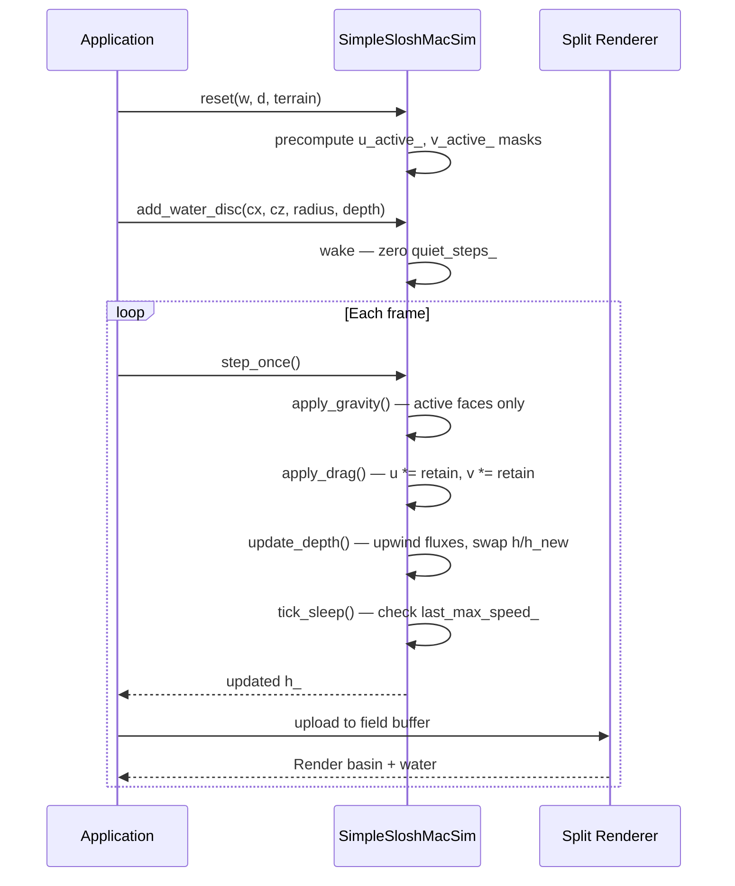

# CPU 13 - Slosh MAC Grid

## Overview

This experiment introduces the **staggered MAC grid** (Marker-and-Cell), the
fundamental data layout behind almost every practical fluid simulation in games
and visual effects. The central question it answers is:

> Why does water in the pipe model run out of velocity before it reaches any
> barrier, and what is the minimum change needed to fix that?

The answer is deceptively simple. In the pipe model, velocity is derived fresh
from pressure every step. There is no stored state for a moving wave front.
In the MAC grid, velocity components live on cell faces and accumulate pressure
impulses over time. A wave launched at the west wall arrives at the east wall
still carrying that momentum — it is the **sum of all the pressure events that
pushed it** since it was created.

## The Core Idea: Where Velocity Lives

The pipe model stores one flow rate per pipe, shared between the two cells it
connects. There is no cell-local representation of how fast water is moving or
in which direction.

The MAC grid stores velocity differently:

```
        ·── v ──·── v ──·── v ──·
        │       │       │       │
        u   h   u   h   u   h   u
        │       │       │       │
        ·── v ──·── v ──·── v ──·
```

- `h` — water depth, at cell centers
- `u` — x-direction velocity, at east/west cell faces (the vertical lines)
- `v` — z-direction velocity, at north/south cell faces (the horizontal lines)

This is the staggered layout. Velocity lives exactly between the pressure
points that drive it, which eliminates the checkerboard instability you get
from storing everything at cell centers. (On a collocated grid, the pressure
gradient between cell i-1 and i+1 skips cell i entirely — a checkerboard
pressure field applies zero net force to anything.)

**Reference:** The staggered velocity layout was introduced in:

> Harlow, F. H. & Welch, J. E. (1965). "Numerical Calculation of
> Time-Dependent Viscous Incompressible Flow of Fluid with Free Surface."
> *Physics of Fluids* 8 (12), 2182–2189.
> https://doi.org/10.1063/1.1761178

Harlow and Welch were modeling a jet of water hitting a plate. The MAC grid
they designed to do it is now the workhorse behind ocean models, climate
simulations, and every water effect in modern visual effects pipelines.

## The Equations

This experiment solves the **linearised 2D depth-averaged shallow water
equations**. "Depth-averaged" means we do not track the vertical water
velocity or pressure variation with depth — the water column is treated as
a single unit with one horizontal velocity. "Linearised" means the nonlinear
advection term `u·∂u/∂x` is omitted (see Limitations below).

### 1. Pressure / Gravity Step

Each face velocity is updated by the free-surface head gradient:

```
u[x+½, z] -= dt · g · (η[x+1, z] − η[x, z]) / Δx
v[x, z+½] -= dt · g · (η[x, z+1] − η[x, z]) / Δz
```

where `η = terrain_height + h` is the free surface elevation in feet and
`g = 32.174 ft/s²`.

If the right cell is higher than the left, the gradient is positive and `u`
decreases — the face is pushed toward the left. On the next step the right
cell's depth has grown (water came in from the left), so the gradient is
smaller. The system finds its own equilibrium.

Nothing in this step looks up a pipe area or a Manning coefficient. The
impulse is pure Newtonian gravity.

### 2. Linear Drag

```
u *= (1 − α · dt)
v *= (1 − α · dt)
```

`α` is the damping coefficient in units of 1/s, exposed as a slider (default
0.02). At 0.02/s and dt = 0.016, each step retains 99.97% of the velocity.
After one simulated second (62 steps), the wave retains `0.9997^62 ≈ 98.1%`
of its original speed — nearly frictionless.

### 3. Continuity / Depth Update

Water depth is updated using the velocities computed above, with first-order
upwind advection to prevent the depth from going negative:

```
For each non-solid cell (x, z):

  flux_east  = u[x+1,z] > 0  ?  u[x+1,z] · h[x,z]
                               :  u[x+1,z] · h[x+1,z]

  flux_west  = u[x,z]   > 0  ?  u[x,z]   · h[x-1,z]
                               :  u[x,z]   · h[x,z]

  flux_north = v[x,z+1] > 0  ?  v[x,z+1] · h[x,z]
                               :  v[x,z+1] · h[x,z+1]

  flux_south = v[x,z]   > 0  ?  v[x,z]   · h[x,z-1]
                               :  v[x,z]   · h[x,z]

  h_new[x,z] = max(0, h[x,z] − dt/Δx · (flux_east − flux_west
                                        + flux_north − flux_south))
```

Upwind rule: when velocity is positive (flow going right or up), use the
source cell's depth; when negative (flow going left or down), use the
destination cell's depth. This is the simplest stable advection scheme and
is equivalent to first-order donor-cell upwinding.

## Wave Speed

The linearised shallow water equations have a known wave speed:

```
c = √(g · H)
```

where `H` is the mean water depth. For `H = 8 in = 0.667 ft`:
`c ≈ √(32.174 × 0.667) ≈ 4.6 ft/s`.

For `H = 24 in = 2 ft`: `c ≈ 8.0 ft/s`.

This is a physical consequence of the equations, not a tuning parameter.
Deeper water means faster waves. The CFL stability condition requires:

```
c · dt / Δx < 1
```

With `dt = 0.016 s` and `Δx = 1 ft`, the limit is `c < 62.5 ft/s`, or
water depth below `~121 ft`. Well inside the safe range for any realistic
slosh scenario.

## Solid Wall Handling

At reset, the solver precomputes a boolean mask `u_active` and `v_active`
over every face. A face is active only if both adjacent cells have terrain
below the solid threshold (60 inches). Inactive faces:

- are skipped entirely in the gravity step (no wasted computation)
- are never written to (they stay at zero permanently)
- produce zero flux in the continuity step

The result is that rigid walls have zero velocity at their surfaces for free,
without any special boundary condition code in the hot loop. The precomputed
mask also makes the hot loop branch-free on the common path.

## Step Loop



## State Layout



Total memory for a 100×100 grid: `h_` 40 KB, `u_` 40.4 KB, `v_` 40.4 KB,
masks 10.2 KB. Well under 1 MB.

## Terrain Map

Shared with CPU 12. All features have hard vertical faces:

| Feature | Height | Location |
|---|---|---|
| Basin floor | 16 in | everywhere inside the rim |
| Outer rim | 72 in | 4-cell border on all sides |
| Spillway notch | 50 in | south rim, x = 74–88 |
| Central pillar | 72 in | solid 16×14 ft block |
| East partial wall | 72 in | gap south of z = 72 |
| Diagonal baffle | 72 in | rasterized line [22,76]→[60,28] |
| West ledge | 34 in | half-height step |

## Runtime Sequence



## What To Try

- **Add Water near the west wall.** Watch the wave travel the flat floor at
  constant speed until it hits the east partial wall. Without a smooth Gaussian
  ramp in the way, it arrives at full speed.

- **Add Water near the diagonal baffle.** Waves split and the halves arrive at
  different walls at slightly different times, producing complex interference
  when they reflect back.

- **Lower damping to near zero.** Even a single pulse will bounce back and
  forth for dozens of cycles. The settling time is very long.

- **Use Step (x100).** At 60fps, each call advances 0.016 s of simulation,
  so a wave at 4.6 ft/s moves about 0.07 cells per frame. Step (x100) jumps
  forward 1.6 simulated seconds at once to see full rebound behavior quickly.

- **Compare CPU 12 vs CPU 13** using the lesson panel's primary/alternate
  buttons. Add water in the same place in both. CPU 12's wave slows and thins
  before it hits the far wall; CPU 13's wave arrives at the same speed it left.

- **Watch the velocity display mode.** Set display to speed and debug gain
  around 0.2. You will see the color change ahead of the visible depth wave —
  the face velocities propagate faster than the depth perturbation because the
  depth is driven by the face velocities, not the other way around.

## Limitations

**No nonlinear advection.** The full shallow water momentum equation includes
`u·∂u/∂x + v·∂u/∂z` — the rate at which the flow carries itself forward. This
term becomes important at large wave amplitudes (when the wave height is a
significant fraction of the water depth). Without it, very large waves do not
steepen, break, or form hydraulic jumps. The waves here are always a bit
gentler than real water would be.

Adding advection requires interpolating the face velocity onto the opposing
face for the cross-component terms, and a stable advection scheme (semi-
Lagrangian or BFECC). That is the natural next step.

**No pressure solve.** The gravity step treats the free surface as the only
pressure source. For the incompressible case this is accurate only in the
long-wave / shallow-water limit where vertical acceleration is small. For
water columns taller than they are wide, a full incompressible pressure solve
(solving a Poisson equation) would be needed.

**First-order upwinding.** The continuity step uses donor-cell upwinding,
which is numerically diffusive: sharp wave fronts spread by roughly one cell
width per step. Higher-order schemes (Lax-Wendroff, MUSCL, or PPM) would
preserve sharper fronts.

## Implementation Files

| File | Purpose |
|---|---|
| `sim/simple_slosh_mac_sim.h` | MAC grid `IFieldSim` implementation |
| `sim/simple_slosh_basin_flow_sim.h` | CPU 12 pipe slosh wrapper (shares terrain map) |
| `main.cpp` | Registers CPU 13, builds the shared slosh basin seed map |
| `LESSON_CATALOG.md` | Adds CPU 13 to the experiment ladder |
| `lesson_experiment_slosh_mac_grid_sim.md` | This lesson |

## Takeaway

The pipe model asks "what does the pressure tell me to do right now?" The MAC
grid asks "how fast was I already going, and how much did the pressure change
that?" The second question is what inertia means. CPU 13 is the smallest
possible experiment that actually has inertia.
