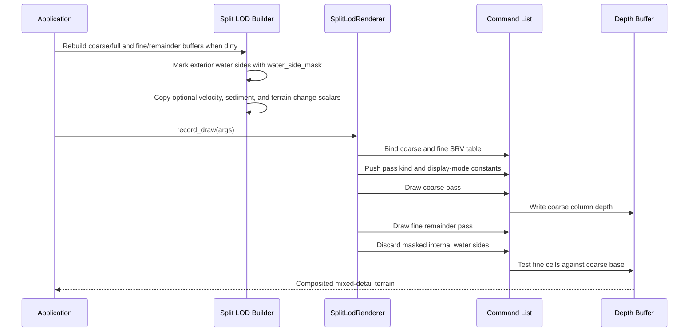
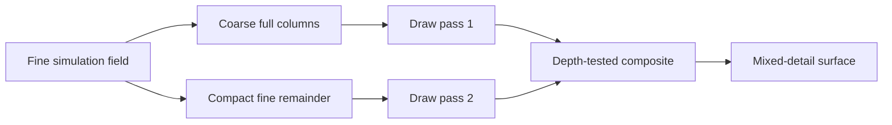

# Experiment: The Split LOD Renderer

---

## Chapter 1: The Problem With One Level of Detail

The raycast and wireframe renderers treat every column identically — each 1-foot
cell gets exactly the same amount of work regardless of whether it contributes
meaningfully to the visible image.

In a field where large areas share similar heights, that is wasteful. A block of
sand that has not eroded at all presents a flat surface. Drawing it with fine
1-foot resolution produces the same image as drawing it with coarser 12-foot
blocks. If we can draw the flat base cheaply and only spend fine-resolution work
where heights actually vary, the total draw cost drops significantly.

The `SplitLodRenderer` is an experiment in that idea. It keeps the simulation
grid at full 1-foot resolution but renders through two passes:

1. **Coarse pass** — one solid column per 12×12 patch of fine cells, drawn up to
   the minimum height shared across that entire patch.
2. **Fine remainder pass** — only the columns that exceed the coarse floor,
   drawn individually to capture the actual height variation.

A depth buffer composites the two passes correctly: the fine remainder sits on
top of the coarse base wherever both cover the same screen pixels.

---

## Chapter 2: Opt-In Flags — Signalling Extra Resource Needs

The basic `IFieldRenderer` interface assumes a renderer needs only the standard
shared resources: the SRV heap, the constant buffer, and the field heights SRV.
The split LOD renderer needs two more things:

- A **depth buffer** (DSV) to composite the two passes.
- Two **split LOD structured buffers** — one for coarse column data, one for
  compacted fine remainder data — each with its own SRV.

The interface exposes two optional virtual methods for this:

```cpp
[[nodiscard]] virtual bool uses_depth_buffer()      const noexcept { return false; }
[[nodiscard]] virtual bool uses_split_lod_buffers() const noexcept { return false; }
```

The default return value is `false`. Renderers that do not need these resources
never override the methods. `SplitLodRenderer` overrides both to return `true`:

```cpp
[[nodiscard]] bool uses_depth_buffer()      const noexcept override { return true; }
[[nodiscard]] bool uses_split_lod_buffers() const noexcept override { return true; }
```

When the application initialises a renderer it checks these flags and allocates
the corresponding GPU resources only if they are needed. This keeps the common
case fast — most renderers incur no extra allocation — while giving advanced
renderers a clean way to request more.

---

## Chapter 3: A Three-Parameter Root Signature

The raycast and wireframe renderers each need two root parameters. The split LOD
renderer needs three:

```cpp
D3D12_ROOT_PARAMETER params[3] = {};

// Param 0: inline CBV at b0 — SceneConstants
params[0].ParameterType             = D3D12_ROOT_PARAMETER_TYPE_CBV;
params[0].Descriptor.ShaderRegister = 0;
params[0].ShaderVisibility          = D3D12_SHADER_VISIBILITY_ALL;

// Param 1: descriptor table — two SRVs at t0 and t1 (coarse + fine buffers)
D3D12_DESCRIPTOR_RANGE srv_range = {};
srv_range.RangeType          = D3D12_DESCRIPTOR_RANGE_TYPE_SRV;
srv_range.NumDescriptors     = 2;           // t0 = coarse, t1 = fine
srv_range.BaseShaderRegister = 0;
srv_range.OffsetInDescriptorsFromTableStart = D3D12_DESCRIPTOR_RANGE_OFFSET_APPEND;

params[1].ParameterType    = D3D12_ROOT_PARAMETER_TYPE_DESCRIPTOR_TABLE;
params[1].DescriptorTable.NumDescriptorRanges = 1;
params[1].DescriptorTable.pDescriptorRanges   = &srv_range;
params[1].ShaderVisibility = D3D12_SHADER_VISIBILITY_VERTEX;

// Param 2: inline 32-bit constants at b1 — PassConstants
params[2].ParameterType            = D3D12_ROOT_PARAMETER_TYPE_32BIT_CONSTANTS;
params[2].Constants.ShaderRegister = 1;  // b1 in HLSL
params[2].Constants.Num32BitValues = 7;
params[2].ShaderVisibility         = D3D12_SHADER_VISIBILITY_ALL;
```

Param 2 is a type not seen in the earlier renderers: **inline 32-bit constants**.
These are seven 32-bit values pushed directly into the command list — no heap
slot, no constant buffer allocation. Some change between the coarse pass and the
fine pass within a single frame, so they must be fast to update.

---

## Chapter 4: PassConstants — Telling the Shader Which Pass

The vertex shader for this renderer must behave differently in the two passes.
`PassConstants` carries the information:

```cpp
struct PassConstants
{
    std::uint32_t pass_kind              = 0; // 0 = coarse, 1 = fine remainder
    std::uint32_t coarse_width           = 0;
    std::uint32_t coarse_depth           = 0;
    std::uint32_t coarse_cell_size_cells = 1;
    float water_alpha                    = 1.0f;
    std::uint32_t display_mode           = 0;
    float debug_gain                     = 4.0f;
};
```

`pass_kind = 0` means the vertex shader should index the coarse SRV (at `t0`)
and generate solid box geometry for each coarse column.

`pass_kind = 1` means the vertex shader should index the fine remainder SRV (at
`t1`) and generate geometry for only the partial-height fine columns that sit on
top of the coarse base.

The shader chooses between branches based on `pass_kind`. Using a 32-bit
constant for this is cheaper than uploading a new constant buffer or keeping two
PSOs. The root constant update costs a single CPU instruction in the command
list.

The same pushed constant block also carries water visualization controls.
`water_alpha` is now fixed at `1.0`, because this renderer favors solid,
readable water over translucency. `display_mode` selects the diagnostic view
and `debug_gain` scales the color ramp:

- water depth: shallow water is light blue and deeper water is darker blue
- flow speed: slow water is dark and fast water brightens toward cyan
- suspended sediment: sediment-rich water warms toward orange
- erosion/deposition: erosion marks green and deposition marks red

The fine-cell buffer also carries a four-bit `water_side_mask`. The mask maps
to the four vertical cube sides:

```text
bit 0 = -Z side
bit 1 = +Z side
bit 2 = -X side
bit 3 = +X side
```

For dry or terrain-only cells all four bits are set. For water-tinted cells,
the CPU clears a side bit when the neighboring cell on that side is also wet.
The pixel shader discards those hidden water side faces so an opaque pool reads
as one exterior body instead of a stack of internal blue planes.

The fine-cell buffer also carries optional simulator diagnostics: velocity,
suspended sediment, and latest signed terrain change. Most simulators provide
zeroes for those channels. The hydraulic erosion experiment fills them in so
the same renderer can become an inspection tool.

---

## Chapter 5: Two Draw Calls Per Frame

The `record_draw()` method issues the two passes in sequence:

```cpp
PassConstants pass {};
pass.coarse_width = args.split_coarse_width;
pass.coarse_depth = args.split_coarse_depth;

// Coarse pass
pass.pass_kind = 0;
args.cmd->SetGraphicsRoot32BitConstants(2, 7, &pass, 0);
args.cmd->DrawInstanced(
    args.split_coarse_width * args.split_coarse_depth * k_vertices_per_column,
    1, 0, 0);

// Fine remainder pass
if (args.split_fine_count > 0)
{
    pass.pass_kind = 1;
    args.cmd->SetGraphicsRoot32BitConstants(2, 7, &pass, 0);
    args.cmd->DrawInstanced(
        args.split_fine_count * k_vertices_per_column,
        1, 0, 0);
}
```

The constant `k_vertices_per_column = 36` comes from rendering a full solid
box: 6 faces × 2 triangles per face × 3 vertices per triangle = 36 vertices.
This is more expensive per column than the wireframe renderer's 6 vertices, but
the column count is much lower — the coarse pass has roughly (W/12) × (D/12)
columns and the fine pass has only the remainder cells that exceed the coarse
floor.

The fine remainder pass is skipped entirely if `split_fine_count == 0` — that
is, if every cell in the field is exactly at its coarse base height with no
remainder. In a freshly reset field that is never true, but after aggressive
erosion large areas can flatten out.

---

## Chapter 6: The Depth Buffer Enables Correct Compositing

With `ds.DepthEnable = TRUE` and `ds.DepthFunc = D3D12_COMPARISON_FUNC_LESS_EQUAL`:

- The coarse pass fills the depth buffer with the surface of the coarse columns.
- The fine remainder pass only writes pixels where its depth value is less than
  or equal to what is already in the depth buffer.

This means fine remainder columns naturally overlay the coarse base wherever they
extend above it. A fine cell that does not exceed the coarse base would be
entirely occluded and discarded by the depth test — no wasted shading.

`LESS_EQUAL` rather than `LESS` is used because the fine remainder columns sit
exactly on top of the coarse columns where they share a surface. A strict `LESS`
would create Z-fighting on the shared boundary.

---

## Chapter 7: The split_lod_srv_gpu Handle

In `RendererFrameArgs`, the split LOD renderer does not use `field_srv_gpu` (the
standard heights SRV). It uses `split_lod_srv_gpu`, which points to a
consecutive pair of heap slots:

```
split_lod_srv_gpu → [ slot N     ] = coarse columns SRV (t0)
                    [ slot N + 1 ] = fine remainder SRV  (t1)
```

The descriptor table's `NumDescriptors = 2` tells the GPU to read two
consecutive descriptors starting from the handle's offset. The vertex shader
selects between `t0` and `t1` using the `pass_kind` value from the push
constants. Only one is read per draw call, but both must be bound in the same
table because D3D12 descriptor tables cover a contiguous range.

---

## Chapter 8: What We Learned

- **Opt-in virtual flags** (`uses_depth_buffer()`, `uses_split_lod_buffers()`)
  are a clean way to let a renderer advertise that it needs extra GPU resources
  without forcing every renderer to deal with those allocations.
- **Inline 32-bit constants** are the cheapest way to change a small amount of
  per-draw data mid-frame. They bypass the constant buffer and the descriptor
  heap entirely.
- **Two draw calls per frame** with a shared depth buffer is a straightforward
  way to composite two different LOD representations. The depth test handles the
  overlap automatically.
- A descriptor table with `NumDescriptors = 2` exposes two consecutive SRV slots
  as `t0` and `t1`. The vertex shader can reference both in the same draw call;
  the `pass_kind` constant determines which one matters at runtime.
- `D3D12_COMPARISON_FUNC_LESS_EQUAL` prevents Z-fighting when a finer pass sits
  exactly flush against a coarser one.
- A per-fine-cell `water_side_mask` keeps opaque water readable by hiding
  side faces shared by adjacent wet cells while leaving exterior shorelines and
  top faces visible.
- Per-cell diagnostic scalars let the renderer show water depth, flow speed,
  suspended sediment, and erosion/deposition without coupling it to one
  simulator class.

---

## What Comes Next

All three renderer experiments share a common trait: they are purely visual.
The simulator is entirely separate — it updates the height data and the renderer
reads it. The next two experiments are about the simulators themselves: how the
gravity erosion model works and how a cellular fluid simulation is different.

## Sequence Interaction Diagram



## Concept Diagram


