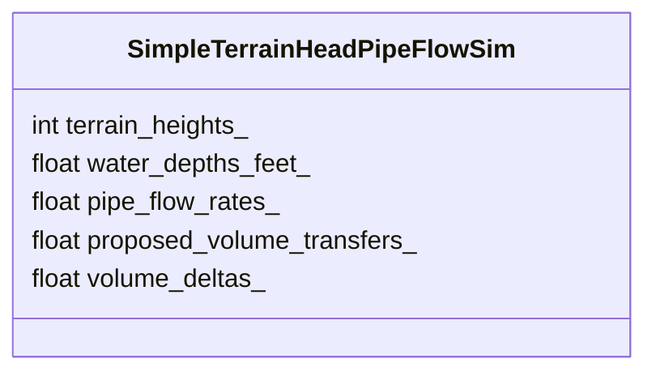
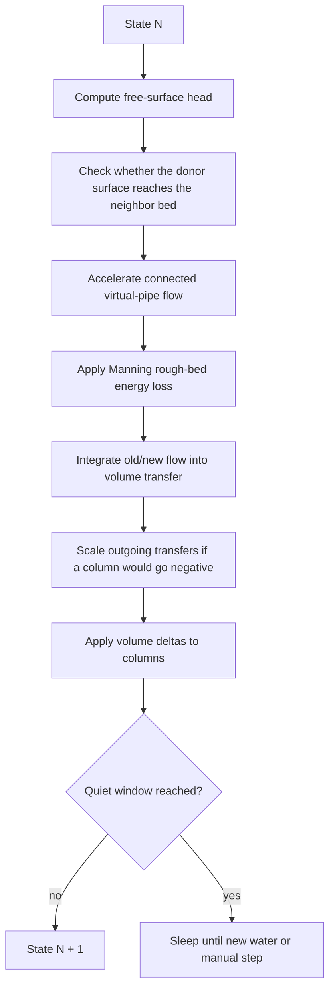
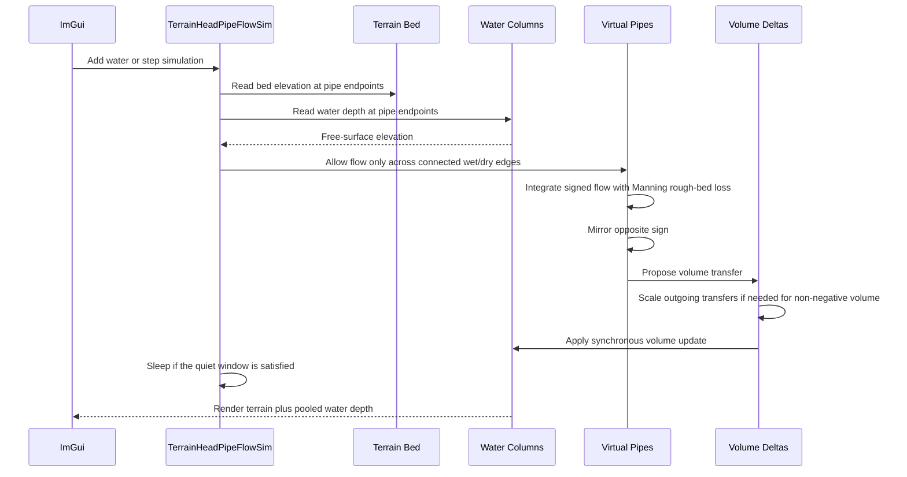

# Experiment Lesson: Terrain-Head Pipe Flow

## Purpose

This experiment answers the question raised by the paper-only branch:

```text
Why does CPU 09 spread water across the whole landscape instead of pooling?
```

CPU 09 isolates the O'Brien/Hodgins volume subsystem, where pressure is based
on fluid column height. That is useful as a reference, but our grass field also
has terrain. This branch adds the missing game-terrain interpretation:

```text
free-surface head = terrain bed elevation + water depth
```

Water now moves from higher free-surface elevation toward lower free-surface
elevation. A dry uphill neighbor is not connected until the donor water surface
is high enough to reach that neighbor's bed elevation.

## What Changed

The pipe network is still familiar:

- vertical water columns,
- eight-neighbor virtual pipes,
- signed flow rates,
- old/new trapezoid integration,
- Manning-style rough-bed energy loss,
- practical steady-state sleeping,
- mirrored opposite pipe flow,
- positive-volume correction.

The important difference is the pressure source:

```text
CPU 09:
    pressure head = water column height

CPU 10:
    pressure head = terrain height + water column height
```

That one change turns the field from a flat hydraulic sheet into a terrain bed.
Hills become barriers unless the water surface rises high enough to overtop
them. Depressions can collect water.

## State



The terrain heights are no longer render-only in this branch. They define the
bottom of each water column.

## Step Loop



The wet/dry edge check is not a tuning clamp. It is the missing terrain
connection rule:

```text
water can flow from A to B only if surface(A) > terrain_bed(B)
```

Without that rule, a dry hill is still just another pipe endpoint, so momentum
can paint water uphill.

The pipe energy loss is also not a slider. The branch models the largest
real-world contributor for shallow yard water: rough-bed friction and turbulent
form drag from soil, grass, and small terrain features. It uses a fixed
Manning-style roughness value for a grass/earth yard. Without this missing
dissipation, equal water surfaces can still have stored pipe momentum, so they
overshoot and slosh instead of settling.

Sleeping is separate from the physics. Once max pipe flow and max per-step
water-depth change stay below tiny visible-motion thresholds for a sustained
quiet window, the experiment stops stepping and clears leftover tiny pipe
momentum. Adding water or pressing a manual step wakes it again.

## Sequence Interaction Diagram



## Interaction

| Control | Meaning |
|---|---|
| Add Water at Target | Adds the fixed starting water sample at the selected cell, or field center if no cell is selected |
| Step (x1) | Advances the terrain-head pipe update once |
| Step (x25) | Advances the same update twenty-five times for quick observation |

There are no solver sliders in this branch. The point is not to tune around the
problem, but to compare the missing physics:

```text
terrain-blind column pressure versus terrain-aware free-surface head
```

## Expected Behavior

Compared with CPU 09:

- water should prefer depressions,
- dry high ground should stay dry until overtopped,
- water should not form a uniform shallow film over unrelated hills,
- late-stage surface oscillation should decay instead of ringing forever,
- after a quiet window, the experiment should sleep instead of redrawing tiny sub-visible changes forever,
- closed boundaries should retain total volume inside the field.

This is still not the paper's full surface subsystem. It is the smallest useful
terrain-bed extension for game-map pooling.

## Implementation Files

| File | Purpose |
|---|---|
| `sim/simple_terrain_head_pipe_flow_sim.h` | Terrain-aware CPU `IFieldSim` implementation |
| `main.cpp` | Registers CPU 10 and connects lesson buttons |
| `LESSON_CATALOG.md` | Adds CPU 10 to the experiment ladder |
| `lesson_experiment_terrain_head_pipe_flow_sim.md` | This lesson |

## Takeaway

CPU 09 tells us what the isolated paper volume subsystem does. CPU 10 tells us
what changes when the grass-field terrain becomes the bed of the water body.
