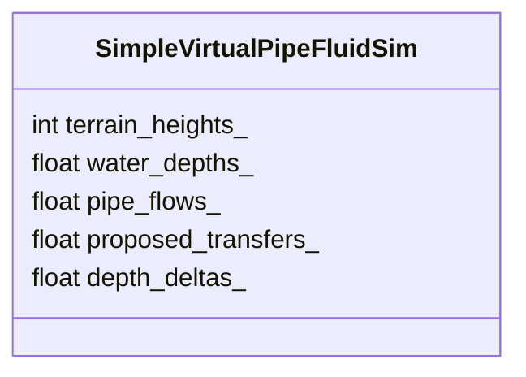
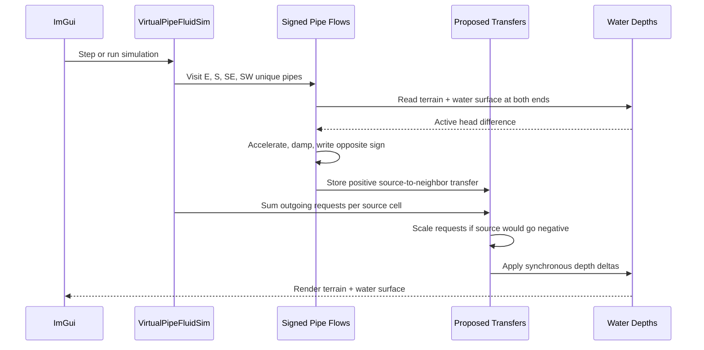
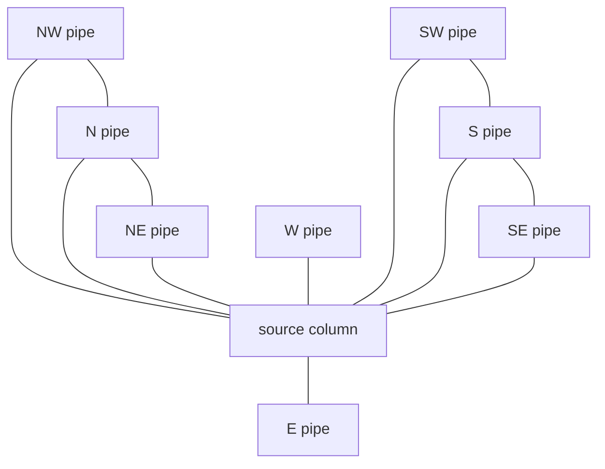

# Experiment Lesson: Virtual Pipe Fluid With Eight Neighbors

## Chapter 1: Why This Paper Fits GF003

The O'Brien/Hodgins paper, "Dynamic Simulation of Splashing Fluids", describes
a fluid model split into three parts:

- a main volume model,
- a surface model,
- and a spray particle model.

For this GF003 experiment, we only borrow the part that fits the current
heightfield sandbox: the main volume model.

The useful idea is simple and game-friendly:

> Treat the fluid as vertical columns connected by virtual pipes.

Each column stores water volume. Each pipe stores a signed flow rate. During a
tick, pressure differences accelerate the flow in those pipes, and the pipe
flows move water between neighboring columns.

This is different from the earlier cellular water model. Cellular water asks:

```text
How much water should I send to lower neighbors right now?
```

Virtual-pipe water asks:

```text
How fast is water already moving through each tunnel, and how should the
surface slope accelerate or slow that tunnel flow?
```

That gives the model memory without jumping all the way to a full 3D fluid
solver.

## Chapter 2: What We Borrowed And What We Skipped

Borrowed from the paper:

- vertical columns of fluid,
- virtual pipes between neighboring columns,
- diagonal neighbors as well as axis-aligned neighbors,
- signed per-pipe flow that persists across ticks,
- pressure/head difference accelerating pipe flow,
- volume preservation by scaling outgoing transfers when a column would go
  negative,
- tunable damping for animation usefulness.

Skipped for this first experiment:

- splash particles,
- object collision against the surface,
- external pressure from falling bodies,
- a separate surface-control mesh,
- foam, bubbles, sheeting, and spray.

That keeps this experiment close to the current renderer contract:

```text
visible surface = terrain height + water depth
```

The "surface" is intentionally plain for now. The experiment is about the
eight-neighbor tunnel network.

This experiment also deliberately runs at one-foot resolution instead of the
one-inch resolution used by the cellular water experiments. That keeps the
first virtual-pipe version interactive while we learn whether the behavior is
worth refining later.

## Chapter 3: State

The simulator stores:



`pipe_flows_` is the important new state. It stores eight signed flow values
per cell:

```text
E, W, S, N, SE, NW, SW, NE
```

The implementation only computes four unique edge families:

```text
E, S, SE, SW
```

Those four families cover every undirected connection in the grid. After a
flow is updated, the opposite direction is written with the negative value:

```text
flow(A -> B) = -flow(B -> A)
```

That keeps the eight-neighbor interface easy to inspect without calculating
the same pipe twice.

## Chapter 4: One Simulation Tick

Each tick has two phases.

Phase A updates pipe momentum:

1. Visit every unique pipe.
2. Compare the visible water surface at both ends.
3. Accelerate the signed pipe flow toward the lower surface.
4. Apply damping.
5. Convert the average flow during the timestep into a proposed transfer.

Phase B applies water movement:

1. Sum the proposed outgoing transfers for each source cell.
2. If the source would go negative, scale all of that source's outgoing
   transfers down.
3. Apply the clamped transfers into a depth-delta array.
4. Add deltas to water depths.
5. Optionally drain edge cells.

## Sequence Interaction Diagram



## Chapter 5: Eight Neighbors As Tunnels

The earlier cellular model used four neighbors:

```text
left, right, up, down
```

This virtual-pipe experiment can use all eight:

```text
left, right, up, down, and four diagonals
```

The diagonal pipes are longer, so their acceleration is divided by the diagonal
length. That gives diagonal flow a cost instead of letting it cheat across the
grid for free.



The UI exposes a `Diagonal pipes` checkbox so we can compare the eight-neighbor
version against the four-neighbor version without adding another class.

## Chapter 6: The Controls

| Control | Meaning |
|---|---|
| Pressure scale | How strongly surface height differences accelerate pipe flow |
| Time step | How much time each logical simulation tick advances |
| Pipe area | Multiplier for how much a pipe can carry |
| Flow damping | How much pipe momentum survives each tick |
| Max out/cell | Safety clamp for total outgoing water from one cell |
| Diagonal pipes | Enables the four diagonal tunnel connections |
| Drain edges | Lets water leave the field at the boundary |
| Zero Pipe Momentum | Clears stored tunnel flow without removing water |

The most interesting control is `Zero Pipe Momentum`. If water keeps moving
after the surface has mostly settled, that is the pipe memory. Clearing momentum
turns the experiment back into something closer to a direct equalization model.

## Chapter 7: What To Watch For

This experiment should produce:

- smoother spreading than direct cellular water,
- diagonal paths that round out the flow shape,
- visible momentum after water has started moving,
- possible sloshing if damping is high,
- faster instability if pressure scale, pipe area, or timestep are pushed too
  far.

The failure modes are useful:

- **Too much pressure:** water rings or jitters.
- **Too much timestep:** pipe flow overshoots and oscillates.
- **Too little damping:** water keeps sloshing forever.
- **Too much damping:** the model collapses back toward simple diffusion.
- **Diagonal pipes off:** spreading becomes grid-aligned again.

## Chapter 8: Why This Is A Separate Experiment

This is not an optimization of the cellular fluid model. It changes the state
and the behavior:

| Model | Memory lives in | Neighbor count | Best question |
|---|---|---:|---|
| Cellular water | No persistent flow | 4 | Where is the lower neighbor now? |
| Shallow water | Cell velocity | 4 | Where is water velocity carrying depth? |
| Virtual pipe fluid | Pipe/tunnel flow | 8 | How fast is water moving through each connection? |

That makes it a good next GF003 branch. It is still simple enough to inspect,
but it starts to resemble the fast heightfield water literature more closely
than the first cellular model.

## Chapter 9: Implementation Files

| File | Purpose |
|---|---|
| `sim/simple_virtual_pipe_fluid_sim.h` | New CPU `IFieldSim` implementation |
| `main.cpp` | Registers the new simulator and lesson guide entry |
| `LESSON_CATALOG.md` | Adds CPU 07 to the experiment ladder |
| `lesson_experiment_virtual_pipe_fluid_sim.md` | This lesson |

The simulator overrides `IFieldSim::cell_size_feet()` to return `1.0f`. The
application uses that value when seeding, picking, camera focusing, constant
buffer upload, and split-LOD grouping, so this experiment runs on the original
`100 x 100` foot grid instead of the expanded `1200 x 1200` inch grid.

## Takeaway

The O'Brien/Hodgins paper is valuable here because it gives us a bridge between
toy cellular water and more serious shallow-water methods. We can ignore the
splash system for now and still get a useful game prototype: a heightfield
where water columns exchange volume through persistent eight-neighbor virtual
tunnels.
