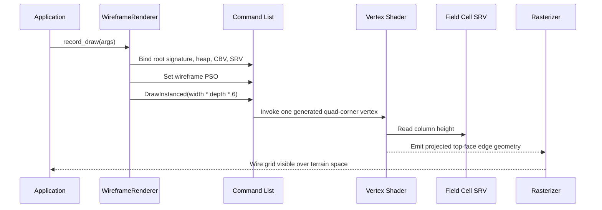
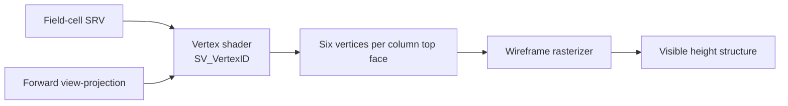

# Experiment: The Wireframe Renderer

---

## Chapter 1: Why Wireframe?

The column raycast renderer is good at *looking like a terrain*. It is not good
at answering the question "where exactly is each column in 3D space?" The DDA
march wraps around perspective and produces a convincing image, but if you want
to see the actual geometry of the grid — cell by cell, height by height — the
raycast technique obscures it.

A wireframe mesh is the opposite. It draws the actual top-face outlines of every
column in full 3D. Erosion patterns become visible as depressions in the grid.
Columns that have not been eroded stand out as raised quads. Hovering above the
field with the orbit camera and comparing the wireframe against the raycast is
one of the fastest ways to understand what the simulator is doing.

`WireframeRenderer` produces that view as a second `IFieldRenderer`
implementation. Switching between the two is a single combo-box selection.

---

## Chapter 2: One Quad Per Column, No Index Buffer

Each column occupies a 1×1 foot cell in the XZ plane. To show its top face as a
wireframe the renderer needs four corners connected by edges. That is one quad —
two triangles — six vertices:

```
  v0 ─── v1
  │  \    │
  │   \   │
  v2 ─── v3
```

Triangle 0: v0, v1, v2  
Triangle 1: v1, v3, v2

Six vertex indices: 0, 1, 2, 1, 3, 2. But the renderer uses no index buffer.
Instead the vertex shader receives a monotonically increasing `SV_VertexID` and
derives both the column position and the corner from it:

```
column index  = SV_VertexID / 6
corner within quad = SV_VertexID % 6
```

The column index maps to `(cx, cz)` coordinates. The corner index selects one
of the four quad corners, and the column height sets the Y coordinate for all
four. No vertex buffer allocation, no staging upload, no separate index buffer —
the mesh is entirely a function of the height data and the vertex IDs.

---

## Chapter 3: A Different Root Signature — VERTEX Visibility

`WireframeRenderer` uses the same two-parameter root signature layout as
`RaycastRenderer`:

- Param 0: inline root CBV at `b0` — `SceneConstants`
- Param 1: descriptor table, one SRV at `t0` — column heights

But the SRV visibility is different:

```cpp
// RaycastRenderer
params[1].ShaderVisibility = D3D12_SHADER_VISIBILITY_PIXEL;

// WireframeRenderer
params[1].ShaderVisibility = D3D12_SHADER_VISIBILITY_VERTEX;
```

In the raycast renderer the vertex shader generates a full-screen triangle from
hard-coded positions — it never reads the height field. The pixel shader reads
it per-ray.

In the wireframe renderer the *vertex* shader reads the height field. It needs
the column height at `(cx, cz)` to place the four quad corners at the correct Y
position in world space. The pixel shader only needs to output a flat colour —
no height data required.

Marking a root parameter as `SHADER_VISIBILITY_VERTEX` means the GPU exposes
that resource to the vertex shader stage and denies it to the pixel shader stage.
Two renderers with identical root parameter slots but different visibility
settings produce different root signatures. D3D12 treats them as separate
objects.

---

## Chapter 4: SceneConstants — Forward Matrix, Not Inverse

Lesson 05 introduced `inverse_view_projection` in `SceneConstants`. The raycast
pixel shader starts at a pixel's NDC position, multiplies by the inverse VP
matrix to reconstruct a world-space ray, then marches that ray forward through
the column grid.

The wireframe vertex shader works in the opposite direction. It starts with a
world-space column corner:

```
world_pos = float3(cx + corner_offset_x, height_at_cy_in_feet, cz + corner_offset_z)
```

It then transforms to clip space using the *forward* `view_projection` matrix:

```hlsl
output.position = mul(float4(world_pos, 1.0), scene.view_projection);
```

That is why `view_projection` was added to `SceneConstants` in Step 10. Before
the wireframe renderer existed, the inverse matrix was all that was needed. The
wireframe renderer is the first pass that actually treats the field as geometry
rather than a lookup table.

The two matrices are both in `SceneConstants` simultaneously, which means a
renderer can use either one without any change to the upload side.

---

## Chapter 5: The PSO — Wireframe Fill

The single biggest difference in the PSO is the fill mode:

```cpp
D3D12_RASTERIZER_DESC raster = {};
raster.FillMode  = D3D12_FILL_MODE_WIREFRAME;
raster.CullMode  = D3D12_CULL_MODE_NONE;
```

With `FILL_MODE_WIREFRAME` the rasterizer draws only the *edges* of each
triangle. The interior pixels are not shaded. The result is a grid of lines
showing every triangle edge in the mesh.

**Why `CULL_MODE_NONE`?** Back-face culling is determined by winding order. With
`FILL_MODE_WIREFRAME` and back-face culling enabled, the GPU may silently drop
some edges of quads that it classifies as "back-facing" depending on the viewing
angle. Disabling culling entirely ensures every edge is always drawn, which is
exactly what a debugging view should do.

The depth buffer is still disabled — `ds.DepthEnable = FALSE` — for the same
reason as the raycast renderer. With a flat top-face grid there are no
overlapping faces from a top-down perspective. Enabling depth would consume a
DSV resource for no benefit in this case.

---

## Chapter 6: The Draw Call — Width × Depth × 6

```cpp
const UINT vertex_count = args.field_width * args.field_depth * 6u;
args.cmd->DrawInstanced(vertex_count, 1, 0, 0);
```

For a 128×128 grid this is 98,304 vertices. That is not a large number for
modern hardware — a single draw call handles it trivially. There is no instancing
(the instance count is 1) and no index buffer. The vertex shader receives IDs
from 0 to `vertex_count - 1` and maps each one to a column corner.

The field dimensions come through `RendererFrameArgs` as `field_width` and
`field_depth`. The renderer does not hard-code the grid size; it queries it at
draw time so the same renderer works for any field resolution.

---

## Chapter 7: Comparing Wireframe to Raycast

Having two renderers behind the same interface makes a comparison table
possible:

| Property | Raycast | Wireframe |
|---|---|---|
| Vertex buffer | None | None |
| Vertex count | 3 | W × D × 6 |
| Height data in | Pixel shader | Vertex shader |
| SRV visibility | PIXEL | VERTEX |
| Matrix used | inverse_view_projection | view_projection |
| Fill mode | SOLID | WIREFRAME |
| Depth buffer | No | No |
| GPU cost | PS-bound (DDA loops) | VS-bound (many vertices) |

The raycast renderer costs less in vertex processing but more in pixel fill rate
because every on-screen pixel runs many DDA iterations. The wireframe renderer
costs more in vertex processing but almost nothing in shading because the
rasterizer only draws edges. On a modern GPU neither is a bottleneck for a
128×128 field.

---

## Chapter 8: What We Learned

- Changing `ShaderVisibility` from `PIXEL` to `VERTEX` on a root parameter
  produces a different root signature. The visibility flags are not just hints —
  they are part of the signature identity and the shader must match.
- `FILL_MODE_WIREFRAME` draws only triangle edges. Combined with
  `CULL_MODE_NONE` it produces a reliable grid view regardless of winding order
  or camera angle.
- The `view_projection` and `inverse_view_projection` matrices in
  `SceneConstants` serve different rendering modes. A renderer that builds world
  positions and projects them forward uses `view_projection`; a renderer that
  reconstructs rays from NDC uses `inverse_view_projection`.
- Procedural vertex generation from `SV_VertexID` is a versatile pattern. A
  grid mesh of arbitrary size requires no pre-allocated vertex buffer — just a
  vertex count and a shader that can compute position from index.

---

## What Comes Next

The raycast and wireframe renderers are both "flat" — they draw the entire field
in a single uniform way. The split LOD renderer introduces a two-pass approach
that separates the field into a coarse grid and a fine remainder, using a depth
buffer to composite them correctly.

## Sequence Interaction Diagram



## Concept Diagram


