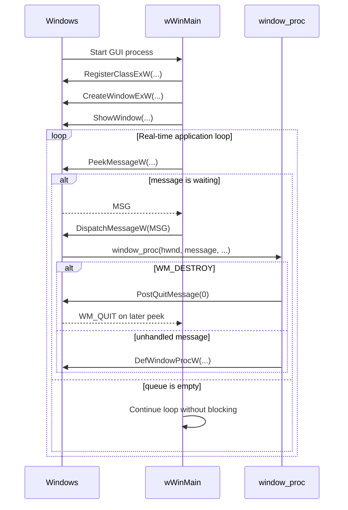
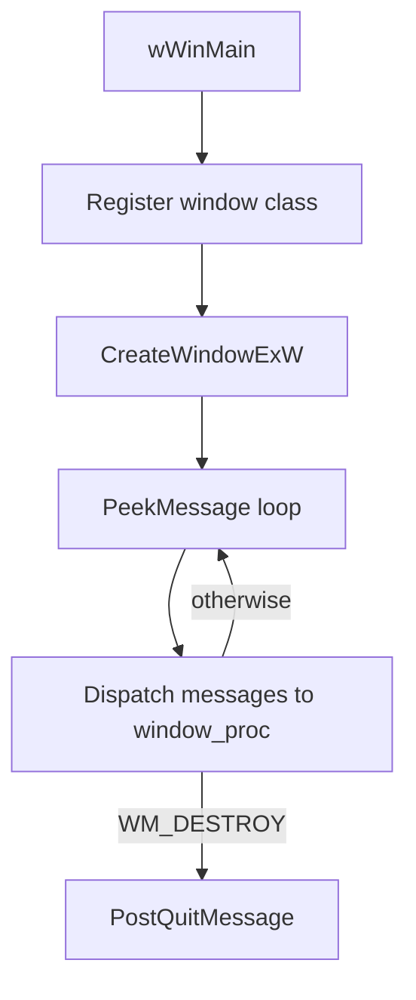

# Lesson 01: The Window

---

## Chapter 1: A Window Is Not Yet a World

We began where every Windows program must begin: with a window that can exist,
receive messages, and shut itself down cleanly.

At this stage the application knew nothing of graphics. It knew only the
ordinary laws of Win32: register a class, create a window, show it, drain the
message queue, and respond to `WM_DESTROY`. This is the proper beginning,
because DirectX 12 does not begin in the GPU. It begins in the machinery that
gives the GPU a place to appear.

---

## Chapter 2: The Entry Point

A Windows GUI application does not start at `main()`. It starts at `wWinMain()`
— the Unicode variant of `WinMain()`. Windows calls this function directly:

```cpp
int WINAPI wWinMain(
    HINSTANCE instance,
    HINSTANCE /*prev_instance*/,
    PWSTR     /*cmd_line*/,
    int       /*show_cmd*/)
```

The first argument, `instance`, is a handle to the current process image. You
need it when registering the window class and creating the window — it tells the
OS which executable owns this window.

The `WINAPI` calling convention is required. Omitting it causes a stack imbalance
at process exit in 32-bit builds, and even on 64-bit it is required by the ABI
contract with Windows.

---

## Chapter 3: The Window Class

Before creating any window, you must register a *window class* — a blueprint that
describes what windows of this type look like and how they behave:

```cpp
WNDCLASSEXW wc    = {};
wc.cbSize         = sizeof(wc);
wc.style          = CS_HREDRAW | CS_VREDRAW;
wc.lpfnWndProc    = window_proc;      // our message-handling function
wc.hInstance      = instance;
wc.hCursor        = LoadCursorW(nullptr, IDC_ARROW);
wc.lpszClassName  = k_window_class_name;
RegisterClassExW(&wc);
```

`CS_HREDRAW | CS_VREDRAW` tells Windows to invalidate and redraw the entire
window whenever it is resized. This will matter once we have a renderer: a
resize changes the swap chain's back buffer dimensions, so every pixel must be
redrawn.

Always zero-initialise `WNDCLASSEXW` with `= {}` before filling in fields. The
structure has grown over Windows versions and uninitialized padding bytes cause
unpredictable behaviour.

---

## Chapter 4: The Window Procedure

The window procedure (`window_proc`) is the core of every Win32 application.
Windows delivers messages by calling it directly:

```cpp
LRESULT CALLBACK window_proc(
    HWND   hwnd,
    UINT   message,
    WPARAM wparam,
    LPARAM lparam)
{
    switch (message)
    {
    case WM_DESTROY:
        PostQuitMessage(0);
        return 0;
    }
    return DefWindowProcW(hwnd, message, wparam, lparam);
}
```

`WM_DESTROY` arrives when the user closes the window. `PostQuitMessage(0)` places
a `WM_QUIT` into the queue, which the main loop detects as its exit signal.

Every message you do not handle explicitly must be passed to `DefWindowProcW`.
That call is what gives the window its default behaviour: moving, resizing,
minimising, the system menu, the close button. Without it, the window becomes
frozen and unresponsive.

---

## Chapter 5: The Message Loop

The message loop is the clock of the application. In a real-time renderer it
must never block:

```cpp
MSG  msg     = {};
bool running = true;
while (running)
{
    while (PeekMessageW(&msg, nullptr, 0, 0, PM_REMOVE))
    {
        if (msg.message == WM_QUIT) { running = false; break; }
        TranslateMessage(&msg);
        DispatchMessageW(&msg);
    }
    // render one frame here — even when idle
}
```

`PeekMessageW` returns immediately whether or not a message is waiting. This
is the critical difference from `GetMessageW`, which blocks until a message
arrives. With `GetMessageW`, the application would freeze as soon as the user
stopped moving the mouse. With `PeekMessage`, we keep rendering at full frame
rate even during total inactivity.

`TranslateMessage` converts raw key-down events into `WM_CHAR` messages.
`DispatchMessageW` routes each message to the correct window procedure.

---

## Chapter 6: What We Learned

By the end of Step 1 the essential ideas are:

- `wWinMain` is the real entry point for a Windows GUI program.
- A window class must be registered before any window can be created from it.
- The window procedure receives every event the OS wants to tell the application
  about; anything you do not handle yourself must go to `DefWindowProcW`.
- `PeekMessageW` enables a real-time loop that produces frames continuously,
  not just in response to input.
- `WM_DESTROY` → `PostQuitMessage` is the clean, universal shutdown path.

That is enough to stand at the threshold of graphics.

The next lesson does not draw a triangle yet. It teaches the program how to
speak DirectX 12 — the explicit, low-level language of the GPU.

---

## Video References

The concepts in this lesson appear in the following tutorial videos. Neither series
follows this project's exact code, but they cover the same Win32 machinery and are
ideal companion watching.

### Chili — *Direct3D 12 Shallow Dive*

- [Episode 1 — Direct3D 12 Shallow Dive](https://www.youtube.com/watch?v=volqcWZjRig):
  Chili's series introduction. Watch this to get the big picture of what the Shallow Dive
  aims to build before diving into window setup.

### JAPG — *Your first DirectX 12 application in C++*

- [Part 1 — Project Setup](https://www.youtube.com/watch?v=3ubqb13Cix4):
  Visual Studio project configuration for a DirectX 12 application — helpful context
  for the CMake setup used here.
- [Part 2 — Window Creation](https://www.youtube.com/watch?v=yfYOm0q_rJQ):
  `WNDCLASSEXW`, `CreateWindowExW`, `ShowWindow` — the same calls made in Chapter 3
  of this lesson.
- [Part 3 — Window message handling](https://www.youtube.com/watch?v=3YXc2ioPm6A):
  `WndProc`, `PeekMessage` vs `GetMessage`, `WM_DESTROY` — the same message loop
  anatomy discussed in Chapter 4.

## Sequence Interaction Diagram



## Concept Diagram


