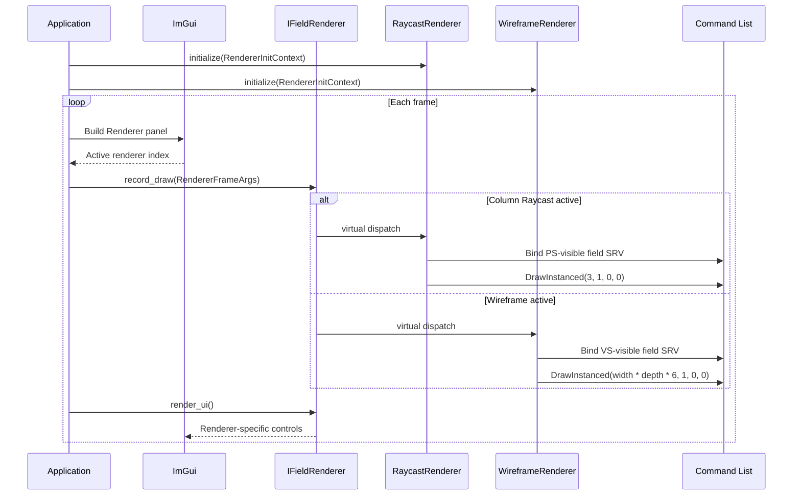
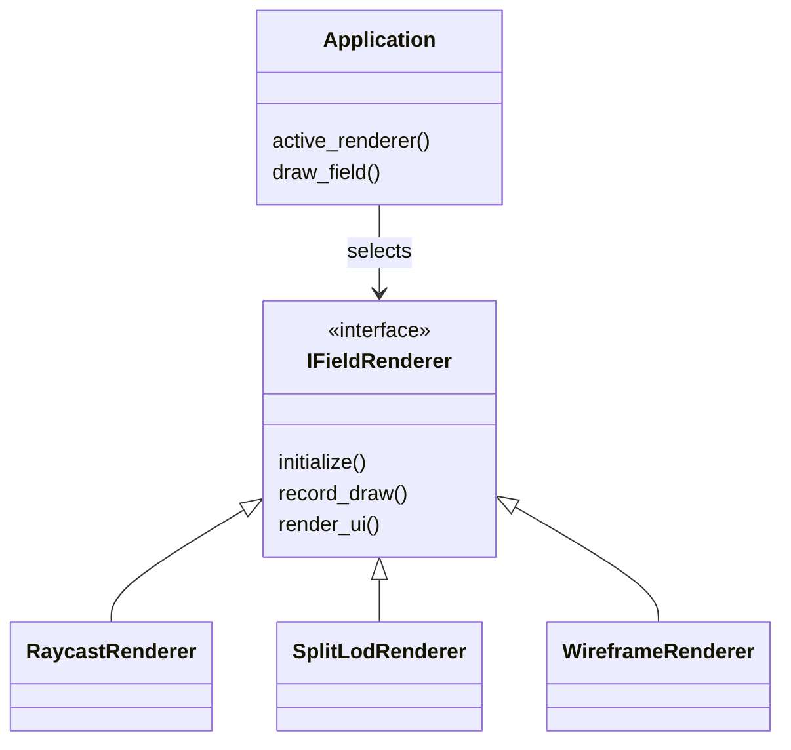

# Lesson 10: Pluggable Renderer and GPU Performance Panel

---

## Chapter 1: Why One Renderer Isn't Enough

After Step 9 the simulator is swappable at runtime. Step 10 applies the same
idea to *rendering*. The application had one fixed rendering pipeline — the DDA
column raycast. There was no way to compare it visually to a different approach,
and all the root-signature, PSO, and draw-call code lived directly in
`Application`.

Two problems:

1. **Comparison** — switching from a raycast to a wireframe mesh is a useful
   learning exercise and a practical debugging tool (see where columns actually
   are in 3D without the raycast's perspective tricks).
2. **Separation** — a renderer's root signature, PSO, and shaders are a
   cohesive unit. Extracting them from `Application` makes each renderer
   self-contained and removes ~200 lines of rendering-specific code from the
   core application struct.

---

## Chapter 2: The IFieldRenderer Interface

`IFieldRenderer` follows the same three-contract structure as `IFieldSim`:

```cpp
class IFieldRenderer
{
public:
    virtual ~IFieldRenderer() = default;

    // Identity
    virtual const char* name() const noexcept = 0;

    // LIFECYCLE CONTRACT — called once at startup
    virtual void initialize(const RendererInitContext& ctx) = 0;

    // RENDER CONTRACT — called every frame
    virtual void record_draw(const RendererFrameArgs& args) = 0;

    // UI CONTRACT — draws renderer-specific ImGui controls
    virtual void render_ui() {}   // default: no-op
};
```

Note that `render_ui()` has a default implementation here (unlike `IFieldSim`).
Most renderers have no tunable settings at first — making it pure-virtual would
force every renderer to write an empty override. The default no-op is the
right design when a contract method is optional.

---

## Chapter 3: Context Structs — Avoiding Application Coupling

Both the `initialize` and `record_draw` methods receive plain data structs
instead of a raw `Application*`. This is deliberate: renderers should be
completely decoupled from the application internals.

### RendererInitContext

```cpp
struct RendererInitContext
{
    ID3D12Device* device;
    DXGI_FORMAT   rtv_format;
    UINT          srv_descriptor_size;
};
```

Everything a renderer needs to build its root signature and PSO. Passed once
at startup.

### RendererFrameArgs

```cpp
struct RendererFrameArgs
{
    ID3D12GraphicsCommandList*  cmd;
    ID3D12DescriptorHeap*       srv_heap;
    D3D12_GPU_VIRTUAL_ADDRESS   cb_gpu_va;
    D3D12_GPU_DESCRIPTOR_HANDLE field_srv_gpu;
    UINT                        viewport_width;
    UINT                        viewport_height;
    UINT                        field_width;
    UINT                        field_depth;
};
```

Everything needed to emit draw calls into an open command list. Passed every
frame. Notice there is no `Application*` — a renderer that only receives these
arguments can be written, compiled, and tested in complete isolation.

---

## Chapter 4: RaycastRenderer — Extracting the Existing Pipeline

`RaycastRenderer` is the same DDA column raycast that existed since Step 5,
extracted out of `Application` into its own class:

```cpp
class RaycastRenderer final : public IFieldRenderer
{
    ComPtr<ID3D12RootSignature> m_root_signature;
    ComPtr<ID3D12PipelineState> m_pso;

public:
    const char* name() const noexcept override { return "Column Raycast (DDA)"; }

    void initialize(const RendererInitContext& ctx) override
    {
        build_root_signature(ctx.device);
        build_pso(ctx.device, ctx.rtv_format);
    }

    void record_draw(const RendererFrameArgs& args) override
    {
        args.cmd->SetGraphicsRootSignature(m_root_signature.Get());
        args.cmd->SetDescriptorHeaps(1, &args.srv_heap);
        args.cmd->SetGraphicsRootConstantBufferView(0, args.cb_gpu_va);
        args.cmd->SetGraphicsRootDescriptorTable(1, args.field_srv_gpu);
        args.cmd->SetPipelineState(m_pso.Get());
        args.cmd->IASetPrimitiveTopology(D3D_PRIMITIVE_TOPOLOGY_TRIANGLELIST);
        // ... viewport, scissor ...
        args.cmd->DrawInstanced(3, 1, 0, 0);  // 3 vertices = one full-screen triangle
    }
};
```

The key observation: the root signature uses `SHADER_VISIBILITY_PIXEL` for the
heights SRV, because the raycast pixel shader reads column heights but the
vertex shader is trivial (three hard-coded NDC corners from `SV_VertexID`).

---

## Chapter 5: WireframeRenderer — A New Technique

`WireframeRenderer` renders the terrain as a grid of wireframe top-face quads.
It introduces several concepts not present in the raycast renderer:

### No vertex buffer — geometry from SV_VertexID

```hlsl
// In wireframe_renderer.hlsl (VSMain):
const uint col_idx = SV_VertexID / 6;   // which column
const uint vert    = SV_VertexID % 6;   // corner within the top-face quad

const uint cx = col_idx % W;
const uint cz = col_idx / W;

float height = column_heights_feet[cz * W + cx];
// ... build world-space corner position from QUAD_OFFSETS[vert] ...
output.Position = mul(float4(world_pos, 1.0), view_projection);
```

Each column contributes 6 vertices (2 triangles = one quad). The VS
derives the exact world-space corner from a look-up table `QUAD_OFFSETS[6]`.
No vertex buffer is uploaded — the GPU generates everything procedurally.

### DrawInstanced count

```cpp
// In WireframeRenderer::record_draw():
const UINT vertex_count = args.field_width * args.field_depth * 6u;
args.cmd->DrawInstanced(vertex_count, 1, 0, 0);
```

Compare to the raycast renderer's `DrawInstanced(3, 1, 0, 0)`. The wireframe
renderer issues W×D×6 vertices — one full top-face quad per column.

### VERTEX-visible SRV

The wireframe VS reads `column_heights_feet` to position quad corners, so the
descriptor-table root parameter must be `SHADER_VISIBILITY_VERTEX`, not
`SHADER_VISIBILITY_PIXEL`:

```cpp
// WireframeRenderer root signature:
params[1].ShaderVisibility = D3D12_SHADER_VISIBILITY_VERTEX;

// RaycastRenderer root signature:
params[1].ShaderVisibility = D3D12_SHADER_VISIBILITY_PIXEL;
```

This is why each renderer owns its own root signature — they have different
binding requirements.

### Wireframe fill mode

```cpp
raster.FillMode = D3D12_FILL_MODE_WIREFRAME;  // edges only
raster.CullMode = D3D12_CULL_MODE_NONE;        // must disable — back-face culling
                                                // + wireframe can silently drop edges
```

`FILL_MODE_WIREFRAME` tells the rasterizer to draw only triangle edges. Back-
face culling is disabled because with wireframe fill, the rasterizer tests the
winding order of the *projected* triangle — culling can silently drop edges
that appear "backwards" in screen space.

### view_projection vs inverse_view_projection

The raycast shader reconstructs world-space rays from `inverse_view_projection`.
The wireframe VS needs to go the other direction — from world-space positions
into clip space — so it uses the forward `view_projection`. This matrix was
appended to `SceneConstants` for Step 10:

```cpp
struct SceneConstants
{
    XMFLOAT4X4 inverse_view_projection;   // bytes 0–63    (raycast PS)
    XMFLOAT4   camera_world_pos;           // bytes 64–79
    // ... field parameters ...            // bytes 80–111
    XMFLOAT4X4 view_projection;            // bytes 112–175 (wireframe VS) ← new
};
```

Appending it at byte 112 preserves the existing 112-byte layout that the
raycast shader reads — the raycast HLSL constant buffer is unchanged.

---

## Chapter 6: What Changed in Application

### Member swap

```cpp
// Before (Step 8)
ComPtr<ID3D12RootSignature> m_root_signature;
ComPtr<ID3D12PipelineState> m_pso;

// After (Step 10)
std::vector<std::unique_ptr<gfx::IFieldRenderer>> m_renderers;
int m_active_renderer = 0;
```

All renderers are initialized at startup and kept alive. Switching between
them is an index change — there is never a GPU stall because no new GPU
resources are created at switch time.

### initialize_renderers()

```cpp
void initialize_renderers()
{
    RendererInitContext ctx;
    ctx.device              = device.Get();
    ctx.rtv_format          = k_back_buffer_format;
    ctx.srv_descriptor_size = srv_descriptor_size;

    m_renderers.push_back(std::make_unique<gfx::RaycastRenderer>());
    m_renderers.push_back(std::make_unique<gfx::WireframeRenderer>());

    for (auto& r : m_renderers)
        r->initialize(ctx);
}
```

Adding a third renderer: implement `IFieldRenderer`, add one `push_back`.
Nothing else changes.

### draw_field() — the draw path

```cpp
void draw_field()
{
    RendererFrameArgs args;
    args.cmd            = command_list.Get();
    args.srv_heap       = imgui_srv_heap.Get();
    args.cb_gpu_va      = m_cb_buffer->GetGPUVirtualAddress();
    args.field_srv_gpu  = m_field_srv_gpu;
    args.viewport_width = width;
    args.viewport_height= height;
    args.field_width    = static_cast<UINT>(m_sim->width());
    args.field_depth    = static_cast<UINT>(m_sim->depth());

    m_renderers[static_cast<std::size_t>(m_active_renderer)]->record_draw(args);
}
```

### Renderer panel — picker

```cpp
{
    const char* names[8] = {};
    const int count = static_cast<int>(
        std::min(m_renderers.size(), std::size_t{ 8 }));
    for (int i = 0; i < count; ++i)
        names[i] = m_renderers[i]->name();

    ImGui::Combo("##renderer", &m_active_renderer, names, count);
}
m_renderers[m_active_renderer]->render_ui();
```

The combo populates itself from `name()` on each renderer. No renderer names
are hardcoded in `Application`.

---

## Chapter 7: GPU Performance Panel

Also added in Step 10 — the Renderer ImGui panel was expanded to show live GPU
and frame statistics.

### Adapter name and VRAM

At device creation, DXGI provides the adapter description:

```cpp
ComPtr<IDXGIAdapter1> adapter;
if (SUCCEEDED(factory->EnumAdapters1(0, &adapter)))
{
    DXGI_ADAPTER_DESC1 desc = {};
    adapter->GetDesc1(&desc);

    // Convert wide Description string to UTF-8 for ImGui
    const int needed = WideCharToMultiByte(
        CP_UTF8, 0, desc.Description, -1, nullptr, 0, nullptr, nullptr);
    m_adapter_name.resize(needed, '\0');
    WideCharToMultiByte(CP_UTF8, 0, desc.Description, -1,
        m_adapter_name.data(), needed, nullptr, nullptr);

    m_adapter_vram_bytes = desc.DedicatedVideoMemory;
}
```

`EnumAdapters1(0)` returns the same adapter that `D3D12CreateDevice(nullptr)`
selects. `DedicatedVideoMemory` is the dedicated GPU VRAM (not shared system
memory).

### Frame timing with QPC

`QueryPerformanceCounter` (QPC) is the highest-resolution timer on Windows. It
does not drift across CPU cores and is not affected by power-management
frequency scaling.

```cpp
// In Application constructor — once only:
QueryPerformanceFrequency(&m_qpc_frequency);
QueryPerformanceCounter(&m_qpc_frame_start);

// tick_frame_time() — called at the top of each frame:
LARGE_INTEGER now;
QueryPerformanceCounter(&now);

const double elapsed_ms =
    static_cast<double>(now.QuadPart - m_qpc_frame_start.QuadPart)
    / static_cast<double>(m_qpc_frequency.QuadPart) * 1000.0;
m_qpc_frame_start = now;

// Exponential Moving Average (α = 0.05) to smooth out per-frame noise.
// s_new = α * sample + (1 - α) * s_old
constexpr float alpha = 0.05f;
m_frame_time_ms = alpha * static_cast<float>(elapsed_ms)
                + (1.f - alpha) * m_frame_time_ms;
m_fps = 1000.f / m_frame_time_ms;
```

The EMA weight `0.05` was chosen to balance two competing needs:
- Too high: the display bounces every frame, unreadable
- Too low: real frame-rate changes take many seconds to show

ImGui also exposes `ImGui::GetIO().Framerate` — a 120-frame smoothed average
computed by the ImGui backend. Both values are shown in the panel: the QPC-EMA
for responsiveness, the ImGui value as a steady reference.

### The panel

```cpp
ImGui::Begin("Renderer");

// GPU identity
ImGui::Text("GPU:   %s", m_adapter_name.c_str());
ImGui::Text("VRAM:  %.0f MB",
    static_cast<float>(m_adapter_vram_bytes) / (1024.f * 1024.f));

ImGui::Separator();

// Frame timing
ImGui::Text("FPS:   %.1f  (%.2f ms)", m_fps, m_frame_time_ms);
ImGui::Text("       ImGui avg: %.1f fps", ImGui::GetIO().Framerate);

ImGui::Separator();

// Back buffer info
ImGui::Text("Size:  %u x %u", width, height);
ImGui::Text("Fmt:   R8G8B8A8_UNORM");
ImGui::Text("Slot:  %u / %u", frame_index, k_frame_count);

ImGui::Separator();

// Renderer picker + renderer-specific UI
// (combo + render_ui() — covered in Chapter 6)
```

---

## Chapter 8: What We Learned

- The same three-contract interface pattern that made the simulator pluggable
  (Step 9) applies equally to renderers. The structural solution is the same;
  only the domain changes.
- Each renderer owns its own **root signature and PSO**. This gives maximum
  flexibility: `SHADER_VISIBILITY_VERTEX` vs `SHADER_VISIBILITY_PIXEL`, fill
  mode, cull mode, and shader blobs can all differ per renderer with no
  interference.
- Initializing all renderers at startup and switching by index means the user
  never waits for GPU resource creation — switching is instantaneous.
- A VB-less mesh is generated entirely by the VS from `SV_VertexID`. For
  simple repeated geometry (one quad per column) this avoids an upload buffer
  entirely — the only CPU→GPU data is the height array and the constant buffer.
- `D3D12_FILL_MODE_WIREFRAME` + `D3D12_CULL_MODE_NONE` is the required
  combination. Enabling back-face culling with wireframe can silently drop
  edges depending on winding order and view direction.
- Extending a `SceneConstants` struct must be done by appending at the end —
  existing shaders that read only the first N bytes are unaffected.
- `DXGI_ADAPTER_DESC1::DedicatedVideoMemory` gives dedicated GPU VRAM.
  `WideCharToMultiByte(CP_UTF8)` converts the wide `Description` field to a
  narrow string for ImGui.
- `QueryPerformanceCounter` is the right timer for frame measurements on Windows.
  An exponential moving average with a small `α` (0.05) is the standard technique
  for producing a readable FPS display.

---

## Video References

### Chili — *Direct3D 12 Shallow Dive*

- [Episode 8 — Depth and Constant Buffer](https://www.youtube.com/watch?v=vXR575UqTqI):
  The constant buffer wiring that carries matrices and field data to the GPU —
  directly relevant to the `RendererFrameArgs.cb_gpu_va` pattern and how both
  renderers bind `SceneConstants`.

### JAPG — *Your first DirectX 12 application in C++*

- [Part 14 — Root Signature](https://www.youtube.com/watch?v=q3FMGgrwUJQ):
  Covers `D3D12_ROOT_PARAMETER`, `D3D12_DESCRIPTOR_RANGE`, visibility flags,
  and `D3D12SerializeRootSignature` — the exact calls made in both renderers'
  `build_root_signature()`.
- [Part 15 — Pipeline State Object](https://www.youtube.com/watch?v=TGaLBQ5jl8w):
  `D3D12_GRAPHICS_PIPELINE_STATE_DESC`, rasterizer state, blend state, fill
  mode — the same PSO construction used in `RaycastRenderer` and
  `WireframeRenderer`.

## Sequence Interaction Diagram



## Concept Diagram


