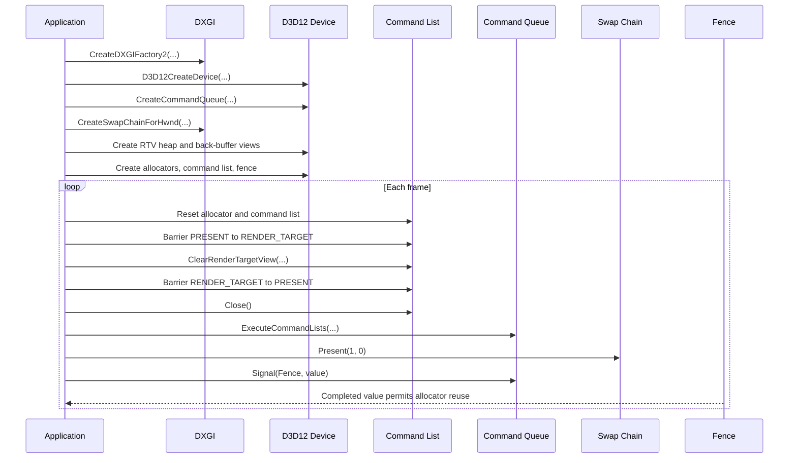
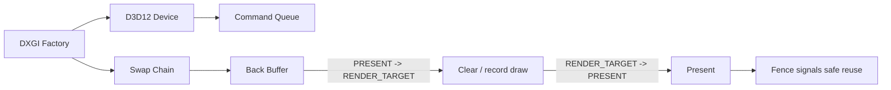

# Lesson 02: Teaching the Window to Draw

---

## Chapter 1: The Question Step 2 Asks

At the end of Step 1 we had a window that could be shown, receive messages, and
close cleanly. It still did not render anything. It was only a shell.

Step 2 begins with a single question: how does a DirectX 12 program put pixels
into that window?

The answer is not one object. It is a chain of objects, each depending on the
one before it. You build the chain once at startup, and then every frame runs
the same ritual against it.

---

## Chapter 2: DXGI and the Factory

Before we touch D3D12 we need DXGI — the *DirectX Graphics Infrastructure*
layer that sits between Windows and the GPU. DXGI knows how to enumerate
adapters (the physical GPUs in the system) and how to create swap chains (the
surfaces the OS will display in our window).

The entry point to DXGI is `IDXGIFactory`. We request version 4, because that
is the minimum that supports `DXGI_SWAP_EFFECT_FLIP_DISCARD` — the swap model
required by modern Windows 10 and later applications:

```cpp
ComPtr<IDXGIFactory4> factory;
CreateDXGIFactory2(factory_flags, IID_PPV_ARGS(&factory));
```

In debug builds we also enable the D3D12 validation layer, which catches
misuse at the API level — invalid resource states, incorrect barrier usage, and
so on. This must happen *before* the device is created:

```cpp
#if defined(_DEBUG)
ComPtr<ID3D12Debug> debug_controller;
if (SUCCEEDED(D3D12GetDebugInterface(IID_PPV_ARGS(&debug_controller))))
    debug_controller->EnableDebugLayer();
#endif
```

---

## Chapter 3: The D3D12 Device

The device is the GPU's logical face to the application. It does not draw
anything by itself — it *creates* everything else:

```cpp
ComPtr<ID3D12Device> device;
D3D12CreateDevice(nullptr, D3D_FEATURE_LEVEL_11_0, IID_PPV_ARGS(&device));
```

Passing `nullptr` as the first argument tells D3D12 to pick the best available
hardware adapter automatically. `D3D_FEATURE_LEVEL_11_0` is the minimum feature
level we require. Almost every GPU made after 2012 meets it.

Once you have the device, you can build the rest of the rendering pipeline. All
of D3D12 — command queues, heaps, fences, buffers, textures — flows from this
one object.

---

## Chapter 4: The Command Queue

The CPU does not draw directly to the GPU. It records a list of commands —
draw calls, resource transitions, clears — and then *submits* that list to a
queue. The GPU picks up work from the queue and executes it asynchronously.

This is one of the central lessons of D3D12: **record first, submit second.**

```cpp
D3D12_COMMAND_QUEUE_DESC queue_desc = {};
queue_desc.Type  = D3D12_COMMAND_LIST_TYPE_DIRECT;
queue_desc.Flags = D3D12_COMMAND_QUEUE_FLAG_NONE;

ComPtr<ID3D12CommandQueue> command_queue;
device->CreateCommandQueue(&queue_desc, IID_PPV_ARGS(&command_queue));
```

`D3D12_COMMAND_LIST_TYPE_DIRECT` is the all-purpose queue type. There are also
compute and copy queues, but for our purposes the direct queue handles
everything — rendering, clearing, transitions.

---

## Chapter 5: The Swap Chain

The swap chain is where the window and the graphics system finally meet. It
holds two (or more) back buffers. Each frame we render into one while the OS
displays the other. When we call `Present()`, the buffers swap: the one we just
rendered becomes visible, and the previously displayed one becomes available
for the next frame.

```cpp
DXGI_SWAP_CHAIN_DESC1 sc_desc = {};
sc_desc.BufferCount  = k_frame_count;        // 2 — double buffering
sc_desc.Width        = width;
sc_desc.Height       = height;
sc_desc.Format       = DXGI_FORMAT_R8G8B8A8_UNORM;
sc_desc.BufferUsage  = DXGI_USAGE_RENDER_TARGET_OUTPUT;
sc_desc.SwapEffect   = DXGI_SWAP_EFFECT_FLIP_DISCARD;
sc_desc.SampleDesc   = { 1, 0 };

ComPtr<IDXGISwapChain1> sc;
factory->CreateSwapChainForHwnd(
    command_queue.Get(), hwnd, &sc_desc, nullptr, nullptr, &sc);
```

`DXGI_SWAP_EFFECT_FLIP_DISCARD` is the correct mode for modern Windows. The
older `SEQUENTIAL` modes are deprecated and carry unnecessary overhead.

---

## Chapter 6: The RTV Descriptor Heap

D3D12 does not let shaders or fixed-function hardware access resources directly.
Instead, every resource must be described through a *view*, and views are stored
in *descriptor heaps*.

For the back buffers we need RTV (render-target view) descriptors — one per
frame buffer:

```cpp
D3D12_DESCRIPTOR_HEAP_DESC rtv_heap_desc = {};
rtv_heap_desc.NumDescriptors = k_frame_count;
rtv_heap_desc.Type           = D3D12_DESCRIPTOR_HEAP_TYPE_RTV;
rtv_heap_desc.Flags          = D3D12_DESCRIPTOR_HEAP_FLAG_NONE;

ComPtr<ID3D12DescriptorHeap> rtv_heap;
device->CreateDescriptorHeap(&rtv_heap_desc, IID_PPV_ARGS(&rtv_heap));
```

RTVs live in a CPU-only heap (`FLAG_NONE`). The GPU reads them implicitly when
we call `OMSetRenderTargets` — it never needs to address them from a shader, so
they do not need to be shader-visible.

We fill each slot by calling `CreateRenderTargetView` for each swap chain buffer
obtained from `GetBuffer()`.

---

## Chapter 7: Command Allocators and the Command List

Now we come to the per-frame machinery.

A `CommandAllocator` owns the raw memory where recorded GPU commands live. A
`GraphicsCommandList` is the pen that writes into it. Each frame:

1. Wait until the GPU is finished with this allocator.
2. Call `Reset()` on the allocator to reclaim its memory.
3. Call `Reset()` on the command list with the fresh allocator.
4. Record new commands.
5. `Close()` the list to signal that recording is done.
6. Submit to the command queue.

```cpp
// Per-frame pair (one allocator per frame buffer):
device->CreateCommandAllocator(
    D3D12_COMMAND_LIST_TYPE_DIRECT, IID_PPV_ARGS(&allocator));

// One shared command list, reset each frame:
device->CreateCommandList(
    0, D3D12_COMMAND_LIST_TYPE_DIRECT,
    allocator.Get(), nullptr, IID_PPV_ARGS(&command_list));
command_list->Close();   // must be closed before first Reset()
```

---

## Chapter 8: Resource Barriers — the State Machine

DirectX 12 tracks every resource through a *state machine*. The back buffer is
born in `PRESENT` state — the OS is displaying it. Before we can clear it, we
must transition it to `RENDER_TARGET` state. Before we can display it again, we
must transition it back to `PRESENT`.

```cpp
// PRESENT → RENDER_TARGET
D3D12_RESOURCE_BARRIER barrier = {};
barrier.Type                   = D3D12_RESOURCE_BARRIER_TYPE_TRANSITION;
barrier.Transition.pResource   = back_buffer.Get();
barrier.Transition.StateBefore = D3D12_RESOURCE_STATE_PRESENT;
barrier.Transition.StateAfter  = D3D12_RESOURCE_STATE_RENDER_TARGET;
command_list->ResourceBarrier(1, &barrier);

// Clear
const float clear_color[] = { 0.1f, 0.1f, 0.1f, 1.0f };
command_list->ClearRenderTargetView(rtv_handle, clear_color, 0, nullptr);

// RENDER_TARGET → PRESENT
barrier.Transition.StateBefore = D3D12_RESOURCE_STATE_RENDER_TARGET;
barrier.Transition.StateAfter  = D3D12_RESOURCE_STATE_PRESENT;
command_list->ResourceBarrier(1, &barrier);
```

This explicitness is the price of D3D12's power. Earlier APIs (D3D11, OpenGL)
tracked resource state automatically — at a cost in driver overhead. D3D12 puts
the responsibility on the programmer and trusts us to be correct.

---

## Chapter 9: The Fence — CPU/GPU Synchronization

The GPU executes command lists asynchronously. Without synchronization, the CPU
would reset an allocator while the GPU was still reading commands from it. A
fence prevents this:

```cpp
device->CreateFence(0, D3D12_FENCE_FLAG_NONE, IID_PPV_ARGS(&fence));
fence_event = CreateEventW(nullptr, FALSE, FALSE, nullptr);

// After submitting a frame:
command_queue->Signal(fence.Get(), ++fence_value);

// Before reusing that frame's allocator next time:
if (fence->GetCompletedValue() < fence_value)
{
    fence->SetEventOnCompletion(fence_value, fence_event);
    WaitForSingleObject(fence_event, INFINITE);
}
```

`Signal` writes a value into the fence *after all prior GPU work is complete*.
`GetCompletedValue` lets the CPU poll without blocking. Only if the GPU is still
behind do we stall on `WaitForSingleObject`. With two frame buffers and one frame
of latency this wait rarely fires at all.

---

## Chapter 10: The Frame Loop

Once all of that machinery is in place, every frame becomes a ritual:

1. Wait if the GPU is still using this frame's allocator.
2. Reset the allocator and the command list.
3. Transition the back buffer: `PRESENT` → `RENDER_TARGET`.
4. Bind the render target with `OMSetRenderTargets`.
5. Clear the buffer with `ClearRenderTargetView`.
6. Transition: `RENDER_TARGET` → `PRESENT`.
7. Close the command list.
8. Submit: `ExecuteCommandLists`.
9. Present: `swap_chain->Present(1, 0)`.
10. Signal the fence.

In Step 2 all we do in step 5 is fill the screen with a solid colour. That is
enough to prove the entire path works end to end.

---

## Chapter 11: What Step 2 Really Taught

Step 2 is the lesson that DirectX 12 is *explicit*. Nothing is assumed:

- Not the device — you enumerate adapters and choose one.
- Not the buffers — you describe them, allocate them, and describe them again
  through views.
- Not the submission — you record commands yourself and queue them yourself.
- Not the synchronization — you signal and wait with a fence you created.

Every earlier graphics API hid most of this work inside the driver. D3D12 brings
it all to the surface. The driver does less; the application programmer does more
— and in return, we get predictable, low-overhead GPU work submission.

That explicitness is not a burden. It is what makes it possible to understand,
from first principles, exactly why every frame looks the way it does.

The next lesson adds ImGui — an immediate-mode UI library that will live inside
this same D3D12 frame loop and give us interactive controls over the simulation.

---

## Video References

This lesson's D3D12 initialization chain (factory → device → queue → swap chain →
RTV heap → fence) is exactly what both series build in their opening episodes. Watch
these alongside the chapters above — they reinforce the same concepts in alternate voices.

### Chili — *Direct3D 12 Shallow Dive*

- [Episode 2 — First Present](https://www.youtube.com/watch?v=SxO7QsZjE3Q):
  Chili builds the same factory → device → swap chain → present loop that ends
  Step 2. The code is terse and idiomatic; good for seeing how an expert condenses
  the init chain.
- [Episode 3 — Turbocharged Diagnostics](https://www.youtube.com/watch?v=-PSRCwj17Vk):
  The D3D12 debug layer and DXGI validation described in Chapter 3 of this lesson.
  Chili's setup for promoting messages to errors is exactly what we use.

### JAPG — *Your first DirectX 12 application in C++*

- [Part 4 — Connecting to the hardware](https://www.youtube.com/watch?v=MZntXY763dg):
  DXGI factory, adapter enumeration, and `D3D12CreateDevice` — Chapters 2 and 3
  of this lesson from JAPG's perspective.
- [Part 5 — Debugging DXGI and DirectX12](https://www.youtube.com/watch?v=94dhdWHDsQE):
  Debug layer setup and validation flags; the same "enable errors-as-errors"
  philosophy that Chapter 3 recommends.
- [Part 6 — Initialize CmdList and CmdQueue](https://www.youtube.com/watch?v=XOyPfzO46v8):
  `CreateCommandQueue`, `CreateCommandAllocator`, `CreateCommandList` — Chapters 4
  and 5.
- [Part 7 — Creating the SwapChain](https://www.youtube.com/watch?v=dMZR3EK9GFI):
  `IDXGISwapChain4` creation, buffer count, and format — Chapter 6.
- [Part 8 — Presenting the RenderTarget](https://www.youtube.com/watch?v=sCfF_-WylNA):
  RTV heap, descriptor handles, `ClearRenderTargetView`, `Present`, and fence
  synchronization — Chapters 7 through 11.

## Sequence Interaction Diagram



## Concept Diagram


