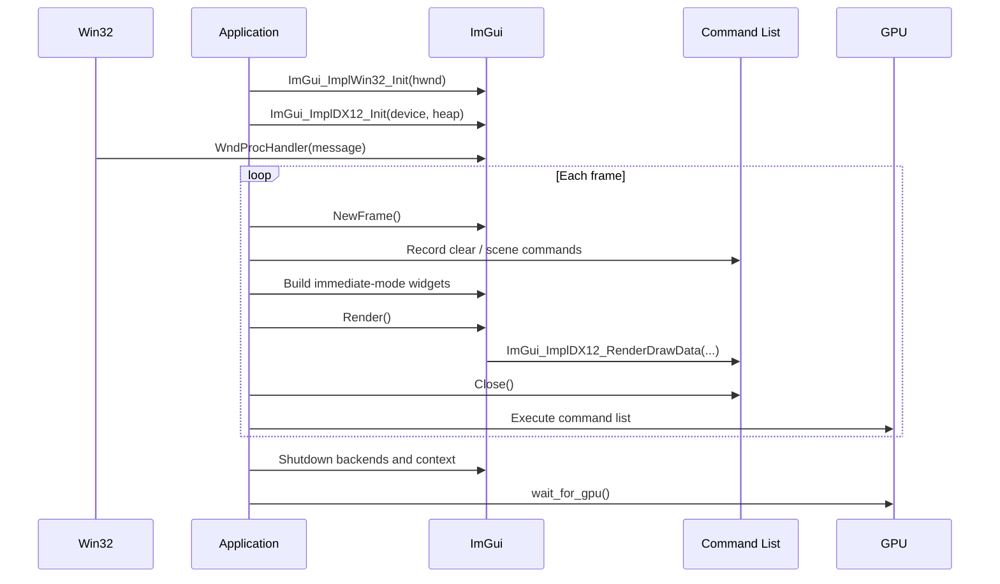

# Step 3 — Putting a Face on the Machine: Dear ImGui

## The Problem with a Silent Window

In Steps 1 and 2 we built something real: a Win32 window backed by a full D3D12
rendering pipeline, clearing the back buffer to sky-blue sixty times a second.
But there was nothing to look at, no way to know that anything was actually
running, and — crucially — no way to poke at the program while it ran.

That is the problem Dear ImGui was built to solve.

## What ImGui Is

Dear ImGui is an *immediate-mode* GUI library. "Immediate-mode" is a design
philosophy: instead of creating widget objects that live in memory and send you
events later, you call functions that both describe *and* draw a widget in a
single call. Every frame, you say:

```cpp
if (ImGui::Button("Step Erosion"))
    do_the_erosion();
```

The `Button` call renders the button *right now* and returns `true` the instant
it is clicked. There are no callback registrations, no widget trees to update,
no retained state to synchronize. The GUI exists only for as long as you keep
calling the functions that describe it.

This makes ImGui extraordinarily easy to add to an existing renderer. It does
not own the render loop; it rides inside yours.

## Where ImGui Lives in the Frame

ImGui needs to know three things:

1. **The platform** — mouse position, keyboard state, window size. On Windows,
   this comes from `ImGui_ImplWin32`. You route your `WndProc` messages through
   `ImGui_ImplWin32_WndProcHandler` so ImGui hears every mouse click and key
   press before your own code.

2. **The renderer** — a D3D12 command list to record draw commands into, and a
   shader-visible descriptor heap to hold the font atlas texture. On D3D12, this
   is `ImGui_ImplDX12`.

3. **A frame boundary** — you call `NewFrame()` before drawing any widgets and
   `Render()` followed by `RenderDrawData()` after. Everything between those two
   calls is your GUI.

In our frame loop the choreography looks like this:

```
begin_frame()                    ← transition back buffer, bind RTV
ClearRenderTargetView(...)        ← paint the sky

ImGui_ImplDX12_NewFrame()         ← tell ImGui the D3D12 frame is starting
ImGui_ImplWin32_NewFrame()        ← tell ImGui the platform frame is starting
ImGui::NewFrame()                 ← begin the immediate-mode frame

render_imgui()                   ← your Begin/End/Button/Text calls
                                 ← ImGui::Render() + RenderDrawData()

end_frame()                      ← transition back buffer, Present
```

Notice that ImGui's commands are recorded into the *same* command list as the
clear. They are submitted together at `end_frame()`, which is exactly right:
ImGui's draw calls are ordinary D3D12 draw calls — vertex buffers, an index
buffer, a texture (the font atlas), and a simple shader.

## The Shader-Visible Heap

In Step 2 we created an `rtv_heap` — a descriptor heap of type `RTV` with the
flag `D3D12_DESCRIPTOR_HEAP_FLAG_NONE`. That flag means the heap is only visible
to the CPU; the GPU cannot read it directly. RTVs are fine with this because the
GPU binds them through the `OMSetRenderTargets` call, not through a shader.

ImGui's font atlas is different. It is a texture that the pixel shader samples
during the draw call. Shader-accessed resources must live in a
`CBV_SRV_UAV`-type heap with the flag `D3D12_DESCRIPTOR_HEAP_FLAG_SHADER_VISIBLE`.

So we added `imgui_srv_heap`, a one-descriptor shader-visible heap, and passed
both its CPU and GPU handles to `ImGui_ImplDX12_Init`. ImGui stores the font
atlas texture in that single slot. Before calling `RenderDrawData` each frame we
bind the heap with `SetDescriptorHeaps` so the GPU can find the texture.

One heap, one descriptor, one texture — it is the simplest possible example of
how D3D12 resource binding works, and a useful preview of what we will do at
much larger scale in Step 5.

## Shutdown

ImGui holds D3D12 resources (the font atlas texture and its upload buffer). We
must release them before the D3D12 device is destroyed, which means the ImGui
shutdown calls must come *before* `wait_for_gpu()` in the destructor — and
`wait_for_gpu()` must come before any ComPtr destructor fires.

The destructor order in Step 3:

```cpp
ImGui_ImplDX12_Shutdown();
ImGui_ImplWin32_Shutdown();
ImGui::DestroyContext();

wait_for_gpu();     // drain all in-flight GPU work
// ComPtrs release here, in reverse declaration order
```

Getting this order wrong produces a D3D12 validation error or a driver crash.
Getting it right is an early lesson in the discipline that D3D12 demands: every
resource has a lifetime, and you own it.

## What We Built

After Step 3 the window shows two floating panels:

- A **Renderer** panel displaying the current back buffer index and dimensions.
- A **Step 3** panel confirming ImGui is operational inside the D3D12 frame.

These are placeholders. In Step 4 they will be replaced by live simulation data,
making the program genuinely interactive for the first time.

---

## Video References

Neither of the companion tutorial series covers Dear ImGui integration directly.
ImGui is a third-party library with its own D3D12 backend, not part of the
DirectX 12 standard.

For video context, the closest alternatives are:

- **Search YouTube** for *"Dear ImGui DirectX 12"* — several community tutorials
  cover `ImGui_ImplDX12_Init`, the descriptor heap slot you must reserve for ImGui's
  font texture, and the `NewFrame` / `Render` lifecycle that Chapter 2 of this lesson
  describes.
- **JAPG Part 8** — [Presenting the RenderTarget](https://www.youtube.com/watch?v=sCfF_-WylNA)
  and **Chili Episode 2** — [First Present](https://www.youtube.com/watch?v=SxO7QsZjE3Q)
  both show the `BeginFrame` / record commands / `EndFrame` pattern on the command list.
  Understanding that pattern first makes ImGui's requirements clear: ImGui simply
  records additional draw commands into the same list before `Close()`.

## Sequence Interaction Diagram


