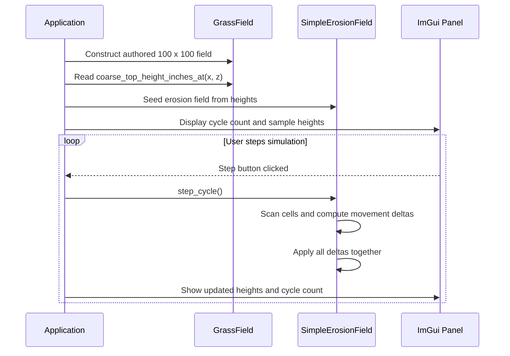
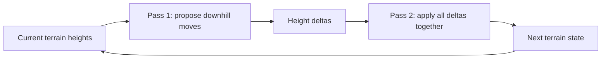

# Step 4 — The Simulation: Gravity Settling from Scratch

## Before We Draw Anything

There is a temptation, when working with graphics, to reach for the GPU the
moment you have something to show. Resist it. The most common source of
mysterious rendering bugs is not a bad shader — it is a bad data model. Before
we commit pixels to the screen we need to know that our simulation is *correct*,
and the best way to know that is to be able to read its state directly without
a shader in the way.

That is why Step 4 is a pure C++ exercise. We write the erosion simulation,
wire it to ImGui, and watch numbers change when we click a button. Only when
the numbers make sense do we write the shader in Step 5.

## The Problem the Simulation Solves

Imagine granny's back yard as a grid of columns. Each column has a height —
the number of inches of soil above some notional bedrock. Rain falls, soil
softens, and gravity pulls loose material downhill. Over many cycles the
yard develops natural slopes, channels, and flat areas.

We model this with the simplest possible rule: **if a column is two or more
inches taller than a neighbour, one inch of material moves to that neighbour**.

That's the whole algorithm. The complexity comes from running it thousands of
times.

## The Two-Pass Design

Here is the first engineering decision worth understanding: you cannot update
the height grid in-place during the scan.

Suppose column A is 14 inches tall and its neighbour B is 12 inches tall. The
difference is 2, so A donates 1 inch to B. Now B is 13 inches and its neighbour
C is 10 inches — a difference of 3. So B donates 1 inch to C in the *same
cycle*. You have just moved material two columns in a single step. Run this
enough times and material will "flow" across the entire grid in one cycle rather
than settling one inch per cycle. The simulation is wrong.

The fix is to separate *observation* from *mutation*:

```
Pass 1: for every column, observe heights, compute what would change.
        Store the changes in a delta buffer. Do NOT touch heights.

Pass 2: apply all the deltas at once.
```

The delta buffer is just `std::vector<int>` pre-filled with zeros. When we
decide that column A loses 1 inch and column B gains 1 inch, we write:

```cpp
deltas[index_of(A)] -= 1;
deltas[index_of(B)] += 1;
```

After scanning every column we do one final pass:

```cpp
for (size_t i = 0; i < heights_.size(); ++i)
    heights_[i] += deltas[i];
```

Now every column sees the *same* state during the decision pass regardless of
scan order. This is the standard pattern for cellular automata — Game of Life
uses it, Conway's water simulation uses it, and so does this.

## The Angle-of-Repose Threshold

Why does the height difference need to be *at least 2 inches* before material
moves?

A difference of exactly 1 inch is stable. If you allowed a difference of 1 to
trigger a move, the inch would fall to the neighbour, making the neighbour 1
inch taller than the original column — which would then trigger a move back.
The simulation would oscillate forever and never settle.

Two inches is the minimum height from which a single inch of material can fall
and leave the donor at a height equal to or higher than the recipient. It is a
discrete approximation of the *angle of repose* — the steepest slope at which
loose granular material stays put without sliding.

Real sand has an angle of repose around 30–35 degrees. In our model, a drop of
2 inches over one column-width of distance (one foot at 1-foot voxels) is about
10 degrees — gentler than real sand, which means our terrain will settle to
very shallow slopes over many cycles. That is fine for a learning simulation;
adjusting the threshold and the grid resolution are later refinements.

## Data Layout: Row-Major Order

The height grid is stored as a flat `std::vector<int>`:

```
index = z * width + x
```

This is *row-major* order: all columns in row z=0 come first, then z=1, and so
on. It is the same layout that C arrays use, and that most GPU buffer uploads
expect. Getting comfortable with `index = row * width + col` will serve you
well when we pack data into upload heaps in Step 6.

## Seeding from GrassField

`SimpleErosionField` knows nothing about `GrassField`'s terrain materials,
detail patches, or Perlin noise. It takes exactly one thing: a flat array of
heights in inches. The seeding loop in `Application` translates between the
two:

```cpp
for (int z = 0; z < d; ++z)
    for (int x = 0; x < w; ++x)
        heights.push_back(m_grass_field.coarse_top_height_inches_at(x, z));
```

This is a useful separation of concerns: terrain *generation* lives in
`GrassField`, terrain *settling* lives in `SimpleErosionField`. The simulation
does not need to know where the initial terrain came from, and the terrain
generator does not need to know what happens to its output.

## What You Can Observe

Run the program and open the **Simulation** panel. The heights shown are the
top-left 3×3 patch of the 100×100 yard — raw numbers in inches.

Click **Step Erosion (x1)** once. Some of the numbers will change by ±1. These
are columns that were exactly 2 inches different from a neighbour and have
begun to settle.

Click **Step Erosion (x100)** a few times. The numbers will converge. After
enough cycles the yard approaches its angle-of-repose equilibrium — a gently
sloped surface with almost no two-inch drops anywhere. At that point the
simulation is "done" for this initial terrain, and further stepping changes
very little.

This is the entire simulation working correctly, and you can prove it without
a single draw call.

---

## Video References

The gravity-settling erosion simulation in this step is specific to this project
and has no direct equivalent in either companion series.

For broader context on the data-before-GPU philosophy that motivates this step:

### JAPG — *Your first DirectX 12 application in C++*

- [Part 9 — Summary (no code)](https://www.youtube.com/watch?v=gSBF8oz8BcA):
  A conceptual recap of the first eight episodes that reinforces the idea of building
  the platform in layers before rendering anything. This episode's spirit — understand
  every layer before you reach for the GPU — is exactly what Step 4 practices.
- [Part 10 — Creating buffers on the GPU](https://www.youtube.com/watch?v=6juAjhlSPoc):
  The `ID3D12Resource` upload-heap pattern used to move the column height array from
  CPU to GPU in Step 6 is introduced here. Watching it now prepares you for that
  transition.

## Sequence Interaction Diagram



## Concept Diagram


