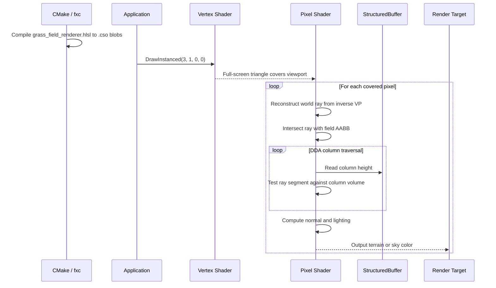
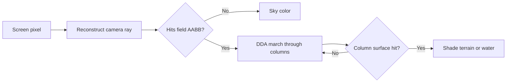

# Lesson 05: The HLSL Column Raycast Shader

---

## Chapter 1: What Problem This Shader Solves

After Step 4 we had simulation data living in a C++ struct — a flat array of
column heights, integers representing inches of packed sand. None of that was
visible yet. To make it visible we need to answer one question per pixel:

**Given this pixel's position on screen, what does the camera see when it looks
through that pixel into the column field?**

A traditional mesh renderer would convert the column heights into triangles and
rasterise them. We chose a different path: *column raycasting*, the same
technique Wolfenstein 3D used for its walls in 1992, adapted for a grid of
variable-height columns seen from above.

---

## Chapter 2: The Full-Screen Triangle Trick

Most tutorials draw a full-screen quad — two triangles — to cover the viewport.
We use one triangle instead. The vertex shader generates its three vertices from
nothing but the vertex index (`SV_VertexID`):

```hlsl
VSOutput VSMain(uint vertex_id : SV_VertexID)
{
    const float2 clip = float2(
        vertex_id == 2 ? 3.0 : -1.0,
        vertex_id == 1 ? 3.0 : -1.0);

    VSOutput output;
    output.position = float4(clip, 0.0, 1.0);
    output.uv = float2(
        (clip.x + 1.0) * 0.5,
        (1.0 - clip.y) * 0.5);
    return output;
}
```

The three clip-space positions are `(-1, -1)`, `(-1, 3)`, and `(3, -1)`. These
form a triangle that completely contains the NDC unit square `[-1, 1]²`. The
GPU rasteriser clips the overhanging parts to the viewport boundary and visits
every pixel in the square exactly once.

Why one triangle? Two triangles share a diagonal edge and, under certain GPU
rounding modes, can produce a visible seam or precision discontinuity along that
diagonal. One triangle has no such internal edge.

We call `DrawInstanced(3, 1, 0, 0)` with *no vertex buffer at all*. The number
`3` is the only thing that matters — the GPU invokes the vertex shader three
times, once per vertex, and `SV_VertexID` carries the index.

---

## Chapter 3: The Constant Buffer — Talking to the Shader

The pixel shader needs to know where the camera is and what the field looks like.
We send that information through a *constant buffer* — a small block of memory
the CPU writes every frame and the GPU reads as read-only uniform data:

```hlsl
cbuffer SceneConstants : register(b0)
{
    float4x4 inverse_view_projection;
    float4   camera_world_pos;
    float    field_origin_x;
    float    field_origin_z;
    float    voxel_size_feet;
    float    max_height_feet;
    uint     field_width;
    uint     field_depth;
    uint     pad0;
    uint     pad1;
};
```

The `register(b0)` annotation tells the compiler this buffer lives at constant
buffer slot 0. On the CPU side, Step 6 will bind a `D3D12_ROOT_CBV` parameter
at the same slot index.

One important layout rule: HLSL packs cbuffer members into 16-byte rows and
will not let a single value straddle a row boundary. The padding fields `pad0`
and `pad1` exist to keep the structure's size a multiple of 16 bytes and prevent
the compiler from inserting unexpected gaps.

---

## Chapter 4: The Structured Buffer — Terrain Data on the GPU

Column heights arrive via a separate `StructuredBuffer`:

```hlsl
StructuredBuffer<float> column_heights_feet : register(t0);
```

`register(t0)` places this at shader resource slot 0. On the CPU side an SRV
(shader resource view) points to an upload heap buffer filled with one `float`
per column in row-major order: `index = z * field_width + x`.

A `StructuredBuffer` is the right choice here — each element is a fixed-stride
struct (just a `float` in our case), and the GPU accesses elements by integer
index. This is more efficient than a `Buffer<float>` (typed) for large irregular
access patterns, and much more natural to use than a raw `ByteAddressBuffer`.

---

## Chapter 5: Reconstructing the Camera Ray

Every pixel runs the same four lines of ray-reconstruction logic:

```hlsl
CameraRay BuildCameraRay(float2 uv)
{
    const float2 ndc      = float2(uv.x * 2.0 - 1.0, 1.0 - uv.y * 2.0);
    float4 far_clip       = float4(ndc, 1.0, 1.0);
    float4 far_world      = mul(far_clip, inverse_view_projection);
    far_world.xyz        /= far_world.w;

    CameraRay ray;
    ray.origin    = camera_world_pos.xyz;
    ray.direction = normalize(far_world.xyz - ray.origin);
    return ray;
}
```

The idea is to run the camera transform *backwards*. The vertex shader normally
goes forward: world space → clip space. Here we go in reverse: for a pixel at
UV position `(u, v)`, we construct a point on the *far clip plane* in clip space
(`z = 1, w = 1`), multiply by the inverse of the view-projection matrix, and
divide by the resulting `w` to recover a true world-space position.

The ray direction is then just that world-space position minus the camera eye.

**The transpose question.** DirectXMath matrices are row-major. HLSL cbuffer
packing stores matrices column by column. The CPU must transpose the matrix
before uploading it, so that the HLSL `mul(row_vector, matrix)` produces the
correct result. The `XMMatrixTranspose` call in `update_scene_constants()` is
not optional — without it every ray points in the wrong direction.

---

## Chapter 6: AABB Rejection — the Slab Method

Before the DDA loop starts, we test whether the ray even touches the field's
bounding box. This early-out is the difference between a shader that runs fast
on sky pixels and one that iterates through an empty grid:

```hlsl
bool IntersectAabb(float3 origin, float3 direction,
                   float3 aabb_min, float3 aabb_max,
                   out float t_enter, out float t_exit)
{
    const float3 t0    = (aabb_min - origin) / direction;
    const float3 t1    = (aabb_max - origin) / direction;
    const float3 t_near = min(t0, t1);
    const float3 t_far  = max(t0, t1);

    t_enter = max(max(t_near.x, t_near.y), t_near.z);
    t_exit  = min(min(t_far.x,  t_far.y),  t_far.z);

    return t_exit >= max(t_enter, 0.0);
}
```

The *slab method* treats the box as three pairs of infinite parallel planes —
one pair per axis. For each axis we solve for the two t-values where the ray
crosses that pair. The ray enters the box at the latest near crossing and exits
at the earliest far crossing. If exit ≥ entry, the ray hits. The `max(t_enter, 0)`
handles the case where the camera is already inside the box.

---

## Chapter 7: DDA Column Traversal

The DDA (Digital Differential Analysis) loop visits every column the ray passes
through, in order from nearest to farthest:

```hlsl
// How far the ray travels in t to cross one column in each direction.
const float t_delta_x = abs(voxel_size_feet / ray.direction.x);
const float t_delta_z = abs(voxel_size_feet / ray.direction.z);

// t at which the ray will next cross an X boundary and a Z boundary.
float t_max_x = (next_boundary_x - entry_pos.x) / ray.direction.x;
float t_max_z = (next_boundary_z - entry_pos.z) / ray.direction.z;

for (int step = 0; step < k_max_steps; ++step)
{
    // Check the column we are currently in.
    float col_height = column_heights_feet[cell_z * field_width + cell_x];
    // ... intersection test here ...

    // Advance to the nearer boundary.
    if (t_max_x < t_max_z) { t_max_x += t_delta_x; cell_x += step_x; }
    else                    { t_max_z += t_delta_z; cell_z += step_z; }
}
```

`t_delta_x` is how much `t` increases each time the ray crosses an X-axis column
boundary. It is `voxel_size / |direction.x|` — the horizontal distance divided
by how fast the ray moves horizontally. At each iteration we compare `t_max_x`
and `t_max_z` and advance to whichever boundary is closer, stepping exactly one
column in that direction. The ray never wastes a step in empty air.

This is the same loop that drew Wolfenstein 3D's walls — just extended from 2D
walls to 3D columns with variable heights.

---

## Chapter 8: Shading

When the DDA finds a hit, the pixel shader computes a diffuse colour. The normal
is estimated from neighbouring column heights (a central-difference gradient on
the top face, or an axis-aligned face normal on a side face). A single directional
light and ambient term give the columns their three-dimensional appearance:

```hlsl
const float3 light_dir = normalize(float3(0.4, 1.0, 0.3));
const float  diffuse   = saturate(dot(normal, light_dir));
const float3 color     = base_color * (diffuse * 0.8 + 0.2);
```

Pixels that miss all columns fall through to `SkyColor()` — a simple
horizon-to-zenith gradient.

---

## Chapter 9: fxc and the Build System

The shader is compiled at *build time* by `fxc.exe`, Microsoft's offline HLSL
compiler. The compiled bytecode (`.cso` file) is embedded into the executable
as a raw binary resource and loaded with `std::ifstream` at runtime.

In `CMakeLists.txt`:

```cmake
add_custom_command(
    OUTPUT  "${CSO_DIR}/grass_field_renderer.ps.cso"
    COMMAND fxc /nologo /T ps_5_0 /E PSMain /Fo "...ps.cso" "...hlsl"
    DEPENDS "${HLSL_FILE}"
    VERBATIM
)
```

`/T ps_5_0` is the shader model (Shader Model 5.0, compatible with all D3D12
hardware). `/E PSMain` names the entry point. A separate `add_custom_command`
compiles the vertex shader with `/T vs_5_0 /E VSMain`.

---

## Chapter 10: What We Learned

Step 5 covers the heart of the rendering system:

- A full-screen triangle driven by `SV_VertexID` is simpler, cheaper, and more
  precise than two triangles with a vertex buffer.
- `cbuffer` and `StructuredBuffer` are how the CPU and GPU exchange data through
  the shader pipeline.
- Ray reconstruction (UV → NDC → inverse VP → world-space direction) runs the
  camera transform backwards, one pixel at a time.
- DDA traversal visits exactly the right columns in exactly the right order,
  with no wasted steps.
- The matrix transpose before upload is not optional — row-major on the CPU
  becomes column-major in the HLSL cbuffer.

Step 6 will wire the CPU side of this pipeline: the root signature that describes
the shader's inputs, the PSO that compiles the shader into a usable state object,
and the upload heap that gets the column heights onto the GPU each frame.

---

## Video References

The HLSL concepts in this lesson — `cbuffer` layout, `StructuredBuffer`,
`SV_VertexID`, and the full-screen triangle trick — appear in both series under
their shader and pipeline setup episodes.

### Chili — *Direct3D 12 Shallow Dive*

- [Episode 5 — Pipeline State Object (PSO) and Root Signature](https://www.youtube.com/watch?v=D21ISXRIJ_A):
  Chili's treatment of PSO creation mirrors the pipeline that will consume this
  shader in Step 6. Watch this alongside the shader to see how HLSL output slots
  map to PSO state.

### JAPG — *Your first DirectX 12 application in C++*

- [Part 12 — Creating a HLSL shader class](https://www.youtube.com/watch?v=4JFAMiSpTCI):
  HLSL shader authoring, compilation with `D3DCompileFromFile`, and the `ID3DBlob`
  you attach to the PSO — the same compilation pipeline that makes this step's
  `.hlsl` file usable.
- [Part 13 — Creating a root signature](https://www.youtube.com/watch?v=V2F-BRXMNZE):
  Root signature design from JAPG's perspective. Compare with Chapter 1 of Step 6
  to see how different binding model choices lead to the same concept.
- [Part 14 — Creating a graphics pipeline](https://www.youtube.com/watch?v=PVtmy76Y9Ow):
  PSO construction, rasteriser state, and input layout — the D3D12 side of what
  this lesson's HLSL describes.

## Sequence Interaction Diagram



## Concept Diagram


