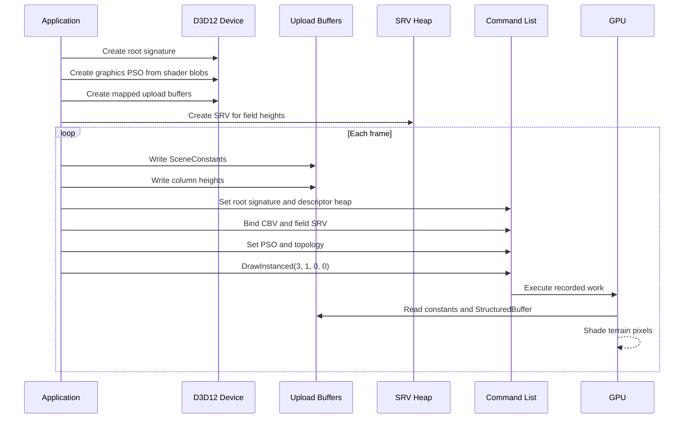
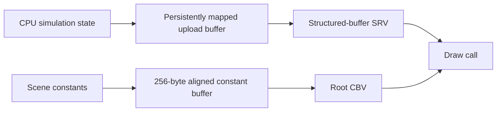

# Lesson 06: GPU Buffer Upload and the Draw Call

---

## Chapter 1: Bridging the CPU and GPU

Step 5 explained what the HLSL shader expects: a constant buffer at `b0` and a
structured buffer at `t0`. Step 6 is about making those promises real on the
CPU side.

Three objects turn the promise into reality:

1. A **root signature** that describes the shader's inputs in a language D3D12
   understands.
2. A **pipeline state object (PSO)** that binds the compiled shader blobs to the
   GPU pipeline, along with rasteriser and blend state.
3. **Upload heap buffers** that carry the actual data — the constant struct and
   the column-height array — from CPU memory to the GPU each frame.

---

## Chapter 2: The Root Signature

The root signature is a contract between the application and the shader. It
describes every resource the shader will read, and it must match the HLSL
`register` declarations exactly.

Our shader has two inputs:

- `cbuffer SceneConstants : register(b0)` — scene constants
- `StructuredBuffer<float> column_heights_feet : register(t0)` — terrain data

The root signature declares these as two root parameters:

```cpp
D3D12_ROOT_PARAMETER params[2] = {};

// Parameter 0: inline root CBV — binds a constant buffer by GPU virtual address.
// No descriptor heap slot needed; the address goes directly into the root.
params[0].ParameterType             = D3D12_ROOT_PARAMETER_TYPE_CBV;
params[0].Descriptor.ShaderRegister = 0;   // b0 in HLSL
params[0].ShaderVisibility          = D3D12_SHADER_VISIBILITY_ALL;

// Parameter 1: descriptor table pointing at the SRV for the field heights.
// A table references one or more slots in a descriptor heap.
D3D12_DESCRIPTOR_RANGE srv_range = {};
srv_range.RangeType          = D3D12_DESCRIPTOR_RANGE_TYPE_SRV;
srv_range.NumDescriptors     = 1;
srv_range.BaseShaderRegister = 0;   // t0 in HLSL

params[1].ParameterType                       = D3D12_ROOT_PARAMETER_TYPE_DESCRIPTOR_TABLE;
params[1].DescriptorTable.NumDescriptorRanges = 1;
params[1].DescriptorTable.pDescriptorRanges   = &srv_range;
params[1].ShaderVisibility                    = D3D12_SHADER_VISIBILITY_PIXEL;
```

An *inline root CBV* is the right choice for the scene constants because they
are small and change every frame. Binding them by GPU virtual address (with
`SetGraphicsRootConstantBufferView`) costs a single 8-byte slot in the root
rather than a descriptor heap slot, which is faster.

The SRV, by contrast, lives in a descriptor heap and is referenced through a
descriptor table. This is the required approach for `StructuredBuffer` and
`Texture` resources — they are bound by a descriptor, not by raw address.

The root signature must be serialised (turned into a binary blob) and then
created on the device:

```cpp
ComPtr<ID3DBlob> sig_blob;
D3D12SerializeRootSignature(&root_sig_desc, D3D_ROOT_SIGNATURE_VERSION_1,
                            &sig_blob, &error_blob);
device->CreateRootSignature(0, sig_blob->GetBufferPointer(),
                            sig_blob->GetBufferSize(),
                            IID_PPV_ARGS(&m_root_signature));
```

---

## Chapter 3: The Pipeline State Object

The PSO is an immutable, compiled description of the entire GPU rendering
pipeline for one type of draw call. Once created it is very cheap to use — the
driver does its most expensive compilation work at `CreateGraphicsPipelineState`
time, not at draw time.

```cpp
D3D12_GRAPHICS_PIPELINE_STATE_DESC pso_desc = {};
pso_desc.pRootSignature        = m_root_signature.Get();
pso_desc.VS                    = { vs_blob.data(), vs_blob.size() };
pso_desc.PS                    = { ps_blob.data(), ps_blob.size() };
pso_desc.BlendState            = blend_desc;
pso_desc.RasterizerState       = raster_desc;
pso_desc.DepthStencilState     = ds_desc;
pso_desc.PrimitiveTopologyType = D3D12_PRIMITIVE_TOPOLOGY_TYPE_TRIANGLE;
pso_desc.NumRenderTargets      = 1;
pso_desc.RTVFormats[0]         = k_back_buffer_format;
pso_desc.SampleDesc.Count      = 1;
```

Two details stand out:

**`RenderTargetWriteMask`.** The blend state's `RenderTargetWriteMask` must be
set to `D3D12_COLOR_WRITE_ENABLE_ALL`. If you leave it at zero (the zero-init
default) the PSO will compile successfully but nothing will appear on screen —
the GPU writes will be masked out silently.

**No depth buffer.** `DepthStencilState.DepthEnable = FALSE`. Our full-screen
raycast shader handles its own depth-sorting internally (DDA returns the nearest
hit by construction), so we do not need a D3D12 depth attachment.

The shader blobs (`.cso` files) are loaded from disk at startup, adjacent to the
executable. CMake's `add_custom_command` compiles them at build time with `fxc`.

---

## Chapter 4: Upload Heaps and Persistent Mapping

D3D12 memory lives in *heaps* — regions of memory with a fixed type. For data
the CPU writes and the GPU reads, the correct heap type is `D3D12_HEAP_TYPE_UPLOAD`.

An upload heap buffer is CPU-writable and GPU-readable. We `Map` it once at
startup and keep the pointer permanently:

```cpp
D3D12_HEAP_PROPERTIES upload_heap = {};
upload_heap.Type = D3D12_HEAP_TYPE_UPLOAD;

D3D12_RESOURCE_DESC buf_desc = {};
buf_desc.Dimension  = D3D12_RESOURCE_DIMENSION_BUFFER;
buf_desc.Width      = field_buf_size;   // bytes
buf_desc.Height = buf_desc.DepthOrArraySize = buf_desc.MipLevels = 1;
buf_desc.Format     = DXGI_FORMAT_UNKNOWN;  // required for buffers
buf_desc.Layout     = D3D12_TEXTURE_LAYOUT_ROW_MAJOR;
buf_desc.SampleDesc.Count = 1;

device->CreateCommittedResource(
    &upload_heap, D3D12_HEAP_FLAG_NONE, &buf_desc,
    D3D12_RESOURCE_STATE_GENERIC_READ,
    nullptr, IID_PPV_ARGS(&m_field_buffer));

D3D12_RANGE no_read = { 0, 0 };   // {0,0} = CPU write-only, no read-back
m_field_buffer->Map(0, &no_read, reinterpret_cast<void**>(&m_field_buffer_mapped));
```

*Persistent mapping* — leaving the buffer mapped between frames — is explicitly
allowed by D3D12 for upload heaps and is the standard pattern for frequently
updated buffers. We simply `memcpy` new data into `m_field_buffer_mapped` each
frame without unmapping and remapping.

---

## Chapter 5: The 256-Byte Alignment Rule

D3D12 requires that constant buffer GPU virtual addresses be aligned to
256 bytes. This is a hardware constraint on the CBV descriptor's address:

```cpp
// Minimum aligned size for the constant buffer
constexpr UINT64 k_cb_aligned_size =
    (sizeof(SceneConstants) + 255) & ~255ULL;  // round up to next 256 bytes
```

The formula `(size + 255) & ~255` is the canonical integer round-up-to-power-of-
two trick. A 104-byte `SceneConstants` struct, for example, rounds up to 256.
The buffer is allocated at this padded size, not the raw `sizeof` size.

Forget this alignment and you get a D3D12 debug layer error:
*"D3D12 ERROR: Invalid GPU virtual address for constant buffer view"* — or, on
release builds, silent garbage rendering.

---

## Chapter 6: The SRV for the Field Heights

The column heights live in the upload heap buffer, but the shader accesses them
through a *shader resource view* (SRV) stored in the descriptor heap. We share
the ImGui SRV heap and place the field SRV at slot 1 (ImGui reserves slot 0 for
its font atlas):

```cpp
D3D12_CPU_DESCRIPTOR_HANDLE srv_cpu =
    imgui_srv_heap->GetCPUDescriptorHandleForHeapStart();
srv_cpu.ptr += srv_descriptor_size;   // advance to slot 1

D3D12_SHADER_RESOURCE_VIEW_DESC srv_desc = {};
srv_desc.Format                     = DXGI_FORMAT_UNKNOWN;  // structured buffer
srv_desc.ViewDimension              = D3D12_SRV_DIMENSION_BUFFER;
srv_desc.Shader4ComponentMapping    = D3D12_DEFAULT_SHADER_4_COMPONENT_MAPPING;
srv_desc.Buffer.NumElements         = static_cast<UINT>(cell_count);
srv_desc.Buffer.StructureByteStride = sizeof(float);

device->CreateShaderResourceView(m_field_buffer.Get(), &srv_desc, srv_cpu);
```

`DXGI_FORMAT_UNKNOWN` with a non-zero `StructureByteStride` is the marker for a
structured buffer SRV, as opposed to a typed buffer. The `Shader4ComponentMapping`
value `D3D12_DEFAULT_SHADER_4_COMPONENT_MAPPING` is a sentinel that means
"read RGBA directly from the resource without swizzling."

---

## Chapter 7: Per-Frame Data Upload

Every frame after an erosion step, `update_field_buffer()` converts the
simulation's inch-scale integer heights into float feet and writes them into the
persistently-mapped CPU pointer:

```cpp
void update_field_buffer()
{
    const int w = m_erosion_field.width();
    const int d = m_erosion_field.depth();
    for (int z = 0; z < d; ++z)
        for (int x = 0; x < w; ++x)
        {
            const float feet = m_erosion_field.height_at(x, z) / 12.f;
            m_field_buffer_mapped[z * w + x] = feet;
        }
}
```

This conversion runs on the CPU. The GPU reads the results via the SRV the same
frame they are written. No copy command is needed because the upload heap is
directly accessible to the GPU; the driver maps it through a PCIe write-combining
path. For buffers this small (100 × 100 × 4 = ~40 KB) there is no performance
concern.

---

## Chapter 8: Recording the Draw Call

With the PSO bound and both resources populated, recording a frame's draw call
is four lines:

```cpp
command_list->SetGraphicsRootSignature(m_root_signature.Get());
command_list->SetDescriptorHeaps(1, imgui_srv_heap.GetAddressOf());

// Bind the constant buffer by GPU virtual address (inline root CBV, slot 0).
command_list->SetGraphicsRootConstantBufferView(
    0, m_cb_buffer->GetGPUVirtualAddress());

// Bind the descriptor table for the SRV (slot 1 in the heap = slot 1 in the table).
D3D12_GPU_DESCRIPTOR_HANDLE field_srv_gpu =
    imgui_srv_heap->GetGPUDescriptorHandleForHeapStart();
field_srv_gpu.ptr += srv_descriptor_size;   // slot 1
command_list->SetGraphicsRootDescriptorTable(1, field_srv_gpu);

command_list->SetPipelineState(m_pso.Get());
command_list->IASetPrimitiveTopology(D3D_PRIMITIVE_TOPOLOGY_TRIANGLELIST);
command_list->DrawInstanced(3, 1, 0, 0);   // 3 vertices, 1 instance — full-screen triangle
```

`DrawInstanced(3, 1, 0, 0)` issues a draw with three vertices and no vertex
buffer. The vertex shader picks up `SV_VertexID` from the GPU and generates the
full-screen triangle positions mathematically. D3D12 does not require a vertex
buffer to be bound if the shader does not use one.

---

## Chapter 9: What We Learned

Step 6 is where the CPU and GPU truly meet:

- The root signature is the formal contract between the application and the
  shader — parameter indices, register numbers, and shader visibility must all
  match exactly.
- The PSO compiles once at startup; switching pipeline states at draw time is
  nearly free.
- Upload heaps are the right tool for data that changes every frame. Persistent
  mapping avoids the overhead of repeated `Map`/`Unmap` calls.
- Constant buffers must be 256-byte aligned — this is a hard hardware rule.
- `DrawInstanced(3, 1, 0, 0)` with no vertex buffer is the correct way to issue
  the full-screen triangle draw.

Steps 5 and 6 together give us a working renderer. The terrain is visible and
updates live as erosion steps run. Step 7 will improve the UI and add mouse
picking so we can click on any column and read its height.

---

## Video References

Step 6 assembles the CPU side of the rendering pipeline — root signature, PSO,
upload heap, SRV, and draw call. These are the most thoroughly covered topics in
both companion series.

### Chili — *Direct3D 12 Shallow Dive*

- [Episode 4 — Uploading Buffers](https://www.youtube.com/watch?v=8bOcEfB1eYM):
  Upload heaps, `Map`/`Unmap`, and committed resources — the exact pattern used
  for the persistent-mapped column height buffer in Chapter 4.
- [Episode 5 — Pipeline State Object (PSO) and Root Signature](https://www.youtube.com/watch?v=D21ISXRIJ_A):
  PSO creation and root signature design from Chili's perspective — the same
  machinery assembled in Chapters 1–3 of this lesson.
- [Episode 6 — Constant Buffer Root Descriptor](https://www.youtube.com/watch?v=ocvAbGJ4ppA):
  Inline root CBVs (`D3D12_ROOT_PARAMETER_TYPE_CBV`), 256-byte alignment, and
  `SetGraphicsRootConstantBufferView` — all explained in Chapter 4.

### JAPG — *Your first DirectX 12 application in C++*

- [Part 10 — Creating buffers on the GPU](https://www.youtube.com/watch?v=6juAjhlSPoc):
  `ID3D12Resource` upload heap creation and the general buffer-upload pattern.
- [Part 15 — Our first drawcall (video 1)](https://www.youtube.com/watch?v=wXJpXAzzeFU):
  Setting the root signature and PSO on the command list and issuing `DrawInstanced`.
- [Part 16 — Our first drawcall (video 2)](https://www.youtube.com/watch?v=IbeYoGQUC44):
  Completing the draw call and seeing the first rendered output — satisfying
  after all this plumbing.
- [Part 17 — Binding a ConstantBuffer](https://www.youtube.com/watch?v=loURV3HGosw):
  `SetGraphicsRootConstantBufferView`, 256-byte alignment, and the cbuffer-to-GPU
  resource connection — the same `SceneConstants` upload described in Chapter 4.

## Sequence Interaction Diagram



## Concept Diagram


