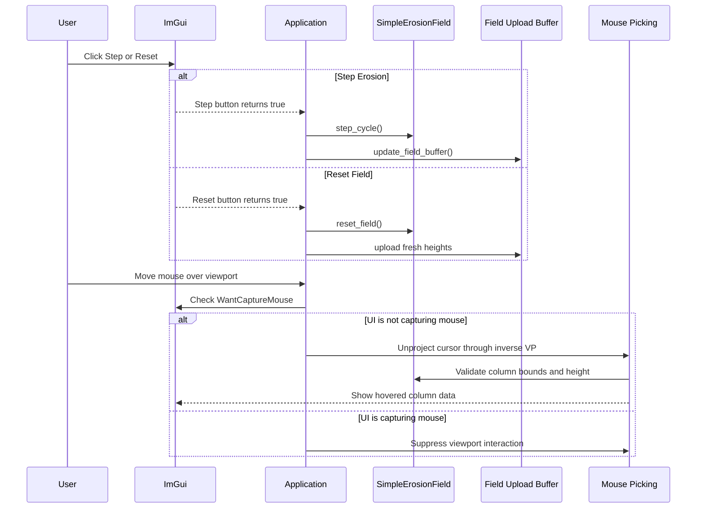
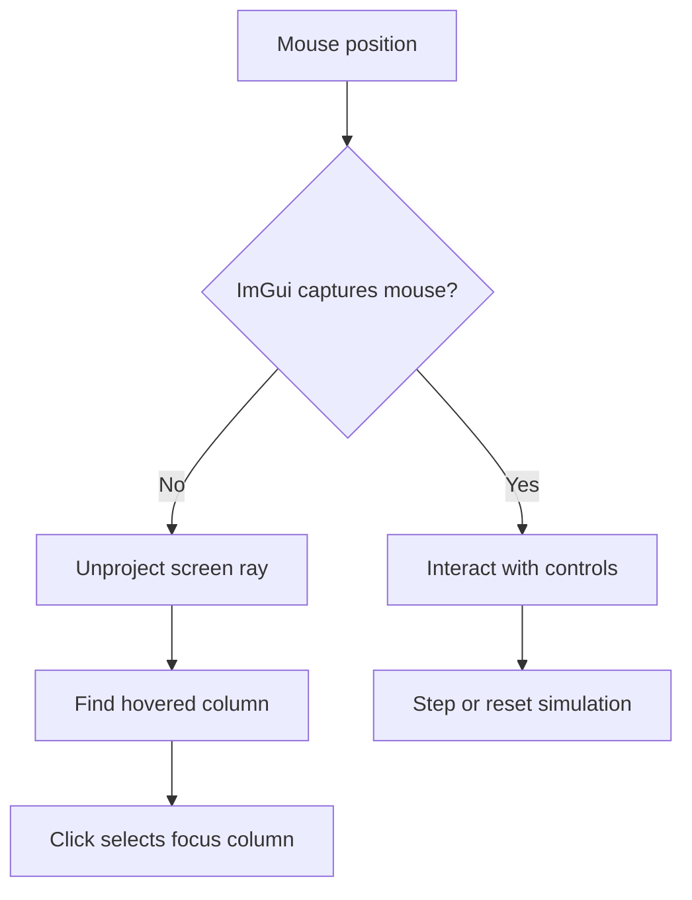

# Lesson 07: ImGui Controls and Mouse Picking

---

## Chapter 1: From Passive Viewer to Interactive Tool

Through Step 6 we had a renderer that could show the terrain, but we could not
interact with it. The erosion field sat at its initial state and the camera
looked from a fixed position.

Step 7 makes the application a real tool:

- A "Step Erosion" button that advances the simulation one cycle.
- A "Reset" button that reconstructs the field from the original terrain data.
- A stats panel showing field dimensions and the current erosion cycle count.
- Mouse picking: hover the cursor over any column to read its height.

None of this involves new D3D12 work. It is all ImGui and CPU math.

---

## Chapter 2: The ImGui Frame Lifecycle (Recap)

Every frame follows the same ImGui sequence — it is worth reviewing before
adding controls:

```cpp
ImGui_ImplDX12_NewFrame();
ImGui_ImplWin32_NewFrame();
ImGui::NewFrame();           // ← ImGui IO is valid from here onward

// build all panels here

ImGui::Render();
ImGui_ImplDX12_RenderDrawData(ImGui::GetDrawData(), command_list.Get());
```

`NewFrame()` is the dividing line. Before it, the previous frame's input state
is in the IO struct. After it, fresh input (mouse position, buttons, wheel) is
available. All ImGui panel code — `Begin`, `Button`, `Text`, etc. — must
happen *after* `NewFrame()` and *before* `Render()`.

---

## Chapter 3: The Simulation Controls Panel

The erosion controls live in a named ImGui window:

```cpp
ImGui::Begin("Erosion Controls");

if (ImGui::Button("Step Erosion"))
{
    m_erosion_field.step();
    update_field_buffer();   // push new heights to the GPU upload buffer
}

if (ImGui::Button("Reset Field"))
    reset_field();

ImGui::Text("Columns: %d x %d", m_erosion_field.width(), m_erosion_field.depth());
ImGui::Text("Erosion cycles: %d", m_erosion_field.cycle_count());

ImGui::End();
```

`ImGui::Button` returns `true` only in the single frame where it is clicked.
That one-frame signal is enough to trigger `step()` or `reset_field()`.

`update_field_buffer()` must be called immediately after `step()` — the GPU's
upload buffer still holds the old heights. If we skip it, the rendered terrain
will lag one erosion cycle behind.

---

## Chapter 4: The reset_field() Function

`reset_field()` constructs a brand-new `SimpleErosionField` seeded from the
original `GrassField` heights. Both the constructor and the Reset button call
the same function — this ensures they always start from an identical state:

```cpp
void reset_field()
{
    const int w = m_grass_field.width();
    const int d = m_grass_field.depth();
    std::vector<int> heights;
    heights.reserve(static_cast<std::size_t>(w * d));
    for (int z = 0; z < d; ++z)
        for (int x = 0; x < w; ++x)
            heights.push_back(m_grass_field.coarse_top_height_inches_at(x, z));
    m_erosion_field = sim::SimpleErosionField(w, d, std::move(heights));
}
```

The iteration order matters: `(z, x)` is row-major, matching
`SimpleErosionField`'s internal layout where `index = z * width + x`. Using a
different traversal order would silently shuffle the terrain into the wrong shape.

---

## Chapter 5: Mouse Picking — the Algorithm

Mouse picking converts a 2D screen position into the 3D column index under the
cursor. The algorithm mirrors what the HLSL shader does for each pixel, but runs
on the CPU and stops as soon as it finds the ground plane:

**Step 1 — Window pixel → NDC.**
NDC (Normalised Device Coordinates) go from −1 to +1. Screen Y increases
downward; NDC Y increases upward, so the Y direction flips:

```cpp
const float ndc_x =  (mouse_x / width)  * 2.f - 1.f;
const float ndc_y = -(mouse_y / height) * 2.f + 1.f;
```

**Step 2 — Unproject through the inverse view-projection.**
The constant buffer holds the inverse VP matrix (computed and cached each
frame by `update_scene_constants`). We construct a far-clip point in
homogeneous clip space and multiply by `inv_vp` to get its world position:

```cpp
XMVECTOR far_clip  = XMVectorSet(ndc_x, ndc_y, 1.f, 1.f);
XMVECTOR far_world = XMVector4Transform(far_clip, XMLoadFloat4x4(&m_inv_vp));

// Perspective divide to recover Cartesian coordinates.
far_world = XMVectorScale(far_world, 1.f / XMVectorGetW(far_world));
```

**Step 3 — Compute the ray direction.**
The ray starts at the camera eye and points toward the unprojected world position:

```cpp
const float dir_x = far_world_x - m_camera_eye.x;
const float dir_y = far_world_y - m_camera_eye.y;
const float dir_z = far_world_z - m_camera_eye.z;
```

**Step 4 — Intersect with Y = 0 (the ground plane).**
The ground is flat at Y = 0. We solve for the t-value where the ray's Y
coordinate equals zero:

```
P(t) = eye + t * dir
P.y = 0  →  t = -eye.y / dir.y
```

If `dir.y` is near zero the ray is nearly horizontal and never hits the ground.
If `t` is negative, the intersection is behind the camera.

```cpp
if (std::fabs(dir_y) < 1e-6f) return;
const float t = -m_camera_eye.y / dir_y;
if (t < 0.f) return;
```

**Step 5 — World XZ → column index.**

```cpp
const float hit_x = m_camera_eye.x + t * dir_x;
const float hit_z = m_camera_eye.z + t * dir_z;
const int cx = static_cast<int>(hit_x / voxel_size);
const int cz = static_cast<int>(hit_z / voxel_size);
```

After bounds-checking, we store `(cx, cz)` and the `m_hovered_column_valid`
flag. The column info panel reads these values the same frame.

---

## Chapter 6: WantCaptureMouse — the Essential Gate

ImGui and application input share the same mouse. Without coordination, clicking
an ImGui button would also trigger whatever application logic reads mouse state.

ImGui provides `io.WantCaptureMouse` precisely for this:

```cpp
ImGuiIO& io = ImGui::GetIO();
if (!io.WantCaptureMouse)
{
    // safe to read mouse state for camera / picking
}
```

`WantCaptureMouse` is true whenever the cursor is over an ImGui window or a
drag is in progress within one. Always gate application mouse handling with this
check. Forget it and you will see the camera orbiting every time you click a
panel button — they share the right mouse button.

Mouse picking is special: we run it every frame regardless of `WantCaptureMouse`,
because the hover readout in the column info panel should still update when the
cursor is over a transparent area of the ImGui window above the terrain.

---

## Chapter 7: The Column Info Panel

The hovered column display uses the picking result from the same frame:

```cpp
ImGui::Begin("Column Info");

if (m_hovered_column_valid)
{
    ImGui::Text("Column (%d, %d)", m_hovered_x, m_hovered_z);
    ImGui::Text("Height: %.2f ft  (%d in)",
        m_erosion_field.height_at(m_hovered_x, m_hovered_z) / 12.f,
        m_erosion_field.height_at(m_hovered_x, m_hovered_z));
}
else
{
    ImGui::TextDisabled("(hover over the field)");
}

ImGui::End();
```

`TextDisabled` draws the text in the UI's greyed-out hint colour — a small
detail that makes the panel feel polished when no column is selected.

---

## Chapter 8: Run Loop Order Matters

`update_mouse_picking()` depends on `m_inv_vp` and `m_camera_eye`, which are
written by `update_scene_constants()`. The order must be:

```
update_scene_constants()    // computes camera matrices, writes m_inv_vp / m_camera_eye
update_field_buffer()       // pushes heights to GPU upload buffer if needed
update_mouse_picking()      // uses m_inv_vp and m_camera_eye set above
--- ImGui::NewFrame() ---
render_imgui()              // builds all panels, reads m_hovered_column_valid
```

If `update_mouse_picking()` ran before `update_scene_constants()`, it would use
last frame's matrices — the pick would lag one frame behind the camera, which
is visible if you orbit while hovering.

---

## Chapter 9: What We Learned

Step 7 completes the interactive layer:

- ImGui buttons return `true` for one frame only; that frame is enough to trigger
  simulation state changes.
- `reset_field()` encapsulates the seeding logic so both the constructor and the
  Reset button share the same code path.
- Mouse picking is just the camera transform in reverse: NDC → inverse VP →
  world space → ray → ground plane intersection → column index.
- `io.WantCaptureMouse` is the essential gate between ImGui input and
  application input. Forgetting it causes accidental camera movement when
  clicking UI panels.
- Run loop order is a design decision — some functions must see this frame's
  camera data, not last frame's.

Step 8 replaces the fixed camera with a fully interactive orbit camera so the
terrain can be inspected from any angle.

---

## Video References

The ImGui simulation controls in this step have no direct equivalent in either
series. The mouse-picking algorithm — ray reconstruction from NDC,
`inverse_view_projection`, AABB slab test — is a custom implementation specific
to this project.

For the underlying matrix math that makes picking possible:

### JAPG — *Your first DirectX 12 application in C++*

- [Part 16 — Creating a View Proj Matrix](https://www.youtube.com/watch?v=AVfHo6uITjA):
  The view-projection matrix whose inverse this step uses. Understanding how the
  matrix is built makes the unprojection in `update_mouse_picking` straightforward
  to follow.
- [Part 23 — Creating transform matrices](https://www.youtube.com/watch?v=tQsaW94yxmU):
  The full matrix pipeline from object space to clip space — and, by extension,
  how to reverse it for screen-to-world unprojection.

For ImGui integration context, revisit the notes in Step 3's Video References section.

## Sequence Interaction Diagram



## Concept Diagram


