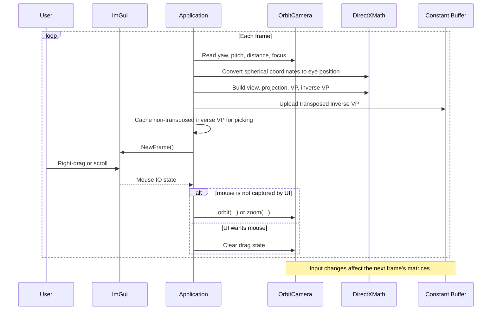
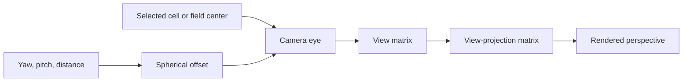

# Lesson 08: Orbit Camera

---

## Chapter 1: Why the Camera Needed to Move

Through Step 7 the camera looked at the terrain from a fixed position —
eye at `(50, 80, -30)`, looking toward `(50, 0, 50)`. That position gave a
decent overhead view of the initial terrain, but as erosion ran and the landscape
changed, there was no way to examine it from a different angle, zoom into a
detail, or look at it from the side.

An *orbit camera* solves this. Instead of storing a fixed eye position, it stores
the camera's *relationship* to a focus point — how far away it is (distance), at
what horizontal angle (yaw), and at what vertical angle (pitch). The user adjusts
those values with right-drag and scroll, and the eye position is recomputed
mathematically every frame.

---

## Chapter 2: Spherical Coordinates

The `gfx::OrbitCamera` class stores the view as three values:

- **yaw** — horizontal rotation around the Y axis, in degrees
- **pitch** — vertical elevation above the horizontal, in degrees
- **distance** — how far the eye is from the focus point

These are *spherical coordinates*. Converting them to a Cartesian eye position
is straightforward trigonometry:

```cpp
const float yaw_rad   = XMConvertToRadians(m_camera.yaw_degrees());
const float pitch_rad = XMConvertToRadians(m_camera.pitch_degrees());

eye.x = focus.x + distance * cosf(yaw_rad) * cosf(pitch_rad);
eye.y = focus.y + distance * sinf(pitch_rad);
eye.z = focus.z + distance * sinf(yaw_rad) * cosf(pitch_rad);
```

Picture the camera sitting on the surface of a sphere centred at `focus`. Yaw
sweeps it horizontally around that sphere; pitch tilts it up or down. Distance
controls the sphere's radius.

The initial values — yaw = −90°, pitch = 45°, distance = 130 — were chosen to
match the old fixed eye position as closely as possible, so switching from the
fixed camera to the orbit camera does not change the opening view.

---

## Chapter 3: Building the View and Projection Matrices

With the eye position in hand, the rest of `update_scene_constants()` is
unchanged from earlier steps:

```cpp
const XMVECTOR eye    = XMLoadFloat3(&eye_f3);
const XMVECTOR target = XMLoadFloat3(&focus_f);
const XMVECTOR up     = XMVectorSet(0.f, 1.f, 0.f, 0.f);

const XMMATRIX view = XMMatrixLookAtRH(eye, target, up);
const XMMATRIX proj = XMMatrixPerspectiveFovRH(
    XMConvertToRadians(45.f), aspect, 0.1f, 500.f);

const XMMATRIX vp     = XMMatrixMultiply(view, proj);
const XMMATRIX inv_vp = XMMatrixInverse(nullptr, vp);
```

`XMMatrixLookAtRH` builds a right-handed view matrix from the eye, target, and
up vectors. *Right-handed* means that in camera space, X points right, Y points
up, and Z points *toward* the viewer (out of the screen). DirectXMath uses
right-handed by default; the shader's coordinate system matches.

The 45° vertical field of view and the near/far clip planes of 0.1 and 500 feet
are the same values used throughout all previous steps.

**The cached matrices.** `m_inv_vp` and `m_camera_eye` are stored as members
and refreshed every frame. `update_mouse_picking()` reads them without
recomputing the camera — this keeps picking consistent with the rendered frame
and avoids duplicating the math.

---

## Chapter 4: The Transpose — Again

Before uploading `inv_vp` to the constant buffer, it must be transposed:

```cpp
// Non-transposed: stored in m_inv_vp for CPU-side picking (XMVector4Transform
// treats the matrix as row-major, which is correct for DirectXMath matrices).
XMStoreFloat4x4(&m_inv_vp, inv_vp);

// Transposed: stored in the GPU constant buffer so that HLSL's mul(row_vec, mat)
// gives the correct result (HLSL cbuffer packing is column-major).
XMStoreFloat4x4(&cb.inverse_view_projection, XMMatrixTranspose(inv_vp));
```

There are two uses of `inv_vp` in the codebase, and they need *opposite*
handling:

- The **CPU** picking code calls `XMVector4Transform(far_clip, mat)`, which
  treats `mat` as row-major. DirectXMath matrices are row-major. No transpose.
- The **HLSL** shader calls `mul(far_clip, inverse_view_projection)`, where
  `mul(row_vec, mat)` in HLSL expects the matrix stored in column-major order
  (because cbuffer packing is column-major). A transpose converts it.

If you accidentally use the same transposition state for both, the CPU picking
and the GPU rendering will disagree about where each ray points — the hover
highlight will be in the wrong column.

---

## Chapter 5: Reading Camera Input

All camera input is read via ImGui's IO struct, not via raw Win32 messages:

```cpp
void handle_camera_input()
{
    ImGuiIO& io = ImGui::GetIO();

    // Respect the WantCaptureMouse gate.
    if (io.WantCaptureMouse)
    {
        m_right_dragging = false;
        return;
    }

    const bool right_down = ImGui::IsMouseDown(ImGuiMouseButton_Right);
    if (right_down)
    {
        if (m_right_dragging)
        {
            const int dx = io.MousePos.x - m_drag_last.x;
            const int dy = io.MousePos.y - m_drag_last.y;
            m_camera.orbit(-dx * 0.35f, dy * 0.25f);
        }
        m_drag_last.x    = static_cast<LONG>(io.MousePos.x);
        m_drag_last.y    = static_cast<LONG>(io.MousePos.y);
        m_right_dragging = true;
    }
    else
    {
        m_right_dragging = false;
    }

    if (io.MouseWheel != 0.f)
        m_camera.zoom(-io.MouseWheel * 1.2f);
}
```

The choice to use ImGui IO rather than `WM_MOUSEMOVE` / `WM_MOUSEWHEEL` is
deliberate. ImGui already processes the Win32 messages and exposes them as a
clean per-frame polled state. Using it avoids the need to track raw Win32 button
state manually and keeps all mouse handling consistent.

**The sensitivity constants** — `0.35°/pixel` for yaw and `0.25°/pixel` for
pitch — were tuned to match the feel of `grass-field-002`. Scroll multiplier
`1.2 feet/notch` gives a zoom rate that is fast enough to be useful but not
so fast it overshoots.

---

## Chapter 6: Where handle_camera_input() Must Run

`handle_camera_input()` must run *after* `ImGui::NewFrame()`. Before `NewFrame()`
the `io.MousePos`, `io.MouseDelta`, and button states have not been populated for
the current frame — reading them would give last frame's values.

The function lives inside `render_imgui()`, which is called after `NewFrame()`:

```
update_scene_constants()   // computes matrices from previous frame's camera state
ImGui::NewFrame()          // ← fresh IO available from here
render_imgui()
    handle_camera_input()  // modifies m_camera for the NEXT frame
    // build all panels
ImGui::Render()
```

This arrangement creates a **one-frame lag**: the camera changes from input
happen after `update_scene_constants()` has already computed this frame's
matrices. Those changes take effect in the *next* call to `update_scene_constants()`.
At 60 fps the lag is about 16 milliseconds — not perceptible during normal
interaction. This is the same pattern used in `grass-field-002` and is the
accepted standard for ImGui + D3D12 orbit cameras.

---

## Chapter 7: The Camera ImGui Panel

The camera panel shows the current spherical coordinates and provides a Reset
button:

```cpp
ImGui::Begin("Camera");

ImGui::Text("Yaw:      %.1f°", m_camera.yaw_degrees());
ImGui::Text("Pitch:    %.1f°", m_camera.pitch_degrees());
ImGui::Text("Distance: %.1f ft", m_camera.distance());

ImGui::Separator();
ImGui::TextDisabled("Right-drag: orbit   Scroll: zoom");

if (ImGui::Button("Reset Camera"))
    m_camera = gfx::OrbitCamera{ -90.f, 45.f, 130.f };

ImGui::End();
```

Resetting the camera is just constructing a new `OrbitCamera` value and
assigning it to `m_camera`. The next frame's `update_scene_constants()` picks
up the new values immediately.

---

## Chapter 8: What We Learned

- An orbit camera stores the view in spherical coordinates (yaw, pitch, distance)
  rather than a fixed Cartesian eye position. Cartesian coordinates are
  recomputed each frame from these three values.
- `XMMatrixLookAtRH` and `XMMatrixPerspectiveFovRH` build the standard right-
  handed view and projection matrices. These are the matrices the shader
  deconstructs each pixel to produce a ray.
- The inverse VP matrix is used in *two* different contexts with *opposite*
  transpose conventions: non-transposed for CPU DirectXMath picking, transposed
  for GPU HLSL constant buffer upload.
- Camera input is read through ImGui IO, not raw Win32 messages — consistent
  with the overall pattern used throughout the project.
- `io.WantCaptureMouse` gates both camera orbit *and* keeping the drag flag
  clear, so clicking an ImGui panel never accidentally starts a camera drag.
- The one-frame lag introduced by reading input after `update_scene_constants()`
  is inherent to this architecture and imperceptible at normal frame rates.

---

## What Comes Next

Step 8 completes the core rendering and camera foundation. The next steps
introduce pluggable, runtime-swappable components:

| Step | What Was Built |
|------|----------------|
| 1 | Bare Win32 window, message loop |
| 2 | D3D12 device, swap chain, clear loop |
| 3 | ImGui integration, font atlas, SRV heap |
| 4 | Simulation data: GrassField + SimpleErosionField |
| 5 | HLSL column raycast shader, DDA traversal |
| 6 | Root signature, PSO, upload heap, draw call |
| 7 | Simulation controls, Reset, mouse picking |
| 8 | Orbit camera, spherical coordinates, matrix conventions |
| 9 | Pluggable simulator interface (`IFieldSim`) |
| 10 | Pluggable renderer interface (`IFieldRenderer`), wireframe renderer, GPU panel |

Continue in **lesson_step9.md**.

---

## Video References

Orbit cameras and the spherical-coordinate view matrix are well-covered topics.
The following episodes are the most relevant from the companion series.

### Chili — *Direct3D 12 Shallow Dive*

- [Episode 8 — Depth and Constant Buffer](https://www.youtube.com/watch?v=vXR575UqTqI):
  Chili's treatment of the constant buffer that carries camera matrices to the
  shader — the same `SceneConstants` struct updated in `update_scene_constants()`
  here. The camera model differs, but the GPU-side wiring is identical.

### JAPG — *Your first DirectX 12 application in C++*

- [Part 16 — Creating a View Proj Matrix](https://www.youtube.com/watch?v=AVfHo6uITjA):
  `XMMatrixLookAtRH`, `XMMatrixPerspectiveFovRH`, and the standard view-projection
  build chain — the same calls made in `update_scene_constants()` in this step.
- [Part 23 — Creating transform matrices](https://www.youtube.com/watch?v=tQsaW94yxmU):
  How model, view, and projection matrices combine and why transposition matters
  when moving from CPU row-major to GPU column-major order. The transpose trap
  documented in Chapter 5 of this lesson is explained here in full generality.

## Sequence Interaction Diagram



## Concept Diagram


