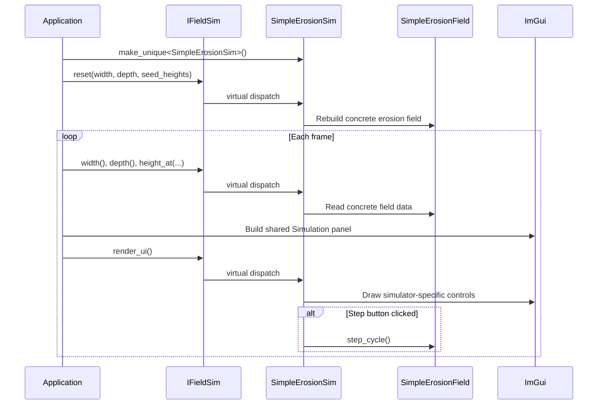
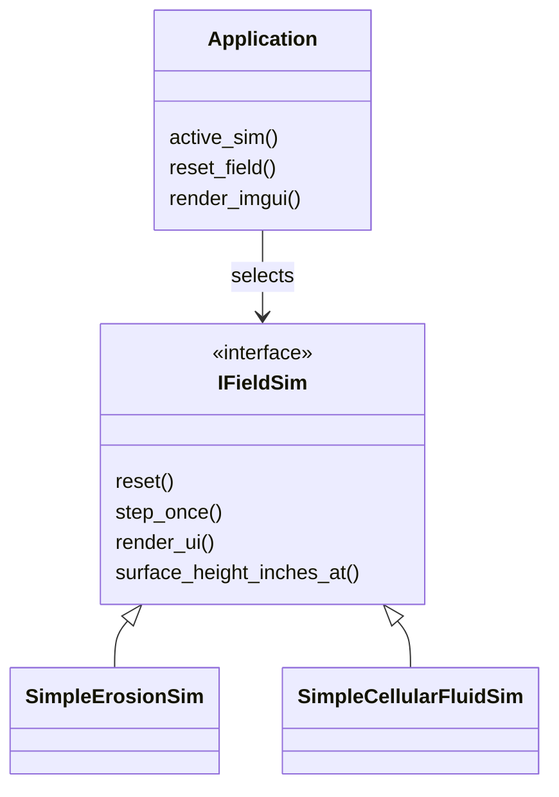

# Lesson 09: Pluggable Simulator Interface

---

## Chapter 1: Why One Simulator Isn't Enough

Through Step 8 the application had exactly one simulator wired directly into
`Application`. The type was `sim::SimpleErosionField`; the step count, cycle
count, and reset logic all lived alongside D3D12 plumbing inside the same giant
struct. Swapping to a different erosion model would mean editing `Application`
in at least seven different places, and there would be no clean boundary to test
against.

The fix is to extract a *contract* — an abstract base class that expresses only
what `Application` needs from any simulator — and hide every concrete simulator
behind it. The moment that contract exists, `Application` becomes completely
ignorant of which simulator is running. Adding a new one requires zero changes to
`Application`.

---

## Chapter 2: The Three Contracts

`IFieldSim` is a narrow pure-virtual interface with exactly three groups of
methods, each matching one role that `Application` requires the simulator to fill:

```cpp
class IFieldSim
{
public:
    virtual ~IFieldSim() = default;

    // Identity
    [[nodiscard]] virtual const char* name() const noexcept = 0;

    // RENDERING CONTRACT — used by initialize_field_buffer, update_field_buffer,
    // update_scene_constants, update_mouse_picking
    [[nodiscard]] virtual int width() const noexcept = 0;
    [[nodiscard]] virtual int depth() const noexcept = 0;
    [[nodiscard]] virtual int height_at(int x, int z) const = 0;

    // LIFECYCLE CONTRACT — used by reset_field
    virtual void reset(int new_width, int new_depth,
                       std::vector<int> heights_inches) = 0;

    // UI CONTRACT — used by render_imgui
    virtual void render_ui() = 0;
};
```

**Rendering contract** — the GPU upload loop and mouse picking only need to
know the grid dimensions and the height of each column. They ask nothing else.

**Lifecycle contract** — `reset_field()` re-seeds the simulator from the
original `GrassField` heights. The interface receives the seed data as a plain
`std::vector<int>` so no concrete simulator header has to be visible to
`Application`.

**UI contract** — `render_ui()` draws the simulator's ImGui controls inside an
already-open panel. The simulator is responsible for its own step buttons, cycle
counters, and tuning sliders. `Application` never reaches in to ask "how many
cycles have run?". It delegates everything.

---

## Chapter 3: The Adapter Pattern

`SimpleErosionSim` is a thin *adapter* class — it wraps `SimpleErosionField`
and conforms it to the `IFieldSim` interface:

```cpp
class SimpleErosionSim final : public IFieldSim
{
public:
    const char* name() const noexcept override
    {
        return "Simple Gravity Erosion";
    }

    int width() const noexcept override { return m_field.width(); }
    int depth() const noexcept override { return m_field.depth(); }
    int height_at(int x, int z) const override
    {
        return m_field.height_at(x, z);
    }

    void reset(int new_width, int new_depth,
               std::vector<int> heights_inches) override
    {
        m_field = SimpleErosionField(new_width, new_depth,
                                     std::move(heights_inches));
    }

    void render_ui() override
    {
        ImGui::Text("Cycles: %d", m_field.cycle_count());
        ImGui::Separator();
        if (ImGui::Button("Step (x1)"))
            m_field.step_cycle();
        ImGui::SameLine();
        if (ImGui::Button("Step (x100)"))
            for (int i = 0; i < 100; ++i)
                m_field.step_cycle();
    }

private:
    SimpleErosionField m_field;
};
```

`SimpleErosionField` is completely unchanged — it never needed to know about
ImGui or `Application`. `SimpleErosionSim` adds only the two things the
interface requires: `reset()` and `render_ui()`. All the forwarding methods
(`width`, `depth`, `height_at`) are single-line wrappers.

---

## Chapter 4: What Changed in Application

### Member declaration

```cpp
// Before
sim::SimpleErosionField m_erosion_field;

// After
std::unique_ptr<sim::IFieldSim> m_sim;
```

Owned through `unique_ptr` so the lifetime is automatic and swapping is a single
assignment.

### Construction

```cpp
Application()
{
    m_sim = std::make_unique<sim::SimpleErosionSim>();
    reset_field();
}
```

### reset_field()

```cpp
void reset_field()
{
    const int w = m_grass_field.width();
    const int d = m_grass_field.depth();
    std::vector<int> heights;
    heights.reserve(static_cast<std::size_t>(w * d));
    for (int z = 0; z < d; ++z)
        for (int x = 0; x < w; ++x)
            heights.push_back(m_grass_field.coarse_top_height_inches_at(x, z));
    m_sim->reset(w, d, std::move(heights));
}
```

`reset_field()` now builds the seed data itself and calls `m_sim->reset()`.
It knows nothing about `SimpleErosionField` — it would work identically if
`m_sim` pointed to any other `IFieldSim` implementation.

### Simulation panel

```cpp
ImGui::Begin("Simulation");
ImGui::Text("Field:  %d x %d columns", m_sim->width(), m_sim->depth());
ImGui::Text("Simulator: %s", m_sim->name());
if (ImGui::Button("Reset"))
    reset_field();
ImGui::Separator();
m_sim->render_ui();   // ← delegates all sim-specific UI to the simulator
ImGui::End();
```

`Application::render_imgui()` shows the grid size and the Reset button — those
are application-level concerns that never change. Everything below the separator
is delegated to `m_sim->render_ui()`.

---

## Chapter 5: The Anti-Coupling Keystone

The most important design decision here is that `render_ui()` is on the
**simulator**, not on `Application`.

Without it, `Application` would need to know which concrete type `m_sim` holds
so it could display its specific state. That means either a downcast, a union of
optional fields, or a type-switch — all of which re-introduce coupling.

With `render_ui()` on the interface, adding a new simulator type with completely
different internal state (a fluid sim with viscosity sliders, for example) is:

1. Write `FluidSim : public IFieldSim`
2. In `Application()`, replace `make_unique<SimpleErosionSim>()` with
   `make_unique<FluidSim>()`
3. Call `reset_field()` — done

`Application` does not change at all. No new member variables, no new `if`
branches, no new includes.

---

## Chapter 6: File Layout

```
sim/
  i_field_sim.h          ← abstract interface (header-only)
  simple_erosion_field.h ← original pure-C++ sim (unchanged)
  simple_erosion_sim.h   ← new adapter conforming to IFieldSim
```

The original `SimpleErosionField` lives unchanged inside the same `sim/`
folder. Putting the interface and the adapters there keeps all simulation
concerns in one place and avoids pulling simulator headers into `main.cpp`.

---

## Chapter 7: What We Learned

- The **Strategy pattern** (pluggable algorithm behind an interface) is a clean
  way to let `Application` work with multiple different simulators without
  knowing which one is active.
- An interface should be **narrow** — express only the contract the consumer
  actually needs, not every method of the underlying class.
- The **Adapter pattern** wraps an existing class (`SimpleErosionField`) to
  conform it to a new interface without modifying the original.
- Putting `render_ui()` on the interface is the keystone: it means `Application`
  never needs to reach inside the simulator to display its state. This is the
  Open/Closed principle in practice — open for extension (new simulators),
  closed for modification (`Application` unchanged).
- `std::unique_ptr<Interface>` is the right ownership model for a
  runtime-swappable component. Swapping is a single `make_unique` assignment;
  destruction is automatic.

---

## What Comes Next

Step 9 applied the pluggable-component pattern to simulators. Step 10 applies
the same pattern to *renderers* — swapping between a column raycast and a
wireframe mesh without touching `Application`.

## Sequence Interaction Diagram



## Concept Diagram


