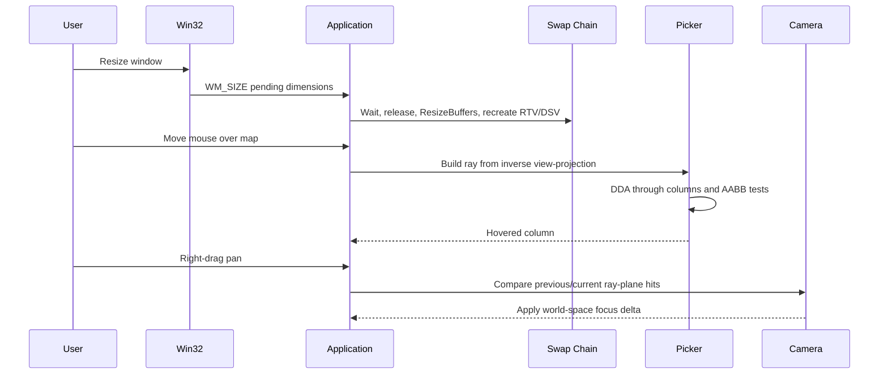

# Lesson: Grass Field 004 Input, Resize, and Picking Corrections

---

## Chapter 1: The Problem We Hit

Grass Field 004 started with a strong visual map pass, but interaction quality
was not yet production-usable:

1. Selection accuracy was inconsistent, especially at angle.
2. Resize changed client dimensions but did not resize swapchain resources.
3. Right-drag pan used pixel scaling, which felt detached at zoomed-out views.
4. User control preferences changed during iteration (left-click select,
   middle-orbit, right-pan).

The lesson is that world-scale visuals only feel "real" when camera, picking,
and window lifecycle all agree on the same geometry and dimensions.

---

## Chapter 2: Why Ground-Plane Picking Failed

The earlier picker projected mouse rays onto `Y=0` and converted that hit
point into grid coordinates.

That is simple, but wrong for many real views:

- canals, terrace walls, house edges, and boulders are elevated
- angled view often "sees" side/top surfaces before ground
- a ground-only projection drifts away from visible geometry

So we replaced this with actual ray traversal through columns.

---

## Chapter 3: DDA + Per-Column AABB Picking

The new picker mirrors rendering logic more closely:

1. Build world ray from mouse pixel using inverse VP.
2. Intersect with map AABB to enter field volume.
3. DDA step through X/Z cells in ray order.
4. For each cell, test ray vs that column's AABB:
   - X/Z bounds = cell footprint
   - Y bounds = `0 .. (height + water)`
5. First hit cell becomes hovered cell.

Benefits:

- angled-view picking matches visible structure better
- top-down is still stable
- one shared geometric truth for camera/selection mental model

---

## Chapter 4: Resize Lifecycle Must Be Complete

Before this work, `WM_SIZE` only changed `width/height` fields. Backbuffers and
depth textures stayed at old sizes, causing UI/picking mismatch and eventually
errors.

Correct pattern implemented:

1. `WM_SIZE` stores pending width/height only.
2. Render loop processes resize at a safe point:
   - wait for GPU
   - release old render targets/depth
   - `ResizeBuffers`
   - reacquire buffers + recreate RTVs/DSV/depth
3. Skip zero-size frames.

Important bug found/fixed:

- `ResizeBuffers` failed when called with a flag value that did not match
  swapchain creation. Using `flags=0` resolved this.

---

## Chapter 5: Pan Should Be World-Delta, Not Pixel-Scale

Original pan used:

- mouse pixel delta × constant scalar

That does not preserve feel across zoom/angle.

New approach:

1. At right-drag start, capture pan plane height from selected column surface.
2. Each frame, build rays for previous and current mouse positions.
3. Intersect both rays with the same plane.
4. Apply world-space delta directly to focus offset.

Result:

- the map tracks cursor movement much more naturally, especially when zoomed out

---

## Chapter 6: Control Map and UX Contract

Current control contract in GF004:

- left-click = select/focus cell
- middle-drag = orbit
- right-drag = pan
- scroll = zoom

Plus:

- hover highlight shows "what will be selected"
- selection/hover data is surfaced in inspector panel

This closes the loop between visual feedback and action intent.

---

## Chapter 7: "Safe Soil" in This Slice

In GF004 today, "safe soil" is an authored topology/material concept, not yet a
dynamic soil simulation class.

Specifically:

- `safe_swale` marks preferred overflow channels.
- `check_dam` marks control points that slow/shape flow.
- nearby `wet_soil` marks known risk zones (for example house-adjacent damp
  foundation band).

So "safe" currently means:

- route water into these designed zones, away from sensitive zones,
- with visual/material structure prepared for future moisture mechanics.

It is a map truth first, not a completed hydraulic ruleset yet.

---

## Sequence Interaction Diagram

---

## Chapter 8: Practical Engineering Takeaway

For column-voxel tools, camera, picking, and resize handling are not
"polish-only." They define whether users can trust the world.

Today's work improved that trust by:

- using geometry-aware picking,
- using proper swapchain lifecycle on resize,
- and using world-space panning semantics.

These are foundational quality steps before deeper gameplay/system layering.
