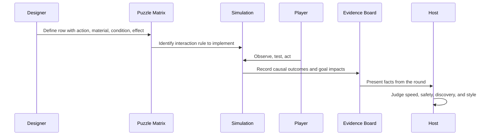

# Lesson: Puzzle Matrix Fundamentals

This lesson walks through the full puzzle matrix system from first principles.
Read it when you are new to the project, returning after a long break, or onboarding
an agent to help with design work. It covers the vocabulary, the motifs, the goal
model, and how to use all of them together.

---

## Chapter 1: Why the matrix exists

Granny's House Trials is a water-routing puzzle game. The player acts on a small
ancient yard — digging, clearing, repairing, opening gates — and water responds.
The game's depth comes from the water system's hidden structure: blocked ancient
channels, structural debris that looks removable, buried drains that connect to
unexpected places.

Without a design vocabulary, every puzzle beat has to be invented from scratch.
That is slow and inconsistent. The puzzle matrix solves this by naming the
meaningful interactions ahead of time.

A matrix row says: "if the player does *this* to *that*, water will do *this*,
which might cause *that*, and the lesson is *this*." Once you have a table of
these rows, you can compose puzzles by combining rows that create interesting
conflicts between their outcomes.

The matrix is a **design vocabulary**, not a simulation. It tells you what
interactions are worth building into the game. The actual hydraulics — flow rates,
erosion thresholds, dampness accumulation — are in the sim code.

---

## Chapter 2: Reading an interaction row

Here is one row from the canonical matrix:

| Player action | Material / object | Immediate effect | Water-system result | Possible chaos | Lesson |
|---|---|---|---|---|---|
| Clear weeds | Ancient canal | Flow resistance decreases | More water reaches terraces faster | Overtopping if downstream not ready | Blockages can be accidental controls |

Reading left to right, this is a causal chain:

1. Player clears weeds from the ancient stone canal.
2. Immediate effect: the weeds were slowing flow; without them, resistance drops.
3. Water-system result: more water now reaches the terraces, and it gets there faster.
4. Possible chaos: if the downstream terraces are not ready for higher flow volume,
   they overtop. The excess water goes somewhere unintended.
5. Lesson: the weeds were not just dirt — they were an accidental flow control.
   Removing them all was the wrong move. Partial clearing would have been correct.

Notice that each column follows from the previous one. There are no invented steps.
If you cannot read a row from left to right as a coherent chain without adding words
in your head, the row is not valid.

**Exercise:** pick any row from `docs/01_interaction_matrix.md`. Read it aloud as a
sentence: "When the player [action] the [material], the immediate effect is [effect].
This causes water to [result]. If the player misjudges, [chaos] may happen. The
lesson is [lesson]." If the sentence makes sense, the row is coherent.

---

## Chapter 3: The axis vocabulary

The matrix rows are not random. They are drawn from a fixed combinatorial space
defined by six axes. Understanding the axes tells you where the gaps are and how
to generate new rows intentionally.

**Axis 1: Source** — where water comes from.

The cistern is an infinite source that requires a gate action to start. Rainfall is
uncontrollable and arrives on every surface. Terrace overflow is a derived source —
it only exists when an upstream terrace is overfull. Knowing the source determines
whether the player can control flow volume.

**Axis 2: Carrier** — how water travels.

A sturdy stone canal can handle high flow. A player-dug dirt trench erodes under
fast flow. A buried conduit carries water silently to an unknown destination. The
carrier is where most player mistakes happen, because players naturally choose the
easiest carrier (a new trench) without checking whether it can handle the source.

**Axis 3: Modifier** — what changes the carrier.

Weeds reduce flow rate. Gates are binary controls. Overflow lips define maximum
water level. Loose stones look removable but are load-bearing. Modifiers are the
primary targets of player action — most player tools act on modifiers, not on the
carrier itself.

**Axis 4: Target** — where water arrives.

A puzzle needs at least one desired target (the garden) and at least one hazard
target (the cellar, the house wall) that is plausibly reachable from the same
source. Without a reachable hazard, there is no tension.

**Axis 5: Failure mode** — how things go wrong.

Some failure modes are recoverable (a gate can be closed, blocked flow can be
unblocked). Some are not (a collapsed wall, a flooded basement). The most important
design rule: every puzzle should have at least one non-recoverable failure mode. If
every mistake can be undone, the round becomes repetitive trial-and-error.

**Axis 6: Player tool** — what the player can do.

The full list: clear, dig, place stone, remove stone, repair, open/close gate,
build weir, redirect flow at junction, plug outlet, test small flow, wait and
observe, expose buried conduit. The last two — test small flow and wait and observe
— are the tools that reward patience and distinguish the Systems Auditor role.

---

## Chapter 4: The motifs

A motif is a named design pattern built from two or three matrix rows that combine
into a reusable "small systems problem with a lesson."

The catalog has seven motifs:

| Motif | Core trap | Core lesson |
|---|---|---|
| Blockage-as-Control | Clear all weeds → system overtops | Some blockage is intentional |
| Loose-Wall Temptation | Dig beside wall → wall collapses | Obvious route may be structurally dangerous |
| Hidden Drain Betrayal | Use drain as overflow → basement floods | Disappearing water is not proof of success |
| Backwater Problem | Block dangerous route completely → overflow at worse point | Every dam needs a relief path |
| Terrace Sequencing | Shortcut to lower bed → upper bed dry, lower bed drowns | Elevation is logic; overflow lips encode sequence |
| Over-Success Surge | Open cistern fully → goal met then overloaded | More water is not always better |
| Useful Danger | Use a contraption → solves one problem, creates another | Know what you are trading |

When reading a motif, focus on the trap path first. The trap path is what most
players will take when they see the scene for the first time. The happy path is
what a careful, informed player does instead.

**Useful Danger** is a meta-motif. It is not a specific interaction but a structural
test: after you design a contraption, ask whether it has a useful effect and a
harmful side effect. If it only has a useful effect, it is not interesting enough.

---

## Chapter 5: Composing a puzzle from motifs

A single motif is a tutorial. Two or three motifs compose into a competition round.

**Choosing motifs:** pick motifs whose required scene features can coexist in the
same small yard, whose happy paths do not contradict each other, and whose trap
paths produce distinctly different failure modes.

**Example first composition (GHT_COMPOSITION_001):**

```
MOTIF_TERRACE_SEQUENCE + MOTIF_LOOSE_WALL_TEMPTATION + MOTIF_BACKWATER_PROBLEM
```

These three work together because:
- They share the same physical zone (west canal + terrace area)
- The traps cascade rather than activate simultaneously
- A careful player can solve all three; a hasty player triggers two or three

**Cascade means:** the Builder player first hits the Loose-Wall trap (digs beside
wall), which activates a secondary flow problem, which they might try to fix by
completely blocking a corridor (triggering the Backwater Problem), while the Terrace
Sequencing problem was never noticed because they went straight for the visible goal.

**Ordering matters.** In this composition, the intended sequence is:
1. Read the terrace system before routing (Terrace Sequencing awareness)
2. Route around the wall, not beside it (Loose-Wall Temptation avoidance)
3. Clear a relief path before blocking the wall corridor (Backwater Problem avoidance)

If the player does step 2 without step 3, they create the backwater problem. If
they do step 1 without step 2, they still route through a dangerous corridor.

---

## Chapter 6: How goals sit above the matrix

The matrix and motifs define what interactions are possible. Goals define what the
player is trying to achieve and what they must not break.

**Primary goals** are the win condition. For the first round:
- `old_garden_hydration >= 70`
- `new_garden_hydration >= 70`

**Safety goals** are the constraints. For the first round:
- `basement_dampness < 30`
- `boulder_wall_stability > 50`

**Quality goals** are the mastery layer:
- `erosion_damage < 40`
- `path_mud < 20`

**Discovery goals** reward the Systems Auditor:
- Discover the hidden drain before using it
- Read all terrace overflow lips before routing

The critical rule: **a patient, methodical approach must always have a path to
success.** If there is no sequence of "observe, test, act" moves that satisfies all
primary and safety goals, the puzzle design is broken, not the player.

**Goal conflicts to know:**

Delivering water quickly and avoiding erosion are in tension — fast flow erodes.
Clearing all blockages and maintaining flow control are in tension — some blockages
are controls. Opening the cistern fully and keeping downstream safe are in tension —
infinite source overwhelms fixed capacity. The puzzle design must provide a way to
satisfy both sides of each conflict at the same time (the happy path), even if it
is not the most obvious way.

---

## Chapter 7: Worked example — one full puzzle beat

Let's walk through one specific beat using all the vocabulary.

**Scene setup:** the player is looking at the north edge of the yard. The stone canal
runs east-west. There are weeds blocking the canal about halfway along. The player
can see the terraced garden below and to the south.

**Matrix row that describes this beat:** ROW-001 (Clear weeds | Ancient canal)

**Motif this beat belongs to:** MOTIF_BLOCKAGE_CONTROL

**What the player should do (happy path):**
Test with a small flow first (ROW-016). Observe where water goes and at what rate.
Then clear only enough weeds to allow a controlled flow to the top terrace without
overtopping the overflow lip.

**What the Builder does (trap path):**
Clears all weeds immediately. The canal flows freely. Top terrace fills fast.
Overflow lip activates. Excess water hits the second terrace before its inlet is
ready. Second terrace overtops. Water runs south along the path edge.

**Goal impacts:**
- Primary goal progress: `old_garden_hydration` rising fast ✓
- Safety goal: `erosion_damage` begins rising as excess flow hits soft ground ✗
- Safety goal: `path_mud` rises as overflow reaches the domestic path ✗

**Lesson revealed:** the weeds were the throttle. They kept the flow at the canal's
designed operating rate. Removing them fully was the mistake. The evidenceboard will
show `erosion_damage` and `path_mud` rising from the moment the weeds were cleared.

**Host's judgment:** the Builder watered the garden efficiently but muddied the path
and started eroding the terrace. Three points for speed, minus two for the mess.

---

## Sequence Interaction Diagram



---

## Chapter 8: Design principles summary

1. **The matrix is a vocabulary, not a simulation.** It names meaningful interactions;
   the sim computes actual magnitudes. Do not put flow rates in the matrix.

2. **Every row must be a complete causal chain.** If you cannot read it left-to-right
   without inventing steps, it is not a valid row.

3. **Traps should be locally optimal.** The player takes the trap path because it
   looks right from their starting position and knowledge. A trap that requires
   deliberate sabotage is not a trap — it is cruelty.

4. **Non-recoverable failures make stakes real.** At least one failure mode per puzzle
   should be permanent. This is what makes the Chaos Tester's round funny and the
   Systems Auditor's round impressive.

5. **Patience must always win.** The "observe, test, act" approach must have a valid
   path to the happy path. If it does not, the puzzle is unfair.

6. **Goals sit above the matrix.** Goals tell the player what to achieve. The matrix
   tells you what interactions to build. Do not confuse the two layers.

7. **Motifs scale with complexity.** One motif for tutorials. Two for the first
   competition round. Three or more only when debugging tools are strong.

8. **The host is the final judge.** The system records evidence. The host decides
   what it meant. This preserves humor, character, and the ability to reward
   unexpected insight that the metrics did not capture.
